# 业务流程

## 1. 应用启动流程

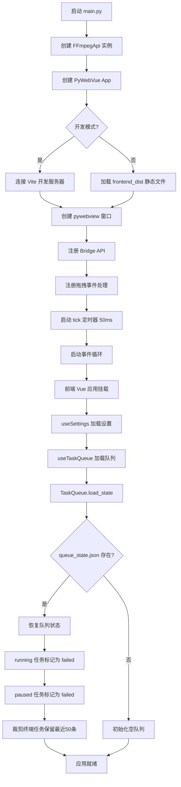
```mermaid
flowchart TD
    A[启动 main.py] --> B[创建 FFmpegApi 实例]
    B --> C[创建 PyWebVue App]
    C --> D{开发模式?}
    D -->|是| E[连接 Vite 开发服务器]
    D -->|否| F[加载 frontend_dist 静态文件]
    E --> G[创建 pywebview 窗口]
    F --> G
    G --> H[注册 Bridge API]
    H --> I[注册拖拽事件处理]
    I --> J[启动 tick 定时器 50ms]
    J --> K[启动事件循环]
    K --> L[前端 Vue 应用挂载]
    L --> M[useSettings 加载设置]
    M --> N[useTaskQueue 加载队列]
    N --> O[TaskQueue.load_state]
    O --> P{queue_state.json 存在?}
    P -->|是| Q[恢复队列状态]
    P -->|否| R[初始化空队列]
    Q --> S[running 任务标记为 failed]
    S --> T[paused 任务标记为 failed]
    T --> U[裁剪终端任务保留最近50条]
    U --> V[应用就绪]
    R --> V
```

## 2. 任务添加流程

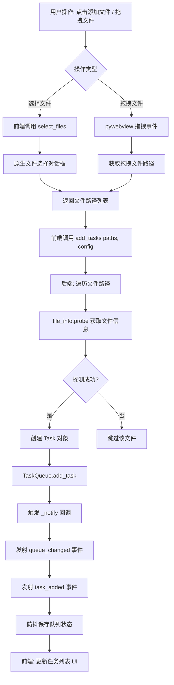
```mermaid
flowchart TD
    A[用户操作: 点击添加文件 / 拖拽文件] --> B{操作类型}
    B -->|选择文件| C[前端调用 select_files]
    B -->|拖拽文件| D[pywebview 拖拽事件]
    C --> E[原生文件选择对话框]
    D --> F[获取拖拽文件路径]
    E --> G[返回文件路径列表]
    F --> G
    G --> H[前端调用 add_tasks paths, config]
    H --> I[后端: 遍历文件路径]
    I --> J[file_info.probe 获取文件信息]
    J --> K{探测成功?}
    K -->|是| L[创建 Task 对象]
    K -->|否| M[跳过该文件]
    L --> N[TaskQueue.add_task]
    N --> O[触发 _notify 回调]
    O --> P[发射 queue_changed 事件]
    P --> Q[发射 task_added 事件]
    Q --> R[防抖保存队列状态]
    R --> S[前端: 更新任务列表 UI]
```

## 3. 任务执行流程

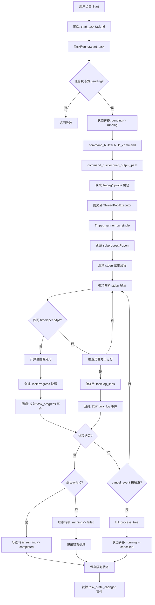
```mermaid
flowchart TD
    A[用户点击 Start] --> B[前端: start_task task_id]
    B --> C[TaskRunner.start_task]
    C --> D{任务状态为 pending?}
    D -->|否| E[返回失败]
    D -->|是| F[状态转移: pending -> running]
    F --> G[command_builder.build_command]
    G --> H[command_builder.build_output_path]
    H --> I[获取 ffmpeg/ffprobe 路径]
    I --> J[提交到 ThreadPoolExecutor]
    J --> K[ffmpeg_runner.run_single]
    K --> L[创建 subprocess.Popen]
    L --> M[启动 stderr 读取线程]
    M --> N[循环解析 stderr 输出]
    N --> O{匹配 time/speed/fps?}
    O -->|是| P[计算进度百分比]
    P --> Q[创建 TaskProgress 快照]
    Q --> R[回调: 发射 task_progress 事件]
    O -->|否| S[检查是否为日志行]
    S -->|是| T[追加到 task.log_lines]
    T --> U[回调: 发射 task_log 事件]
    S -->|否| N
    R --> V{进程结束?}
    U --> V
    V -->|否| W{cancel_event 被触发?}
    W -->|是| X[kill_process_tree]
    X --> Y[状态转移: running -> cancelled]
    W -->|否| N
    V -->|是| Z{退出码为 0?}
    Z -->|是| AA[状态转移: running -> completed]
    Z -->|否| AB[状态转移: running -> failed]
    AB --> AC[记录错误信息]
    AA --> AD[保存队列状态]
    AC --> AD
    AD --> AE[发射 task_state_changed 事件]
    Y --> AD
```

## 4. 任务暂停/恢复流程

### 暂停

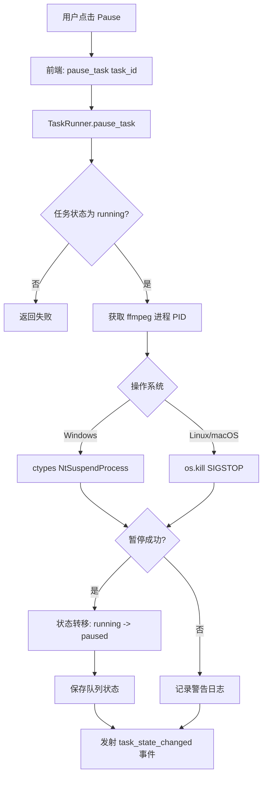
```mermaid
flowchart TD
    A[用户点击 Pause] --> B[前端: pause_task task_id]
    B --> C[TaskRunner.pause_task]
    C --> D{任务状态为 running?}
    D -->|否| E[返回失败]
    D -->|是| F[获取 ffmpeg 进程 PID]
    F --> G{操作系统}
    G -->|Windows| H[ctypes NtSuspendProcess]
    G -->|Linux/macOS| I[os.kill SIGSTOP]
    H --> J{暂停成功?}
    I --> J
    J -->|是| K[状态转移: running -> paused]
    J -->|否| L[记录警告日志]
    K --> M[保存队列状态]
    M --> N[发射 task_state_changed 事件]
    L --> N
```

### 恢复

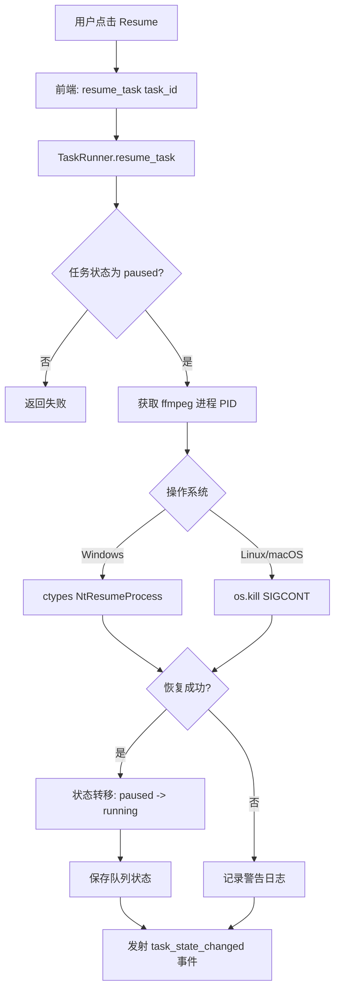
```mermaid
flowchart TD
    A[用户点击 Resume] --> B[前端: resume_task task_id]
    B --> C[TaskRunner.resume_task]
    C --> D{任务状态为 paused?}
    D -->|否| E[返回失败]
    D -->|是| F[获取 ffmpeg 进程 PID]
    F --> G{操作系统}
    G -->|Windows| H[ctypes NtResumeProcess]
    G -->|Linux/macOS| I[os.kill SIGCONT]
    H --> J{恢复成功?}
    I --> J
    J -->|是| K[状态转移: paused -> running]
    J -->|否| L[记录警告日志]
    K --> M[保存队列状态]
    M --> N[发射 task_state_changed 事件]
    L --> N
```

## 5. 任务停止流程

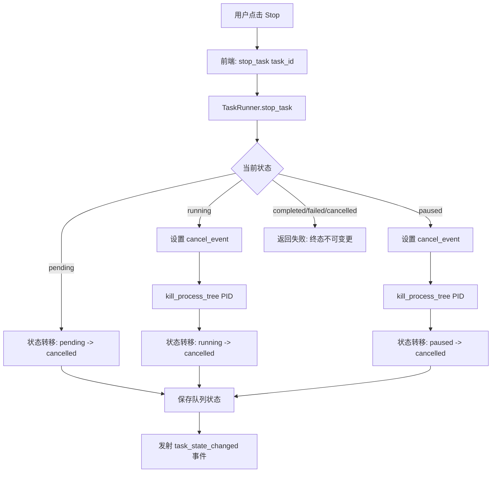
```mermaid
flowchart TD
    A[用户点击 Stop] --> B[前端: stop_task task_id]
    B --> C[TaskRunner.stop_task]
    C --> D{当前状态}
    D -->|pending| E[状态转移: pending -> cancelled]
    D -->|running| F[设置 cancel_event]
    F --> G[kill_process_tree PID]
    G --> H[状态转移: running -> cancelled]
    D -->|paused| I[设置 cancel_event]
    I --> J[kill_process_tree PID]
    J --> K[状态转移: paused -> cancelled]
    D -->|completed/failed/cancelled| L[返回失败: 终态不可变更]
    E --> M[保存队列状态]
    H --> M
    K --> M
    M --> N[发射 task_state_changed 事件]
```

## 6. 批量操作流程

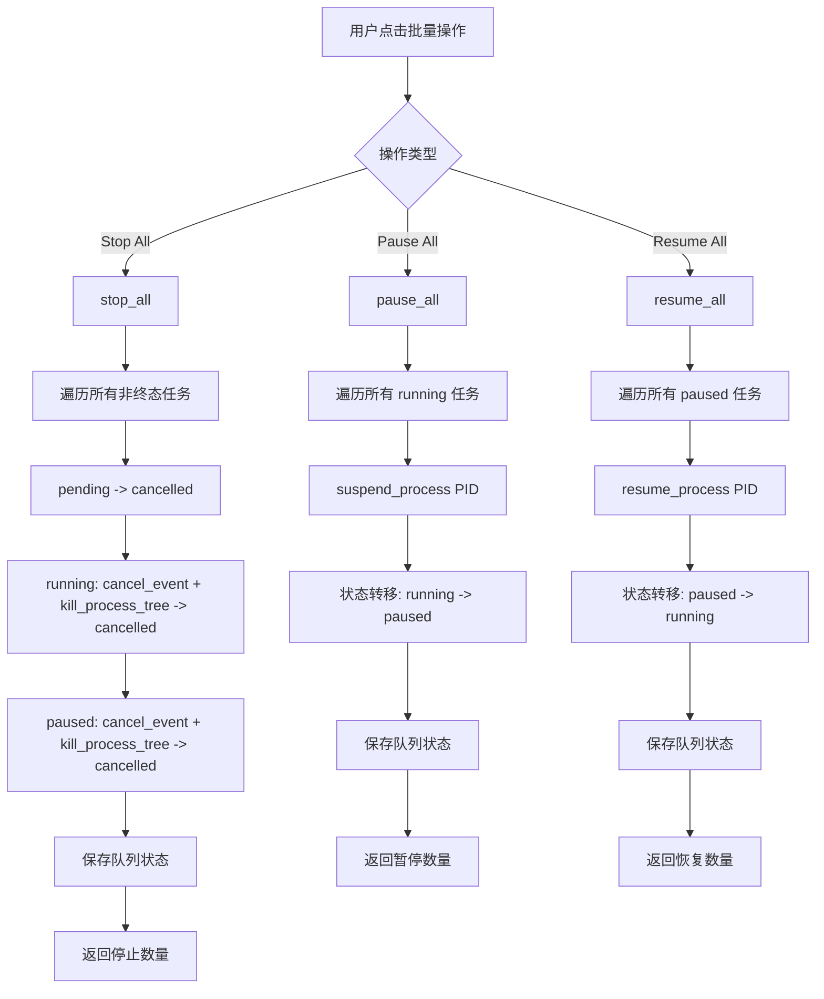
```mermaid
flowchart TD
    A[用户点击批量操作] --> B{操作类型}
    B -->|Stop All| C[stop_all]
    B -->|Pause All| D[pause_all]
    B -->|Resume All| E[resume_all]

    C --> C1[遍历所有非终态任务]
    C1 --> C2[pending -> cancelled]
    C2 --> C3[running: cancel_event + kill_process_tree -> cancelled]
    C3 --> C4[paused: cancel_event + kill_process_tree -> cancelled]
    C4 --> C5[保存队列状态]
    C5 --> C6[返回停止数量]

    D --> D1[遍历所有 running 任务]
    D1 --> D2[suspend_process PID]
    D2 --> D3[状态转移: running -> paused]
    D3 --> D4[保存队列状态]
    D4 --> D5[返回暂停数量]

    E --> E1[遍历所有 paused 任务]
    E1 --> E2[resume_process PID]
    E2 --> E3[状态转移: paused -> running]
    E3 --> E4[保存队列状态]
    E4 --> E5[返回恢复数量]
```

## 7. 预设管理流程

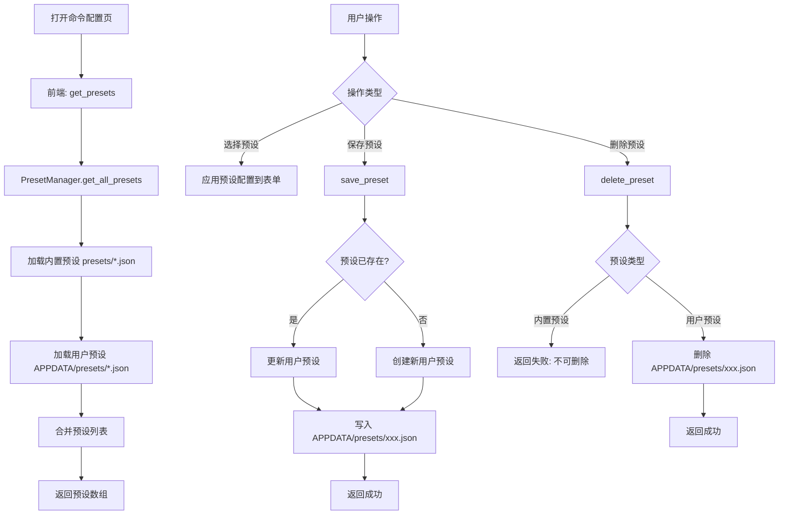
```mermaid
flowchart TD
    A[打开命令配置页] --> B[前端: get_presets]
    B --> C[PresetManager.get_all_presets]
    C --> D[加载内置预设 presets/*.json]
    D --> E[加载用户预设 APPDATA/presets/*.json]
    E --> F[合并预设列表]
    F --> G[返回预设数组]

    H[用户操作] --> I{操作类型}
    I -->|选择预设| J[应用预设配置到表单]
    I -->|保存预设| K[save_preset]
    I -->|删除预设| L[delete_preset]

    K --> K1{预设已存在?}
    K1 -->|是| K2[更新用户预设]
    K1 -->|否| K3[创建新用户预设]
    K2 --> K4[写入 APPDATA/presets/xxx.json]
    K3 --> K4
    K4 --> K5[返回成功]

    L --> L1{预设类型}
    L1 -->|内置预设| L2[返回失败: 不可删除]
    L1 -->|用户预设| L3[删除 APPDATA/presets/xxx.json]
    L3 --> L4[返回成功]
```

## 8. 命令预览流程

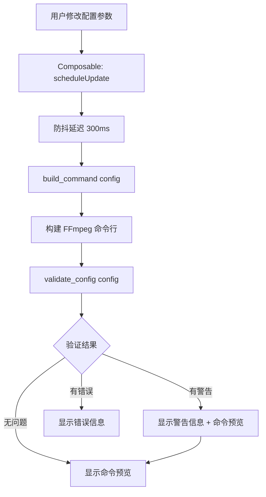
```mermaid
flowchart TD
    A[用户修改配置参数] --> B[Composable: scheduleUpdate]
    B --> C[防抖延迟 300ms]
    C --> D[build_command config]
    D --> E[构建 FFmpeg 命令行]
    E --> F[validate_config config]
    F --> G{验证结果}
    G -->|无问题| H[显示命令预览]
    G -->|有警告| I[显示警告信息 + 命令预览]
    G -->|有错误| J[显示错误信息]
    I --> H
```

## 9. 应用关闭流程

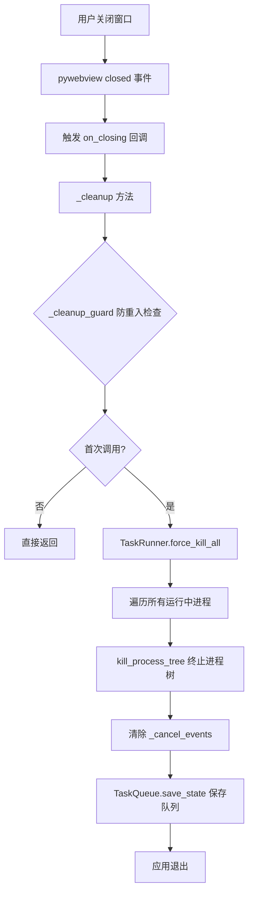
```mermaid
flowchart TD
    A[用户关闭窗口] --> B[pywebview closed 事件]
    B --> C[触发 on_closing 回调]
    C --> D[_cleanup 方法]
    D --> E{_cleanup_guard 防重入检查}
    E --> F{首次调用?}
    F -->|否| G[直接返回]
    F -->|是| H[TaskRunner.force_kill_all]
    H --> I[遍历所有运行中进程]
    I --> J[kill_process_tree 终止进程树]
    J --> K[清除 _cancel_events]
    K --> L[TaskQueue.save_state 保存队列]
    L --> M[应用退出]
```

## 10. 队列恢复流程

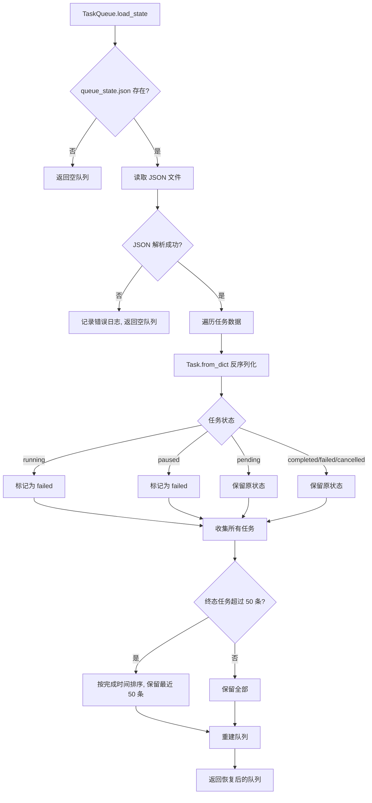
```mermaid
flowchart TD
    A[TaskQueue.load_state] --> B{queue_state.json 存在?}
    B -->|否| C[返回空队列]
    B -->|是| D[读取 JSON 文件]
    D --> E{JSON 解析成功?}
    E -->|否| F[记录错误日志, 返回空队列]
    E -->|是| G[遍历任务数据]
    G --> H[Task.from_dict 反序列化]
    H --> I{任务状态}
    I -->|running| J[标记为 failed]
    I -->|paused| K[标记为 failed]
    I -->|pending| L[保留原状态]
    I -->|completed/failed/cancelled| M[保留原状态]
    J --> N[收集所有任务]
    K --> N
    L --> N
    M --> N
    N --> O{终态任务超过 50 条?}
    O -->|是| P[按完成时间排序, 保留最近 50 条]
    O -->|否| Q[保留全部]
    P --> R[重建队列]
    Q --> R
    R --> S[返回恢复后的队列]
```
