# 业务流程

## 版本变更索引

<!-- 本文件按功能流程组织，每条流程标注了新增/修改的版本 -->

| 版本 | 新增/修改流程 | 说明 |
|------|---------|------|
| v2.1.0 | FFmpeg 版本切换流程 | 新增版本切换与实时更新流程 |
| v2.1.0 | 任务 Reset 流程 | 新增 Reset 流程 |
| v2.1.0 | Download FFmpeg 流程 | 新增下载确认流程 |
| v2.1.0 | 主题切换流程 | 新增主题切换流程 |
| v2.1.0 / Phase 3 | 硬件编码器检测流程 | Phase 3 新增 |
| v2.1.0 / Phase 3 | 视频剪辑流程 | Phase 3 新增 |
| v2.1.0 / Phase 3 | 多视频拼接流程 | Phase 3 新增 |
| v2.1.0 / Phase 3 | 音频字幕混合流程 | Phase 3 新增 |
| v2.1.0 / Phase 3 | 横竖屏转换流程 | Phase 3 新增 |
| v2.1.0 / Phase 3.5 | 编码器质量自动填充流程 | Phase 3.5 新增 |
| v2.1.0 / Phase 3.5 | 自定义命令流程 | Phase 3.5 新增 |
| v2.1.0 / Phase 3.5 | 片头片尾拼接流程 | Phase 3.5 新增 |
| v2.1.0 / Phase 3.5 | 剪辑条件包含流程 | Phase 3.5 新增 |
| v2.1.0 / Phase 3.5.1 | 滤镜互斥清理流程 | Phase 3.5.1 新增 |
| v2.1.0 / Phase 3.5.2 | Merge 独立提交流程 | Phase 3.5.2 新增 |
| v2.1.0 / Phase 3.5.2 | Concat 列表文件创建流程 | Phase 3.5.2 新增 |
| v2.1.0 / Phase 3.5.2 | Intro/Outro 全局应用流程 | Phase 3.5.2 新增 |
| v2.1.0 / Phase 4 | 语言切换流程 | Phase 4 新增国际化 |
| v2.1.0 / Phase 4 | 数据目录迁移流程 | Phase 4 新增 |
| v2.1.0 / Phase 4 | FFmpeg 平台下载流程 | Phase 4 新增 |
| v2.1.0 / Phase 5 | 打开文件夹流程 | Phase 5 新增 UX 优化 |
| v2.1.0 / Phase 5 | 任务状态变更重新获取流程 | Phase 5 新增 |
| v2.1.1 | 命令预览流程（重写） | v2.1.1 重写，合并 IPC |
| v2.1.1 | 文件探测异步流程 | v2.1.1 新增 |
| v2.1.1 | FFmpeg 下载完成流程（修改） | v2.1.1 改为事件驱动 |
| v2.2.0 / Phase 1 | Auto-Editor 路径设置流程 | 新增 |
| v2.2.0 / Phase 1 | Auto-Editor 任务添加流程 | 新增 |
| v2.2.0 / Phase 1 | Auto-Editor 任务执行流程 | 新增 |
| v2.2.0 / Phase 1 | Auto-Editor 编码器查询流程 | 新增 |
| v2.2.0 / Phase 2 | Auto-Editor 页面初始化流程 | 新增前端状态检查与 composable 初始化 |
| v2.2.0 / Phase 2 | Auto-Editor 命令预览流程 | 新增 debounced 命令预览与类型切换 |
| v2.2.0 / Phase 3 | Auto-Editor 动作值更新流程 | 新增 speed/volume action 值动态显隐 |
| v2.2.0 / Phase 4 | Auto-Editor 编码器查询流程 | 新增 Advanced Tab 编码器动态查询与范围列表管理 |
| v2.2.0 / Phase 5 | Auto-Editor 路径设置流程（Settings 页面） | 新增 Settings 页面 auto-editor 配置流程 |
| v2.2.0 / Phase 5 | Auto-Editor 任务队列集成流程 | 新增 auto-editor 任务在队列中的展示与控制 |

---

## FFmpeg 管理流程

### FFmpeg 版本切换流程

<!-- v2.1.0-CHANGE: 行3-行25 新增版本切换与实时更新流程 -->

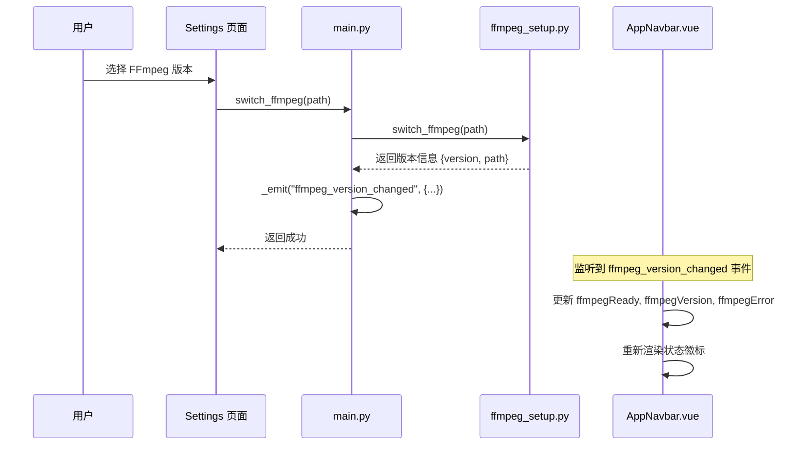
```mermaid
sequenceDiagram
    participant User as 用户
    participant Settings as Settings 页面
    participant Main as main.py
    participant Setup as ffmpeg_setup.py
    participant Navbar as AppNavbar.vue

    User->>Settings: 选择 FFmpeg 版本
    Settings->>Main: switch_ffmpeg(path)
    Main->>Setup: switch_ffmpeg(path)
    Setup-->>Main: 返回版本信息 {version, path}
    Main->>Main: _emit("ffmpeg_version_changed", {...})
    Main-->>Settings: 返回成功
    Note over Navbar: 监听到 ffmpeg_version_changed 事件
    Navbar->>Navbar: 更新 ffmpegReady, ffmpegVersion, ffmpegError
    Navbar->>Navbar: 重新渲染状态徽标
```

#### 流程说明

1. 用户在 Settings 页面的 FFmpeg 面板中选择一个版本
2. 前端调用 `switch_ffmpeg(path)` Bridge API
3. 后端执行 FFmpeg 版本切换，验证路径有效性
4. 后端通过 `_emit("ffmpeg_version_changed")` 广播事件
5. AppNavbar 监听事件并实时更新 FFmpeg 状态徽标

---

### Download FFmpeg 流程

<!-- v2.1.0-CHANGE: 行60-行82 新增下载确认流程 -->
<!-- v2.1.1-CHANGE: 下载完成机制从固定超时改为事件驱动，详见 v2.1.1 节 -->

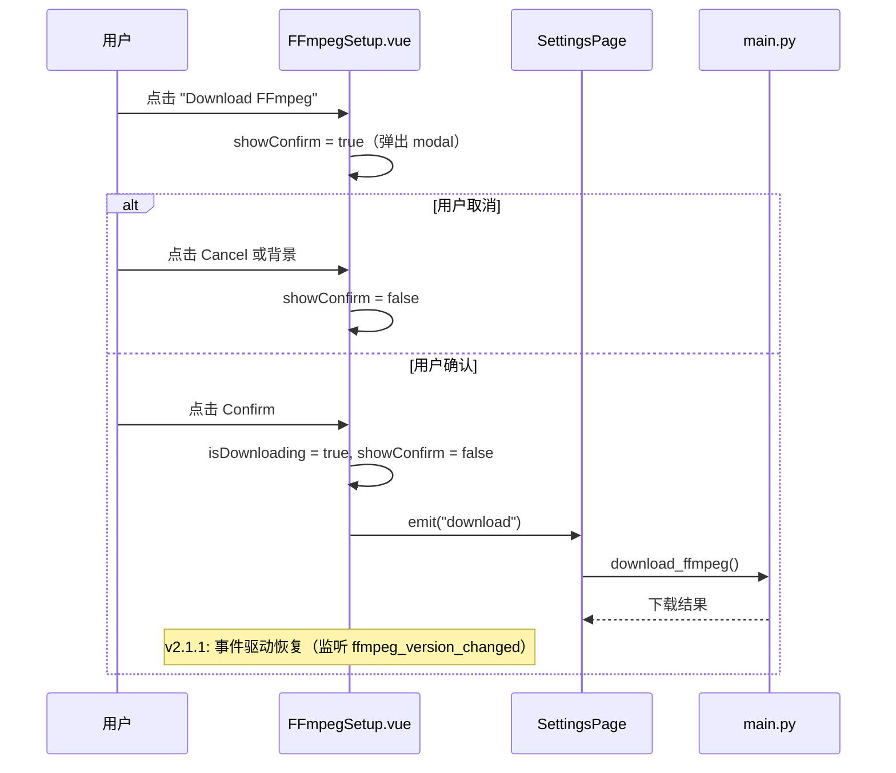
```mermaid
sequenceDiagram
    participant User as 用户
    participant FFmpegSetup as FFmpegSetup.vue
    participant Parent as SettingsPage
    participant Main as main.py

    User->>FFmpegSetup: 点击 "Download FFmpeg"
    FFmpegSetup->>FFmpegSetup: showConfirm = true（弹出 modal）
    alt 用户取消
        User->>FFmpegSetup: 点击 Cancel 或背景
        FFmpegSetup->>FFmpegSetup: showConfirm = false
    else 用户确认
        User->>FFmpegSetup: 点击 Confirm
        FFmpegSetup->>FFmpegSetup: isDownloading = true, showConfirm = false
        FFmpegSetup->>Parent: emit("download")
        Parent->>Main: download_ffmpeg()
        Main-->>Parent: 下载结果
        Note over FFmpegSetup: v2.1.1: 事件驱动恢复（监听 ffmpeg_version_changed）
    end
```

#### 流程说明

1. Download FFmpeg 按钮始终可见（不受 FFmpeg 当前状态影响）
2. 点击后弹出 DaisyUI modal 确认对话框
3. 用户确认后：设置 loading 状态 -> 触发 download 事件 -> 父组件处理后端调用
4. 下载过程中按钮禁用并显示 spinner
5. detecting 状态时按钮也禁用
6. **v2.1.1**: 下载完成通过监听 `ffmpeg_version_changed` 事件恢复，不再使用固定 5 秒超时

---

### FFmpeg 平台下载流程

<!-- v2.1.0-CHANGE: Phase 4 新增流程 -->

```
用户 -> SettingsPage -> FFmpegSetup.vue: 点击按钮
-> if platform === "win32":
  -> 弹出 DaisyUI modal 确认对话框
  -> 确认 -> call("download_ffmpeg")
  -> main.py: static_ffmpeg.add_paths() 下载
  -> 成功 -> ffmpeg_version_changed 事件
-> else:
  -> 显示平台安装提示 (非按钮，静态文本)
  -> macOS: "brew install ffmpeg" + brew.sh 链接
  -> Linux: 对应包管理器命令
```

#### 非 Windows 调用 download_ffmpeg:

```
main.py: download_ffmpeg()
-> sys.platform != "win32"
-> 返回 {"success": False, "error": "download_not_supported", "data": {"platform": "darwin", "instructions": {"method": "homebrew", "command": "brew install ffmpeg", "url": "https://brew.sh"}}}
```

---

### FFmpeg 下载完成流程（v2.1.1 重写）

<!-- v2.1.1-CHANGE: 修改下载完成流程，从固定超时改为事件驱动 -->

```
用户 -> SettingsPage -> FFmpegSetup.vue: 点击 "Download FFmpeg"
-> 弹出 DaisyUI modal 确认对话框
-> 用户确认:
  -> isDownloading = true, showConfirm = false
  -> emit("download")
  -> Parent -> call("download_ffmpeg")
  -> main.py -> static_ffmpeg.add_paths() 下载
  -> 下载完成:
    -> _emit("ffmpeg_version_changed", {version, path, status: "ready"})
    -> _emit("ffmpeg_version_changed", {version, path, status: "not_found"})  // 失败时
  -> FFmpegSetup.vue 监听 ffmpeg_version_changed:
    -> status === "ready":
      -> isDownloading = false
        -> 更新版本号显示
    -> status === "not_found":
      -> isDownloading = false
        -> 显示下载失败错误提示
```

#### v2.1.0 对比:

- v2.1.0: `setTimeout(() => isDownloading = false, 5000)` 固定 5 秒超时，慢速网络 spinner 提前消失
- v2.1.1: 事件驱动，下载真正完成/失败后才恢复 UI 状态

---

## 任务状态流程

### 任务 Reset 流程

<!-- v2.1.0-CHANGE: 行30-行55 新增 Reset 流程 -->

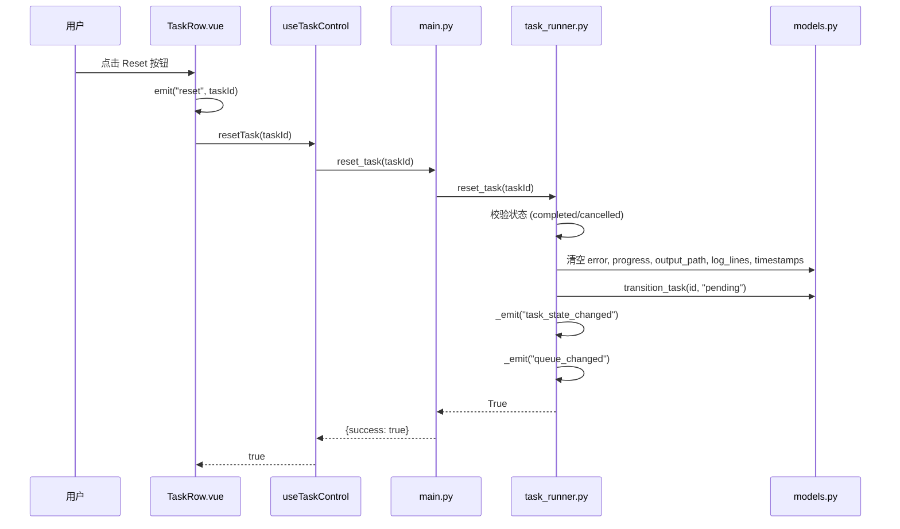
```mermaid
sequenceDiagram
    participant User as 用户
    participant TaskRow as TaskRow.vue
    participant Control as useTaskControl
    participant Main as main.py
    participant Runner as task_runner.py
    participant Model as models.py

    User->>TaskRow: 点击 Reset 按钮
    TaskRow->>TaskRow: emit("reset", taskId)
    TaskRow->>Control: resetTask(taskId)
    Control->>Main: reset_task(taskId)
    Main->>Runner: reset_task(taskId)
    Runner->>Runner: 校验状态 (completed/cancelled)
    Runner->>Model: 清空 error, progress, output_path, log_lines, timestamps
    Runner->>Model: transition_task(id, "pending")
    Runner->>Runner: _emit("task_state_changed")
    Runner->>Runner: _emit("queue_changed")
    Runner-->>Main: True
    Main-->>Control: {success: true}
    Control-->>TaskRow: true
```

#### 流程说明

1. 用户在 completed/cancelled 任务的 Action 列点击 Reset 按钮
2. TaskRow 发射 `reset` 事件，TaskQueuePage 调用 `useTaskControl.resetTask(id)`
3. composable 调用后端 `reset_task(id)` Bridge API
4. `task_runner.reset_task` 执行：
   - 校验任务状态为 completed 或 cancelled
   - 清空所有运行时数据（error, progress, output_path, log_lines, started_at, completed_at）
   - 调用 `transition_task` 将状态转为 pending
   - 广播 `task_state_changed` 和 `queue_changed` 事件
5. 前端通过事件更新 UI，任务回到 pending 状态

---

### 任务状态变更重新获取流程

<!-- v2.1.0-CHANGE: Phase 5 新增 -->

```
后端: task_runner._run_task() 完成
-> _emit("task_state_changed", {task_id, old_state, new_state: "completed"})
-> useTaskQueue.ts: on("task_state_changed", handler)
-> handler: 局部更新 task.state (乐观更新)
-> handler: 检查 new_state === "completed" || new_state === "failed"
  -> 是: 调用 fetchTasks() 完整重新获取
  -> 否: 仅使用局部更新
-> fetchTasks(): call("get_tasks") -> tasks.value = res.data
-> TaskRow.vue: output_path 已填充 -> 显示"打开文件夹"按钮
```

#### 流程说明:

1. 后端任务完成/失败时广播 `task_state_changed` 事件，事件仅包含 `{task_id, old_state, new_state}`
2. 前端先做乐观更新（局部修改 task.state），立即反映状态变化
3. 对于终态（completed/failed），额外调用 `fetchTasks()` 获取完整数据（包括 output_path、error 等）
4. 这样无需用户手动刷新页面，completed 任务立即显示"打开文件夹"按钮

---

### 打开文件夹流程

<!-- v2.1.0-CHANGE: Phase 5 新增 -->

```
用户 -> TaskRow.vue: 看到 completed 任务的"打开文件夹"按钮
-> 点击按钮 -> call("open_folder", task.output_path)
-> main.py: open_folder(path)
  -> folder = os.path.dirname(path) if os.path.isfile(path) else path
  -> if sys.platform == "win32": os.startfile(folder)
  -> elif sys.platform == "darwin": subprocess.Popen(["open", folder])
  -> else: subprocess.Popen(["xdg-open", folder])
  -> return {success: True}
-> TaskRow.vue: 无需额外处理（调用静默失败）
```

#### 流程说明:

1. 任务完成后，后端设置 `output_path`，前端通过重新获取任务列表获得该字段
2. TaskRow 条件渲染：`task.state === 'completed' && task.output_path` 时显示按钮
3. 点击后调用 `open_folder` Bridge API，后端根据平台选择打开方式
4. 失败时前端静默处理（不弹错误提示），避免干扰用户操作

---

## 主题切换流程

<!-- v2.1.0-CHANGE: 行87-行105 新增主题切换流程 -->

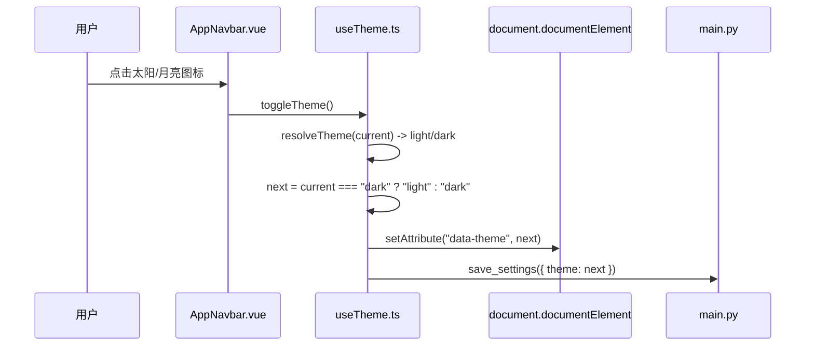
```mermaid
sequenceDiagram
    participant User as 用户
    participant Navbar as AppNavbar.vue
    participant Theme as useTheme.ts
    participant DOM as document.documentElement
    participant Backend as main.py

    User->>Navbar: 点击太阳/月亮图标
    Navbar->>Theme: toggleTheme()
    Theme->>Theme: resolveTheme(current) -> light/dark
    Theme->>Theme: next = current === "dark" ? "light" : "dark"
    Theme->>DOM: setAttribute("data-theme", next)
    Theme->>Backend: save_settings({ theme: next })
```

### 流程说明

1. 用户点击导航栏的主题切换按钮
2. `toggleTheme()` 解析当前实际主题，切换到相反主题
3. 通过修改 `data-theme` 属性切换 DaisyUI 主题
4. 异步保存到后端 settings.json（失败不影响本地主题）
5. auto 模式下监听系统主题变化事件自动更新

#### auto 模式解析:

1. 启动时读取 settings.language，若为 "auto" 则读取 navigator.language
2. 匹配优先级：zh-CN > zh > en > fallback "zh-CN"

---

## 命令构建流程

### 硬件编码器检测流程

<!-- v2.1.0-CHANGE: Phase 3 新增命令构建相关流程 -->

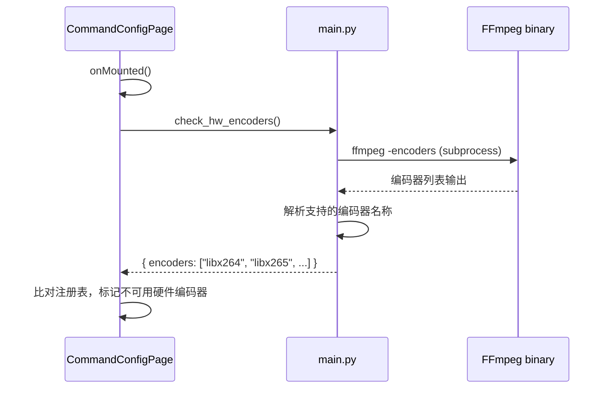
```mermaid
sequenceDiagram
    participant App as CommandConfigPage
    participant Main as main.py
    participant FFmpeg as FFmpeg binary

    App->>App: onMounted()
    App->>Main: check_hw_encoders()
    Main->>FFmpeg: ffmpeg -encoders (subprocess)
    FFmpeg-->>Main: 编码器列表输出
    Main->>Main: 解析支持的编码器名称
    Main-->>App: { encoders: ["libx264", "libx265", ...] }
    App->>App: 比对注册表，标记不可用硬件编码器
```

#### 流程说明

1. 命令配置页面加载时调用 `check_hw_encoders()` Bridge API
2. 后端执行 `ffmpeg -encoders` 获取所有可用编码器
3. 解析输出文本中的编码器名称列表
4. 前端将检测结果与编码器注册表比对
5. 不在支持列表中的硬件编码器在 UI 中灰显

---

### 视频剪辑流程

<!-- v2.1.0-CHANGE: Phase 3 新增 -->

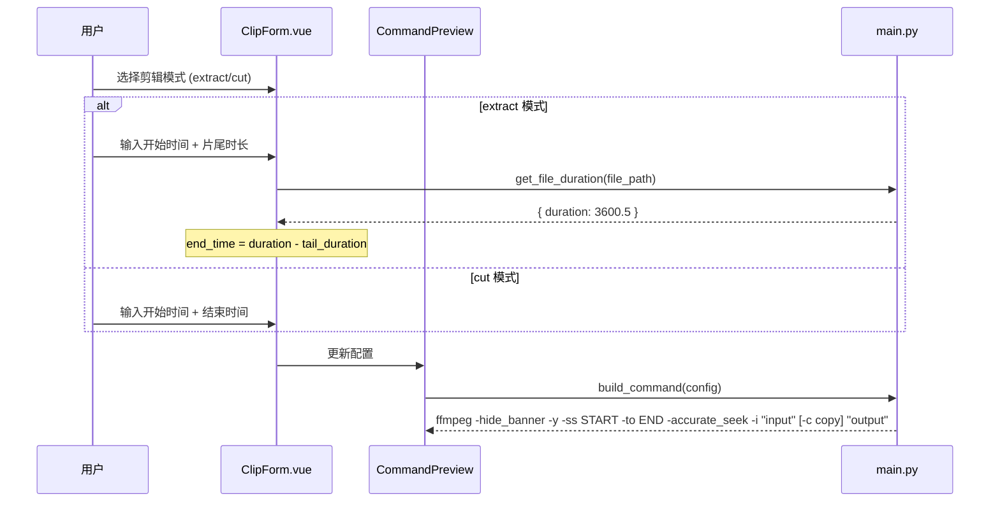
```mermaid
sequenceDiagram
    participant User as 用户
    participant ClipForm as ClipForm.vue
    participant Preview as CommandPreview
    participant Main as main.py

    User->>ClipForm: 选择剪辑模式 (extract/cut)
    alt extract 模式
        User->>ClipForm: 输入开始时间 + 片尾时长
        ClipForm->>Main: get_file_duration(file_path)
        Main-->>ClipForm: { duration: 3600.5 }
        Note over ClipForm: end_time = duration - tail_duration
    else cut 模式
        User->>ClipForm: 输入开始时间 + 结束时间
    end
    ClipForm->>Preview: 更新配置
    Preview->>Main: build_command(config)
    Main-->>Preview: ffmpeg -hide_banner -y -ss START -to END -accurate_seek -i "input" [-c copy] "output"
```

#### 流程说明

1. 用户在命令配置页的"剪辑"选项卡中操作
2. 选择 extract 模式：输入开始时间和片尾时长，后端自动获取文件时长并计算结束时间
3. 选择 cut 模式：直接输入开始和结束时间戳
4. 时间格式转换：UI 的 `H:mm:ss.fff` 转换为 FFmpeg 的 `HH:MM:SS.mmm`（第8个冒号替换为点号）
5. 默认使用 `-c copy` 无损快速剪辑，禁用时使用当前 TranscodeConfig 重新编码
6. 命令预览实时更新

---

### 多视频拼接流程

<!-- v2.1.0-CHANGE: Phase 3 新增 -->

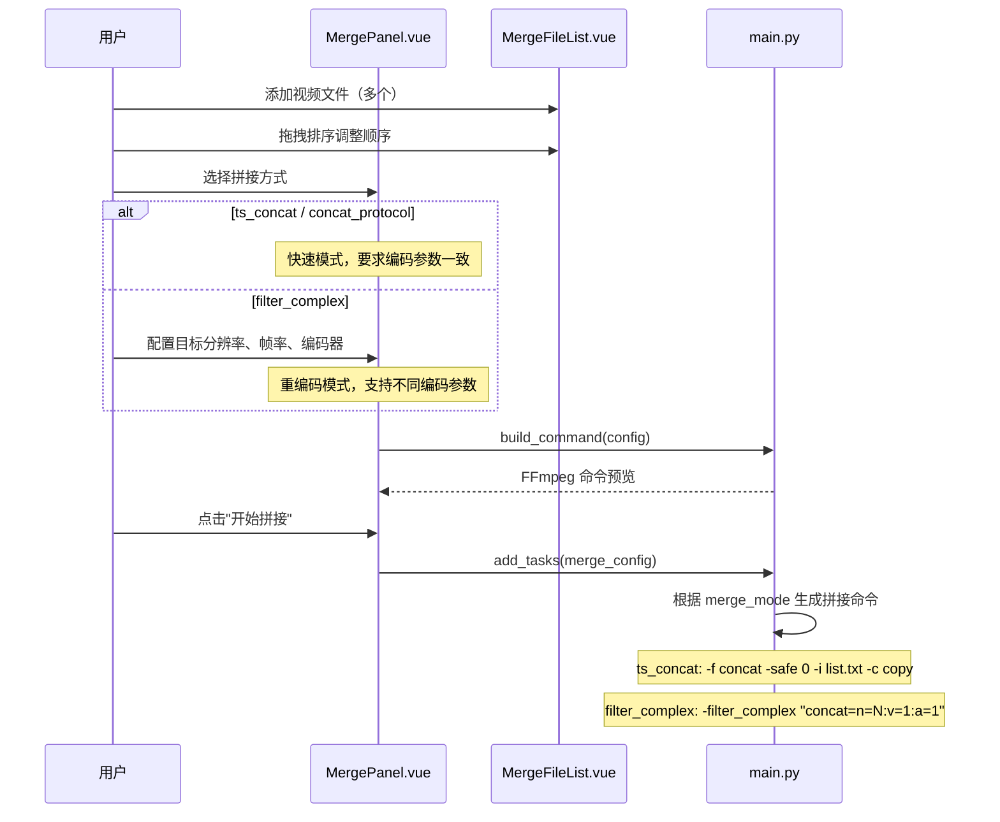
```mermaid
sequenceDiagram
    participant User as 用户
    participant Merge as MergePanel.vue
    participant FileList as MergeFileList.vue
    participant Main as main.py

    User->>FileList: 添加视频文件（多个）
    User->>FileList: 拖拽排序调整顺序
    User->>Merge: 选择拼接方式
    alt ts_concat / concat_protocol
        Note over Merge: 快速模式，要求编码参数一致
    else filter_complex
        User->>Merge: 配置目标分辨率、帧率、编码器
        Note over Merge: 重编码模式，支持不同编码参数
    end
    Merge->>Main: build_command(config)
    Main-->>Merge: FFmpeg 命令预览

    User->>Merge: 点击"开始拼接"
    Merge->>Main: add_tasks(merge_config)
    Main->>Main: 根据 merge_mode 生成拼接命令
    Note over Main: ts_concat: -f concat -safe 0 -i list.txt -c copy
    Note over Main: filter_complex: -filter_complex "concat=n=N:v=1:a=1"
```

#### 流程说明

1. 用户通过文件列表组件添加 2 个或以上视频文件
2. 支持拖拽排序调整拼接顺序
3. 选择拼接方式：默认 ts_concat（最快）
4. filter_complex 模式可配置目标分辨率、帧率和编码器进行标准化
5. 命令预览实时显示生成的 FFmpeg 命令
6. 开始拼接后作为任务添加到任务队列执行

---

### 音频字幕混合流程

<!-- v2.1.0-CHANGE: Phase 3 新增 -->

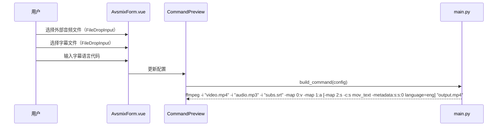
```mermaid
sequenceDiagram
    participant User as 用户
    participant Avsmix as AvsmixForm.vue
    participant Preview as CommandPreview
    participant Main as main.py

    User->>Avsmix: 选择外部音频文件（FileDropInput）
    User->>Avsmix: 选择字幕文件（FileDropInput）
    User->>Avsmix: 输入字幕语言代码
    Avsmix->>Preview: 更新配置
    Preview->>Main: build_command(config)
    Main-->>Preview: ffmpeg -i "video.mp4" -i "audio.mp3" -i "subs.srt" -map 0:v -map 1:a [-map 2:s -c:s mov_text -metadata:s:s:0 language=eng] "output.mp4"
```

#### 流程说明

1. 用户在"音频/字幕"选项卡中操作
2. 通过 FileDropInput 组件拖拽或选择外部音频/字幕文件
3. 可选输入字幕语言代码（如 `chi`, `eng`）
4. 命令通过额外的 `-i` 输入和 `-map` 流映射实现混合
5. 字幕使用 mov_text 编码器嵌入 MP4 容器
6. 此功能与转码/滤镜配置可叠加使用

---

### 横竖屏转换流程

<!-- v2.1.0-CHANGE: Phase 3 新增 -->

```mermaid
sequenceDiagram
    participant User as 用户
    participant Filter as FilterForm.vue
    participant Preview as CommandPreview
    participant Main as main.py

    User->>Filter: 选择横竖屏转换模式
    alt I 模式（背景图片）
        User->>Filter: 选择背景图片（FileDropInput）
    end
    User->>Filter: 设置目标分辨率（默认 1080x1920）
    Filter->>Preview: 更新配置
    Preview->>Main: build_command(config)

    alt H2V-I（横转竖+图片背景）
        Note over Main: -filter_complex "[1:v]scale=W:H,setsar=1,loop=-1:size=duration[bg];[0:v]scale=W:-2,setsar=1[v];[bg][v]overlay=(W-w)/2:(H-h)/2:shortest=1[vout]"
    else H2V-T（横转竖+模糊视频背景）
        Note over Main: -filter_complex "split=2[v_main][v_bg];scale,boxblur,scale[bg_blurred];overlay"
    else H2V-B（横转竖+黑色填充）
        Note over Main: scale + pad
    end
```

#### 流程说明

1. 用户在滤镜配置中选择 aspect_convert 模式
2. I 模式（H2V-I/V2H-I）需额外提供背景图片
3. T 模式（H2V-T/V2H-T）使用视频自身模糊作为背景
4. B 模式（H2V-B/V2H-B）使用黑色填充（最简单）
5. 所有模式均使用 `-filter_complex`，需要处理多输入流
6. 启用横竖屏转换时，基础滤镜（crop/rotate/watermark）应被禁用

---

### 编码器质量自动填充流程

<!-- v2.1.0-CHANGE: Phase 3.5 新增 -->

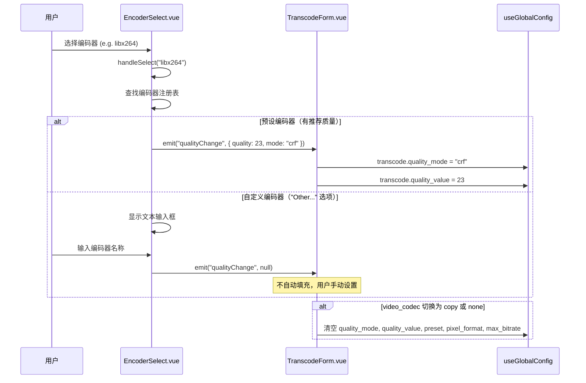
```mermaid
sequenceDiagram
    participant User as 用户
    participant EncoderSelect as EncoderSelect.vue
    participant TranscodeForm as TranscodeForm.vue
    participant Config as useGlobalConfig

    User->>EncoderSelect: 选择编码器 (e.g. libx264)
    EncoderSelect->>EncoderSelect: handleSelect("libx264")
    EncoderSelect->>EncoderSelect: 查找编码器注册表
    alt 预设编码器（有推荐质量）
        EncoderSelect->>TranscodeForm: emit("qualityChange", { quality: 23, mode: "crf" })
        TranscodeForm->>Config: transcode.quality_mode = "crf"
        TranscodeForm->>Config: transcode.quality_value = 23
    else 自定义编码器（"Other..." 选项）
        EncoderSelect->>EncoderSelect: 显示文本输入框
        User->>EncoderSelect: 输入编码器名称
        EncoderSelect->>TranscodeForm: emit("qualityChange", null)
        Note over TranscodeForm: 不自动填充，用户手动设置
    end
    alt video_codec 切换为 copy 或 none
        TranscodeForm->>Config: 清空 quality_mode, quality_value, preset, pixel_format, max_bitrate
    end
```

#### 流程说明

1. 用户从 EncoderSelect 下拉列表选择预设编码器
2. 组件查找编码器注册表中的 `recommendedQuality` 和 `qualityMode`
3. 通过 `qualityChange` 事件传递给 TranscodeForm，自动填充质量参数
4. 选择 "Other (custom name)..." 选项时，显示文本输入框
5. 自定义编码器不触发自动填充（`qualityChange` 返回 null）
6. 当 video_codec 切换为 copy 或 none 时，清空所有质量相关字段

---

### 自定义命令流程

<!-- v2.1.0-CHANGE: Phase 3.5 新增 -->

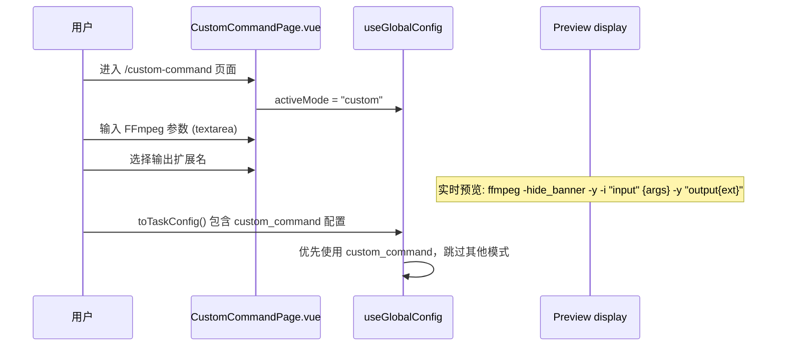
```mermaid
sequenceDiagram
    participant User as 用户
    participant Page as CustomCommandPage.vue
    participant Config as useGlobalConfig
    participant Preview as Preview display

    User->>Page: 进入 /custom-command 页面
    Page->>Config: activeMode = "custom"
    User->>Page: 输入 FFmpeg 参数 (textarea)
    User->>Page: 选择输出扩展名
    Note over Preview: 实时预览: ffmpeg -hide_banner -y -i "input" {args} -y "output{ext}"
    User->>Config: toTaskConfig() 包含 custom_command 配置
    Config->>Config: 优先使用 custom_command，跳过其他模式
```

#### 流程说明

1. 用户通过导航栏或路由进入自定义命令页面
2. 页面设置 `activeMode = "custom"`
3. 用户在 textarea 中输入原始 FFmpeg 参数
4. 可选择输出文件扩展名（默认 .mp4）
5. 页面实时显示完整命令预览（不调用 build_command）
6. `toTaskConfig()` 在 activeMode 为 custom 时优先生成 custom_command 配置
7. 实际执行时直接拼接用户参数，不经过常规命令构建流程

---

### 片头片尾拼接流程

<!-- v2.1.0-CHANGE: Phase 3.5 新增 -->

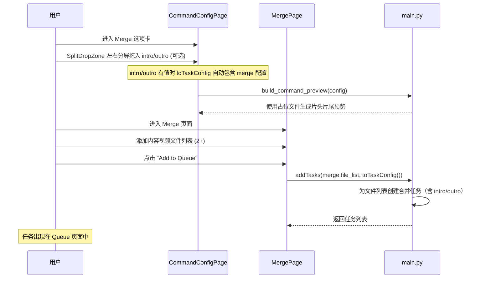
```mermaid
sequenceDiagram
    participant User as 用户
    participant Config as CommandConfigPage
    participant Merge as MergePage
    participant Main as main.py

    User->>Config: 进入 Merge 选项卡
    User->>Config: SplitDropZone 左右分屏拖入 intro/outro (可选)
    Note over Config: intro/outro 有值时 toTaskConfig 自动包含 merge 配置
    Config->>Main: build_command_preview(config)
    Main-->>Config: 使用占位文件生成片头片尾预览

    User->>Merge: 进入 Merge 页面
    User->>Merge: 添加内容视频文件列表 (2+)
    User->>Merge: 点击 "Add to Queue"
    Merge->>Main: addTasks(merge.file_list, toTaskConfig())
    Main->>Main: 为文件列表创建合并任务（含 intro/outro）
    Main-->>Merge: 返回任务列表
    Note over User: 任务出现在 Queue 页面中
```

#### 流程说明

<!-- v2.1.0-CHANGE: Phase 3.5.2 更新 Intro/Outro 流程 -->

1. Intro/Outro 从 Merge 页面移至 Config 页面的 Merge 选项卡
2. 使用 SplitDropZone 实现左右分屏拖拽上传
3. 当 intro_path 或 outro_path 有值时，`toTaskConfig()` 自动包含 merge 配置（无论当前 activeMode）
4. Config 页面的命令预览使用占位文件显示 intro/outro 命令
5. Merge 页面仅保留文件列表、合并模式和 Add to Queue 按钮
6. 提交后为每个内容视频生成独立的合并任务（含 intro/outro）

---

### 剪辑条件包含流程

<!-- v2.1.0-CHANGE: Phase 3.5 新增条件包含规则 -->

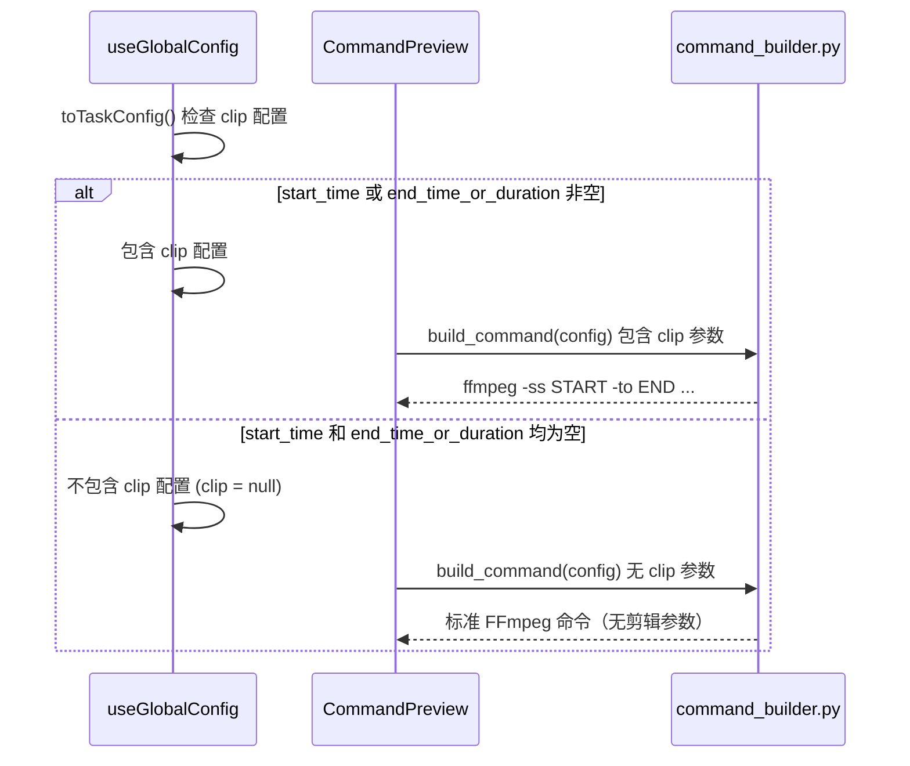
```mermaid
sequenceDiagram
    participant Config as useGlobalConfig
    participant Preview as CommandPreview
    participant Builder as command_builder.py

    Config->>Config: toTaskConfig() 检查 clip 配置
    alt start_time 或 end_time_or_duration 非空
        Config->>Config: 包含 clip 配置
        Preview->>Builder: build_command(config) 包含 clip 参数
        Builder-->>Preview: ffmpeg -ss START -to END ...
    else start_time 和 end_time_or_duration 均为空
        Config->>Config: 不包含 clip 配置 (clip = null)
        Preview->>Builder: build_command(config) 无 clip 参数
        Builder-->>Preview: 标准 FFmpeg 命令（无剪辑参数）
    end
```

#### 流程说明

1. `toTaskConfig()` 检查 clip 的 start_time 和 end_time_or_duration 是否有值
2. 均为空时，`clip` 字段设为 `null`，不传递给 `build_command`
3. `build_command` 仅在 `config.clip` 非空时才调用 `build_clip_command()`

---

### 滤镜互斥清理流程

<!-- v2.1.0-CHANGE: Phase 3.5.1 新增 -->

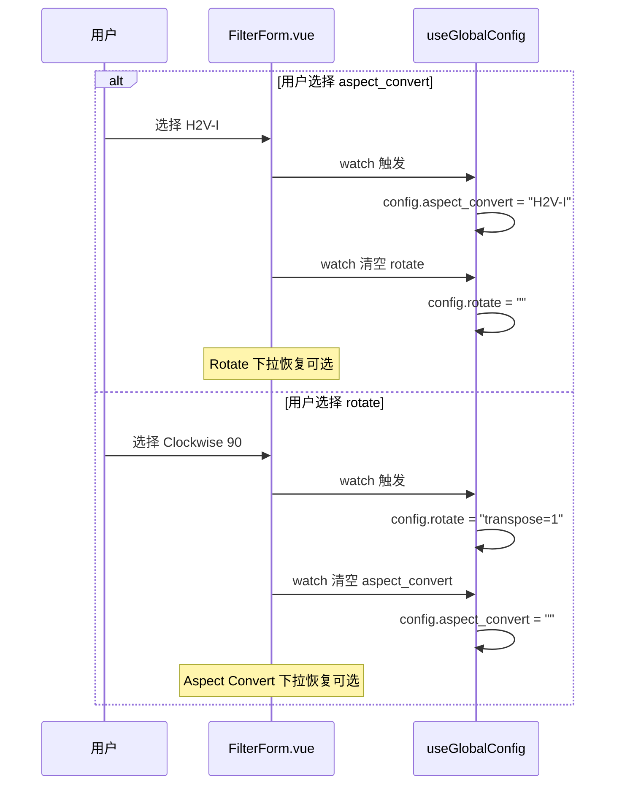
```mermaid
sequenceDiagram
    participant User as 用户
    participant FilterForm as FilterForm.vue
    participant Config as useGlobalConfig

    alt 用户选择 aspect_convert
        User->>FilterForm: 选择 H2V-I
        FilterForm->>Config: watch 触发
        Config->>Config: config.aspect_convert = "H2V-I"
        FilterForm->>Config: watch 清空 rotate
        Config->>Config: config.rotate = ""
        Note over FilterForm: Rotate 下拉恢复可选
    else 用户选择 rotate
        User->>FilterForm: 选择 Clockwise 90
        FilterForm->>Config: watch 触发
        Config->>Config: config.rotate = "transpose=1"
        FilterForm->>Config: watch 清空 aspect_convert
        Config->>Config: config.aspect_convert = ""
        Note over FilterForm: Aspect Convert 下拉恢复可选
    end
```

#### 流程说明

1. FilterForm 通过 `watch` 监听 `aspect_convert` 和 `rotate` 的变化
2. 选择 aspect_convert 时自动清空 rotate，选择 rotate 时自动清空 aspect_convert
3. 修复了此前两个选项可能同时被禁用的 bug，确保始终可以取消选择

---

### Merge 独立提交流程

<!-- v2.1.0-CHANGE: Phase 3.5.2-fixes 新增 -->

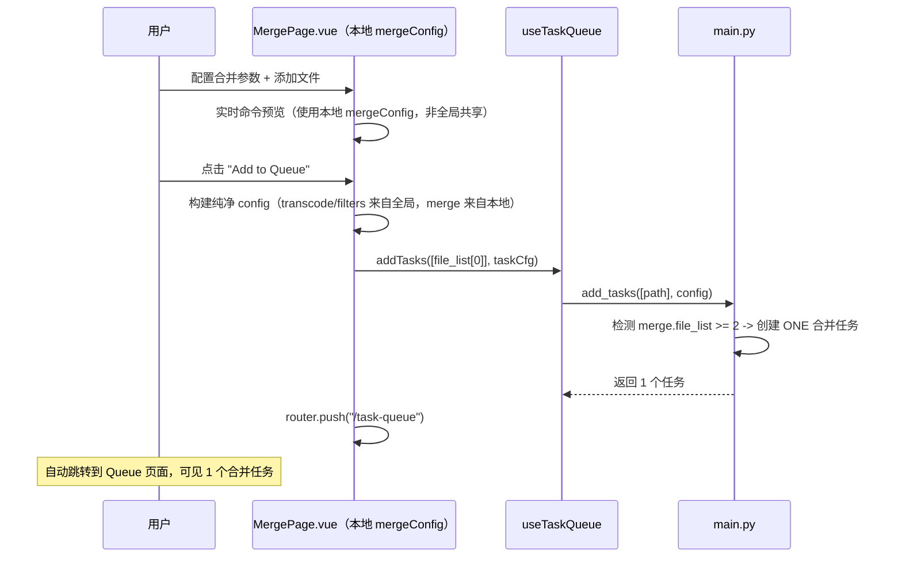
```mermaid
sequenceDiagram
    participant User as 用户
    participant MergePage as MergePage.vue（本地 mergeConfig）
    participant Queue as useTaskQueue
    participant Main as main.py

    User->>MergePage: 配置合并参数 + 添加文件
    MergePage->>MergePage: 实时命令预览（使用本地 mergeConfig，非全局共享）
    User->>MergePage: 点击 "Add to Queue"
    MergePage->>MergePage: 构建纯净 config（transcode/filters 来自全局，merge 来自本地）
    MergePage->>Queue: addTasks([file_list[0]], taskCfg)
    Queue->>Main: add_tasks([path], config)
    Main->>Main: 检测 merge.file_list >= 2 -> 创建 ONE 合并任务
    Main-->>Queue: 返回 1 个任务
    MergePage->>MergePage: router.push("/task-queue")
    Note over User: 自动跳转到 Queue 页面，可见 1 个合并任务
```

#### 流程说明

1. 用户在 Merge 页面配置合并参数并添加文件
2. 命令预览使用本地 `mergeConfig`（不引用全局 merge 单例，避免与 Config 页面 intro/outro 冲突）
3. 点击 "Add to Queue" 时构建纯净配置：仅继承全局 `transcode` + `filters`，merge 使用本地配置
4. 后端检测到 config 包含 `merge.file_list >= 2` 时创建 ONE 任务（给 merge.file_list 第一个文件路径）
5. 添加完成后自动跳转到 Queue 页面 (`router.push("/task-queue")`)

---

### Concat 列表文件创建流程

<!-- v2.1.0-CHANGE: Phase 3.5.2-fixes 新增 -->

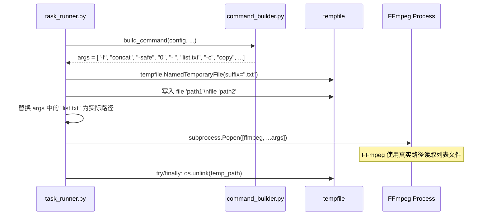
```mermaid
sequenceDiagram
    participant TaskRunner as task_runner.py
    participant Builder as command_builder.py
    participant TempFile as tempfile
    participant FFmpeg as FFmpeg Process

    TaskRunner->>Builder: build_command(config, ...)
    Builder-->>TaskRunner: args = ["-f", "concat", "-safe", "0", "-i", "list.txt", "-c", "copy", ...]
    TaskRunner->>TempFile: tempfile.NamedTemporaryFile(suffix=".txt")
    TaskRunner->>TempFile: 写入 file 'path1'\nfile 'path2'
    TaskRunner->>TaskRunner: 替换 args 中的 "list.txt" 为实际路径
    TaskRunner->>FFmpeg: subprocess.Popen([ffmpeg, ...args])
    Note over FFmpeg: FFmpeg 使用真实路径读取列表文件
    TaskRunner->>TempFile: try/finally: os.unlink(temp_path)
```

#### 流程说明

1. `build_merge_command` 返回 `list.txt` 作为占位符（预览和执行用同一函数）
2. `start_task` 在构建完命令后检查是否为 concat demuxer 模式
3. 创建临时列表文件，内容为 `file 'path1'\nfile 'path2'`
4. 替换 args 中的占位符为临时文件真实路径
5. 提交到线程池执行
6. `_run_task` 通过 `try/finally` 确保临时文件被清理

---

### Intro/Outro 全局应用流程

<!-- v2.1.0-CHANGE: Phase 3.5.2-fixes 新增 -->

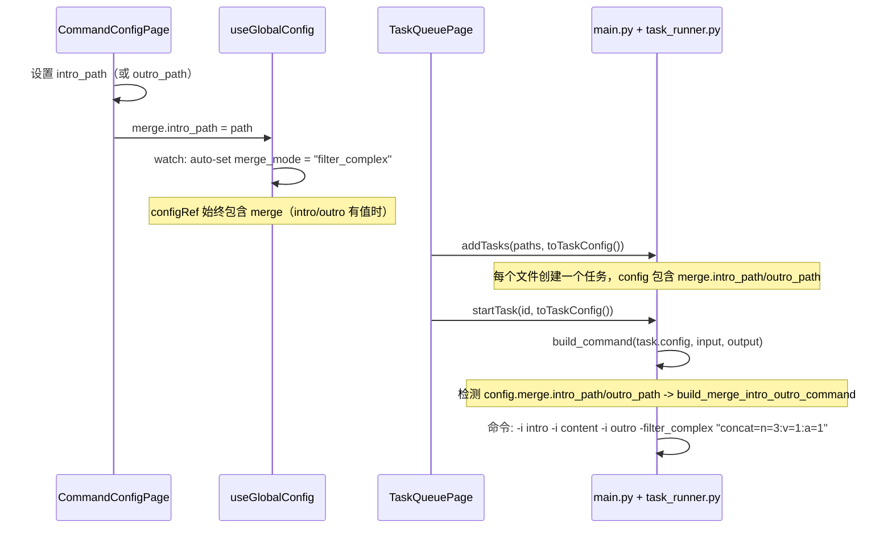
```mermaid
sequenceDiagram
    participant Config as CommandConfigPage
    participant GlobalConfig as useGlobalConfig
    participant Queue as TaskQueuePage
    participant Backend as main.py + task_runner.py

    Config->>Config: 设置 intro_path（或 outro_path）
    Config->>GlobalConfig: merge.intro_path = path
    GlobalConfig->>GlobalConfig: watch: auto-set merge_mode = "filter_complex"
    Note over GlobalConfig: configRef 始终包含 merge（intro/outro 有值时）
    
    Queue->>Backend: addTasks(paths, toTaskConfig())
    Note over Backend: 每个文件创建一个任务，config 包含 merge.intro_path/outro_path
    
    Queue->>Backend: startTask(id, toTaskConfig())
    Backend->>Backend: build_command(task.config, input, output)
    Note over Backend: 检测 config.merge.intro_path/outro_path -> build_merge_intro_outro_command
    Backend->>Backend: 命令: -i intro -i content -i outro -filter_complex "concat=n=3:v=1:a=1"
```

#### 流程说明

1. Config 页面设置 intro/outro → 全局 reactive merge 更新 → watch 自动设 merge_mode 为 filter_complex
2. `toTaskConfig()` 在 intro/outro 有值时始终包含 merge 配置（无论当前 activeMode）
3. Queue 页面添加任务时，每个任务都包含 intro/outro 配置
4. 任务启动时 `build_command` 检测 intro/outro → 调度到 `build_merge_intro_outro_command`
5. Merge 页面任务不受影响：`start_task` 保留任务已有的 merge 配置

---

## 国际化与平台化流程

### 语言切换流程

<!-- v2.1.0-CHANGE: Phase 4 新增 -->

```
用户 -> AppNavbar.vue: 点击语言切换按钮 (CN/EN)
-> useLocale.setLocale("en" | "zh-CN")
-> vue-i18n: i18n.locale.value = "en"
-> 页面所有 t("key") 立即响应切换
-> save_settings({ language: "en" })
-> core/config.py: 持久化到 data/settings.json
```

**auto 模式解析**:
1. 启动时读取 settings.language，若为 "auto" 则读取 navigator.language
2. 匹配优先级：zh-CN > zh > en > fallback "zh-CN"

---

### 数据目录迁移流程

<!-- v2.1.0-CHANGE: Phase 4 新增 -->

```
main.py 启动
-> from core.paths import migrate_if_needed
-> migrate_if_needed()
-> 检查 get_data_dir()/settings.json 是否存在
  -> 存在: 跳过，已迁移
  -> 不存在: 检查旧 APPDATA 路径
    -> 旧路径存在: 复制 settings.json 到 data/
    -> 旧路径存在: 复制 presets/ 到 data/presets/
    -> 日志不迁移（轮转制自动清理）
    -> 打印一次性迁移日志
-> 后续所有模块使用 core.paths 获取路径
```

**初始化顺序**:
1. `main.py` 顶层调用 `migrate_if_needed()`（在任何 core 模块导入之前）
2. `core/config.py` 导入时使用 `core.paths.get_settings_path()`
3. `core/logging.py` 导入时使用 `core.paths.get_log_dir()`
4. `core/preset_manager.py` 导入时使用 `core.paths.get_presets_dir()`

---

## v2.1.1: 性能优化与改进流程

### 命令预览流程（重写）

<!-- v2.1.1-CHANGE: 重写命令预览流程，合并 IPC、添加竞态保护和 debounce 策略 -->

```
用户修改参数 -> Vue reactive state 更新
-> useGlobalConfig.configRef (computed) 重新求值
-> useCommandPreview watch 触发（无 deep, immediate: true）
-> scheduleUpdate():
  -> if (validating): pendingUpdate = true; return
  -> debounceTimer = setTimeout(updatePreview, 500)
-> updatePreview():
  -> validating = true
  -> myId = ++requestId
  -> 单次 call("preview_command", config)（合并 validate + build）
  -> 后端:
    -> TaskConfig.from_dict(config)
    -> validate_task_config(task_config, preview_mode=True)  // 跳过 watermark 文件检查
    -> build_command_preview(task_config)
    -> 返回: {command, errors[{param, message}], warnings[{param, message}]}
  -> if (myId !== requestId): return  // 丢弃过期响应
  -> 应用结果到 commandText / errors / warnings
  -> validating = false
  -> if (pendingUpdate):
    -> pendingUpdate = false
    -> scheduleUpdate()  // 触发下一次更新
-> Vue re-render
```

#### 延迟预估:

- 首次触发: ~1ms reactive + 500ms debounce + 10-50ms IPC + <2ms 后端 = ~520-560ms
- 连续输入: 仅 ~520ms 延迟一次（in-flight 保护避免请求堆积）
- 对比 v2.1.0: ~1ms reactive + 300ms debounce + 2x(10-50ms IPC) + <4ms 后端 = ~320-450ms x2

#### 关键优化:

1. **合并 IPC**: 2 次进程间往返 -> 1 次，减少 20-100ms
2. **竞态保护**: requestId 校验避免慢响应覆盖新结果，消除命令文本闪烁
3. **移除 deep: true**: configRef 是 computed 返回新对象，Vue 已自动追踪内部依赖，deep 为冗余
4. **in-flight 保护**: 请求进行中时标记 pending 而非堆积请求
5. **preview_mode**: 跳过 watermark Path.exists() 检查，避免输入过程中产生误导性错误

---

### 文件探测异步流程（新增）

<!-- v2.1.1-CHANGE: 新增文件探测异步流程，替代同步阻塞的 probe_file -->

```
用户批量添加文件
-> call("add_tasks", {paths: [...], config: {...}})
-> main.py add_tasks():
  -> 创建占位任务（file_name=文件名, duration=0, file_size=0）
  -> tasks.append(task)
  -> _queue.add_tasks(tasks)  // 原子添加
  -> 启动后台线程 threading.Thread(target=_probe_bg, daemon=True):
    -> for task in tasks:
      -> info = probe_file(task.file_path)
      -> task.file_name = info.get("file_name", ...)
      -> task.duration_seconds = info.get("duration", 0)
      -> task.file_size_bytes = info.get("file_size", 0)
      -> _emit("task_info_updated", {task_id, file_name, duration_seconds, file_size_bytes})
  -> 立即返回 [t.to_dict() for t in tasks]
-> 前端:
  -> TaskRow 显示占位数据（duration 为 "0:00"，file_name 为文件名）
  -> 监听 task_info_updated 事件:
    -> 局部更新对应 task 的 file_name / duration / file_size
    -> Vue re-render: TaskRow 显示完整信息
```

#### v2.1.0 对比:

- 同步: 10 个文件 ~0.5-2s 阻塞主线程，50 个文件 ~2.5-10s 阻塞
- 异步: 主线程立即返回，后台逐个 probe，UI 始终响应

#### 错误处理:

- 单个文件 probe 失败不影响其他文件
- probe 失败时保持占位数据（duration=0），不触发 task_info_updated 事件

---

## Auto-Editor 流程（v2.2.0）

### Auto-Editor 路径设置流程

<!-- v2.2.0-CHANGE: 新增 auto-editor 路径设置流程 -->

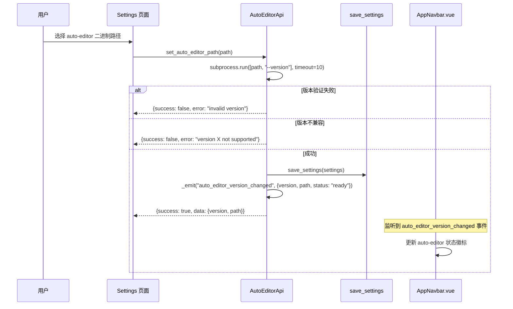
```mermaid
sequenceDiagram
    participant User as 用户
    participant Settings as Settings 页面
    participant Api as AutoEditorApi
    participant SettingsMgr as save_settings
    participant Navbar as AppNavbar.vue

    User->>Settings: 选择 auto-editor 二进制路径
    Settings->>Api: set_auto_editor_path(path)
    Api->>Api: subprocess.run([path, "--version"], timeout=10)
    alt 版本验证失败
        Api-->>Settings: {success: false, error: "invalid version"}
    else 版本不兼容
        Api-->>Settings: {success: false, error: "version X not supported"}
    else 成功
        Api->>SettingsMgr: save_settings(settings)
        Api->>Api: _emit("auto_editor_version_changed", {version, path, status: "ready"})
        Api-->>Settings: {success: true, data: {version, path}}
        Note over Navbar: 监听到 auto_editor_version_changed 事件
        Navbar->>Navbar: 更新 auto-editor 状态徽标
    end
```

### Auto-Editor 任务添加流程

<!-- v2.2.0-CHANGE: 新增 auto-editor 任务添加流程 -->

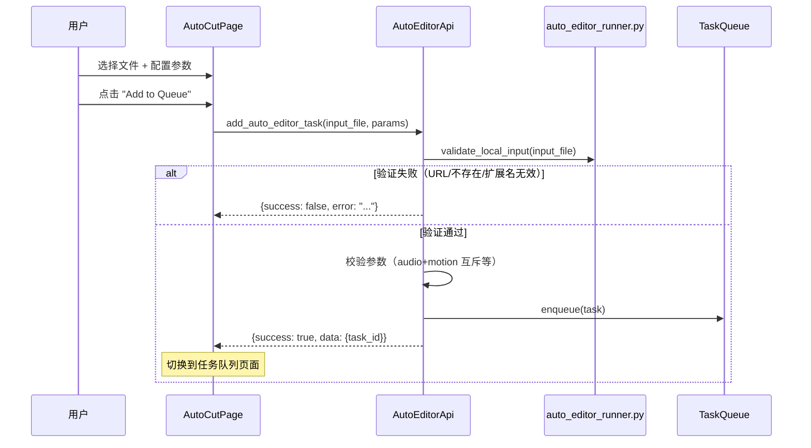
```mermaid
sequenceDiagram
    participant User as 用户
    participant Page as AutoCutPage
    participant Api as AutoEditorApi
    participant Runner as auto_editor_runner.py
    participant Queue as TaskQueue

    User->>Page: 选择文件 + 配置参数
    User->>Page: 点击 "Add to Queue"
    Page->>Api: add_auto_editor_task(input_file, params)
    Api->>Runner: validate_local_input(input_file)
    alt 验证失败（URL/不存在/扩展名无效）
        Api-->>Page: {success: false, error: "..."}
    else 验证通过
        Api->>Api: 校验参数（audio+motion 互斥等）
        Api->>Queue: enqueue(task)
        Api-->>Page: {success: true, data: {task_id}}
        Note over Page: 切换到任务队列页面
    end
```

### Auto-Editor 任务执行流程

<!-- v2.2.0-CHANGE: 新增 auto-editor 任务执行流程 -->

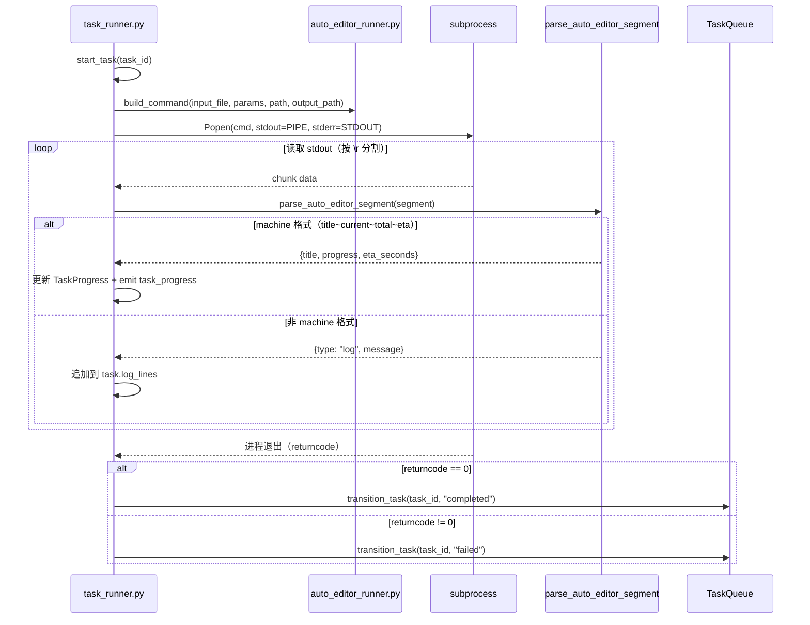
```mermaid
sequenceDiagram
    participant Runner as task_runner.py
    participant Builder as auto_editor_runner.py
    participant Proc as subprocess
    participant Parser as parse_auto_editor_segment
    participant Queue as TaskQueue

    Runner->>Runner: start_task(task_id)
    Runner->>Builder: build_command(input_file, params, path, output_path)
    Runner->>Proc: Popen(cmd, stdout=PIPE, stderr=STDOUT)
    loop 读取 stdout（按 \r 分割）
        Proc-->>Runner: chunk data
        Runner->>Parser: parse_auto_editor_segment(segment)
        alt machine 格式（title~current~total~eta）
            Parser-->>Runner: {title, progress, eta_seconds}
            Runner->>Runner: 更新 TaskProgress + emit task_progress
        else 非 machine 格式
            Parser-->>Runner: {type: "log", message}
            Runner->>Runner: 追加到 task.log_lines
        end
    end
    Proc-->>Runner: 进程退出（returncode）
    alt returncode == 0
        Runner->>Queue: transition_task(task_id, "completed")
    else returncode != 0
        Runner->>Queue: transition_task(task_id, "failed")
    end
```

### Auto-Editor 编码器查询流程

<!-- v2.2.0-CHANGE: 新增 auto-editor 编码器查询流程 -->

```mermaid
sequenceDiagram
    participant Page as AdvancedTab
    participant Api as AutoEditorApi
    participant Proc as subprocess

    Page->>Api: get_auto_editor_encoders("mp4")
    Api->>Proc: subprocess.run([path, "info", "-encoders", "mp4"])
    Proc-->>Api: stdout (v: libx264\na: aac\n...)
    Api->>Api: _parse_encoder_output(stdout)
    Api-->>Page: {success: true, data: {video: [...], audio: [...]}}
    Note over Page: 填充 Codec 下拉框
```


### Auto-Editor 页面初始化流程（v2.2.0 Phase 2）

<!-- v2.2.0-CHANGE: 新增 auto-editor 页面初始化流程 -->

```
用户导航到 /auto-cut
-> AutoCutPage.vue onMounted
-> useAutoEditor composable 初始化:
  -> fetchStatus()  // call get_auto_editor_status
  -> 后端:
    -> load_settings()  // 读取 auto_editor_path
    -> path 为空: 返回 {available: false}
    -> path 非空: subprocess.run([path, "--version"])
    -> 版本兼容性检查 (>=30.1.0, <31.0.0)
  -> 前端: 更新 autoEditorStatus ref
  -> 状态栏渲染:
    -> available=false: "Set auto-editor path in Settings"
    -> compatible=false: "Version X not supported"
    -> available=true, compatible=true: 隐藏状态栏或显示绿色指示器
  -> "Add to Queue" 按钮状态:
    -> !available || !compatible: disabled
    -> available && compatible: enabled
-> 监听 auto_editor_version_changed 事件:
  -> Settings 页面设置路径后触发
  -> 更新 autoEditorStatus ref
  -> 重新评估状态栏和按钮状态
```

### Auto-Editor 命令预览流程（v2.2.0 Phase 2）

<!-- v2.2.0-CHANGE: 新增 auto-editor 命令预览流程 -->

```
用户修改任意 auto-editor 参数
-> Vue reactive state 更新（useAutoEditor composable）
-> watch 触发（监听所有参数）
-> debounceTimer = setTimeout(updatePreview, 300)
-> updatePreview():
  -> 构建 params dict:
    -> edit, threshold (audio/motion), margin, smooth
    -> when_silent, when_normal
    -> input_file (selectedFile.value)
  -> call("preview_auto_editor_command", params)
  -> 后端:
    -> validate_local_input(input_file)
    -> build_command(params, _preview_mode=True)
    -> 返回: {success, data: {argv: [...], display: str}}
  -> 前端:
    -> commandPreview.value = data.display
    -> CommandPreview.vue (type="auto-editor") 纯文本渲染
-> Vue re-render: 命令预览区域更新
```

**与 FFmpeg 命令预览的区别**:

| 对比项 | FFmpeg | Auto-Editor |
|--------|--------|-------------|
| debounce | 500ms | 300ms |
| API | `preview_command` | `preview_auto_editor_command` |
| 参数来源 | configRef (computed) | composable reactive state |
| 验证 | 返回 errors/warnings | 返回 success/error |
| 显示模式 | FFmpeg 语法高亮 | 纯文本 |

### Auto-Editor Action 值动态更新流程（v2.2.0 Phase 3）

<!-- v2.2.0-CHANGE: 新增 action 值动态显隐流程 -->

\`\`\`
用户选择 whenSilent 或 whenNormal action
-> select v-model 更新 whenSilentAction / whenNormalAction
-> computed hasSpeedAction / hasVolumeAction 判断 action 值是否包含 "speed:" / "volume:"
  -> action.startsWith("speed:") -> true
  -> action.startsWith("volume:") -> true
-> v-if="hasSpeedAction": 显示 Speed 输入框
  -> Speed 输入变更 -> speedValue ref 更新
-> v-if="hasVolumeAction": 显示 Volume 输入框
  -> Volume 输入变更 -> volumeValue ref 更新
-> 参数构建:
  -> action="speed:4" -> params.when_silent="speed:4", params.speed_value="4"
  -> action="volume:0.5" -> params.when_normal="volume:0.5", params.volume_value="0.5"
  -> action="cut" -> params.when_silent="cut" (无 speed/volume 参数)
\`\`\`

### Auto-Editor 路径设置流程（Settings 页面）（v2.2.0 Phase 5）

<!-- v2.2.0-CHANGE: 新增 Settings 页面 auto-editor 配置流程 -->

```mermaid
sequenceDiagram
    participant User as 用户
    participant Settings as SettingsPage
    participant Setup as AutoEditorSetup.vue
    participant Main as main.py
    participant Api as AutoEditorApi
    participant Navbar as AppNavbar.vue

    User->>Settings: 进入 Settings 页面
    Settings->>Setup: 传递 autoEditorStatus
    Setup->>Main: get_auto_editor_status()
    Main-->>Setup: 返回 {available, compatible, version, path}
    Note over Setup: 显示当前状态 badge

    User->>Setup: 点击 "Select Binary"
    Setup->>Main: select_file()
    Main-->>Setup: 返回路径
    Setup->>Main: set_auto_editor_path(path)
    Main->>Api: set_auto_editor_path(path)
    Api->>Api: 执行 auto-editor --version 验证
    alt 验证失败
        Api-->>Main: {success: false, error: "..."}
        Main-->>Setup: 显示错误提示
    else 版本不兼容
        Api-->>Main: {success: false, error: "version X not supported"}
        Main-->>Setup: 显示黄色警告
    else 验证成功
        Api->>Api: save_settings({auto_editor_path: path})
        Api-->>Main: {success: true, data: {version, path}}
        Main->>Main: _emit("auto_editor_version_changed", {...})
        Main-->>Setup: 更新状态为就绪
        Note over Navbar: 监听到 auto_editor_version_changed 事件
        Navbar->>Navbar: 更新 auto-editor 状态徽标
    end
```

#### 流程说明

1. 用户进入 Settings 页面，AutoEditorSetup 自动获取当前 auto-editor 状态
2. 用户点击 "Select Binary" 选择二进制路径
3. 后端执行 `--version` 验证路径有效性和版本兼容性
4. 验证通过后保存到 AppSettings，广播 `auto_editor_version_changed` 事件
5. AppNavbar 和 AutoEditorSetup 同时响应事件更新 UI

### Auto-Editor 任务队列集成流程（v2.2.0 Phase 5）

<!-- v2.2.0-CHANGE: 新增 auto-editor 任务队列展示与控制流程 -->

\`\`\`
用户在 AutoCutPage 点击 "Add to Queue"
-> useAutoEditor.addToQueue()
  -> call("add_auto_editor_task", input_file, params)
  -> 后端: validate + enqueue task (task_type="auto_editor")
  -> 返回: {success, data: {task_id}}
-> 用户跳转到任务队列页面
-> TaskQueuePage:
  -> fetchTasks() 获取任务列表（含 task_type 字段）
  -> TaskList 渲染任务列表
  -> TaskRow 根据 task_type 显示对应 badge
    -> task_type="auto_editor": 显示 "Auto Cut" badge
    -> task_type="ffmpeg": 显示 "FFmpeg" badge（或不显示，作为默认类型）
-> 任务执行中:
  -> task_runner 调度 auto_editor 任务
  -> 进度通过 task_progress 事件推送
  -> TaskProgressBar 实时更新百分比
-> 用户取消任务:
  -> control.stopTask(task_id)
  -> 后端: terminate -> wait(5s) -> kill -> 清理部分输出
  -> task_state_changed 事件更新前端状态
\`\`\`
