# 业务流程

## FFmpeg 版本切换流程

<!-- v2.1.0-CHANGE: 行3-行25 新增版本切换与实时更新流程 -->

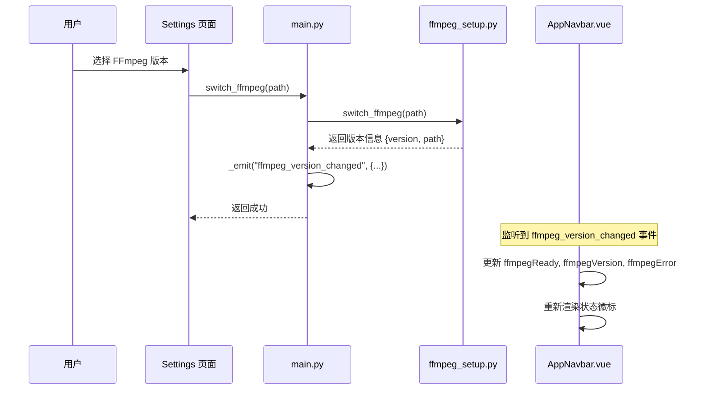

### 流程说明

1. 用户在 Settings 页面的 FFmpeg 面板中选择一个版本
2. 前端调用 `switch_ffmpeg(path)` Bridge API
3. 后端执行 FFmpeg 版本切换，验证路径有效性
4. 后端通过 `_emit("ffmpeg_version_changed")` 广播事件
5. AppNavbar 监听事件并实时更新 FFmpeg 状态徽标

## 任务 Reset 流程

<!-- v2.1.0-CHANGE: 行30-行55 新增 Reset 流程 -->

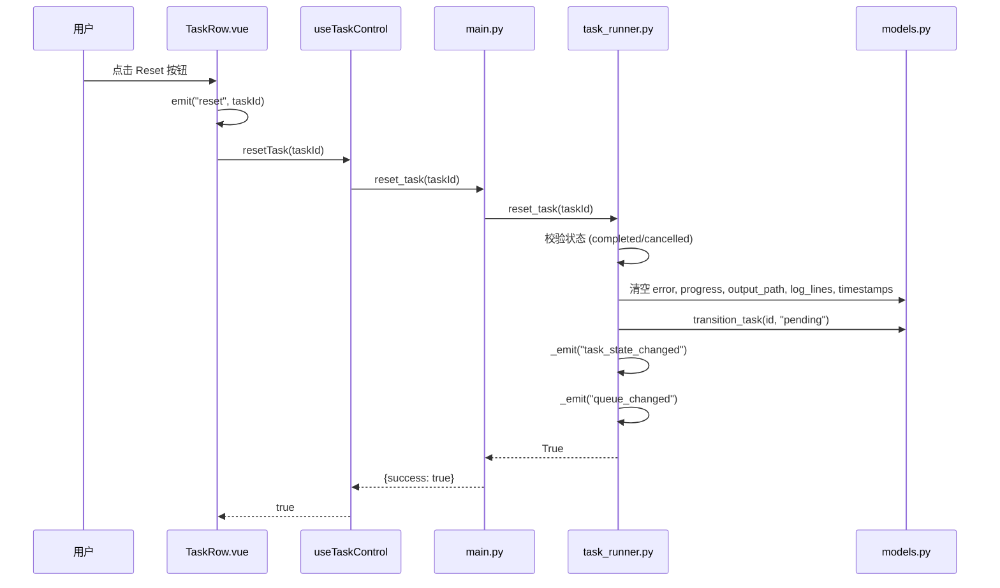

### 流程说明

1. 用户在 completed/cancelled 任务的 Action 列点击 Reset 按钮
2. TaskRow 发射 `reset` 事件，TaskQueuePage 调用 `useTaskControl.resetTask(id)`
3. composable 调用后端 `reset_task(id)` Bridge API
4. `task_runner.reset_task` 执行：
   - 校验任务状态为 completed 或 cancelled
   - 清空所有运行时数据（error, progress, output_path, log_lines, started_at, completed_at）
   - 调用 `transition_task` 将状态转为 pending
   - 广播 `task_state_changed` 和 `queue_changed` 事件
5. 前端通过事件更新 UI，任务回到 pending 状态

## Download FFmpeg 流程

<!-- v2.1.0-CHANGE: 行60-行82 新增下载确认流程 -->

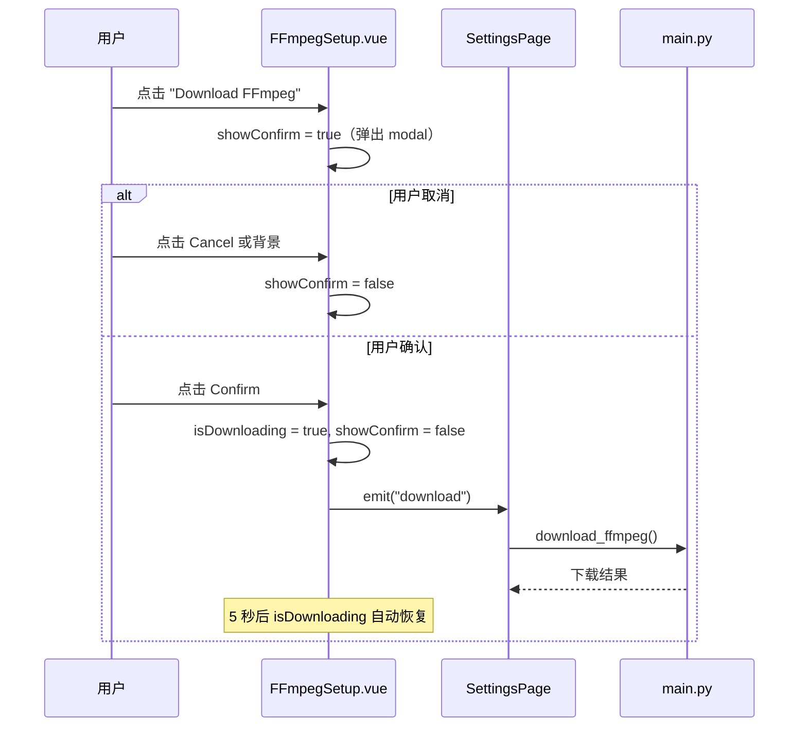

### 流程说明

1. Download FFmpeg 按钮始终可见（不受 FFmpeg 当前状态影响）
2. 点击后弹出 DaisyUI modal 确认对话框
3. 用户确认后：设置 loading 状态 -> 触发 download 事件 -> 父组件处理后端调用
4. 下载过程中按钮禁用并显示 spinner
5. detecting 状态时按钮也禁用

## 主题切换流程

<!-- v2.1.0-CHANGE: 行87-行105 新增主题切换流程 -->

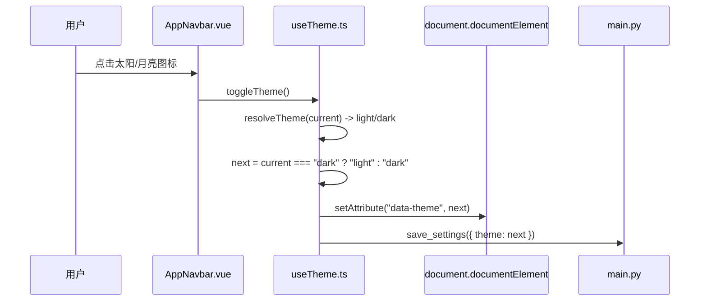

### 流程说明

1. 用户点击导航栏的主题切换按钮
2. `toggleTheme()` 解析当前实际主题，切换到相反主题
3. 通过修改 `data-theme` 属性切换 DaisyUI 主题
4. 异步保存到后端 settings.json（失败不影响本地主题）
5. auto 模式下监听系统主题变化事件自动更新

---

## Phase 3: 命令构建功能流程

<!-- v2.1.0-CHANGE: Phase 3 新增命令构建相关流程 -->

### 硬件编码器检测流程

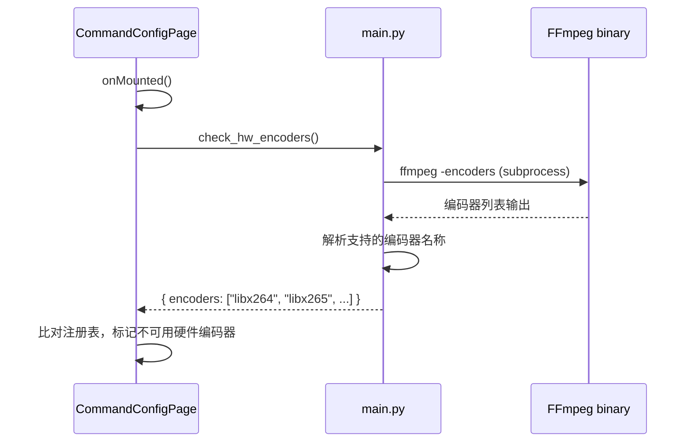

### 流程说明

1. 命令配置页面加载时调用 `check_hw_encoders()` Bridge API
2. 后端执行 `ffmpeg -encoders` 获取所有可用编码器
3. 解析输出文本中的编码器名称列表
4. 前端将检测结果与编码器注册表比对
5. 不在支持列表中的硬件编码器在 UI 中灰显

---

### 视频剪辑流程

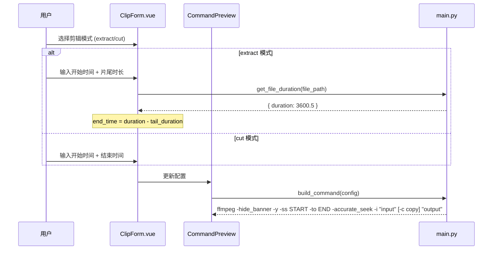

### 流程说明

1. 用户在命令配置页的"剪辑"选项卡中操作
2. 选择 extract 模式：输入开始时间和片尾时长，后端自动获取文件时长并计算结束时间
3. 选择 cut 模式：直接输入开始和结束时间戳
4. 时间格式转换：UI 的 `H:mm:ss.fff` 转换为 FFmpeg 的 `HH:MM:SS.mmm`（第8个冒号替换为点号）
5. 默认使用 `-c copy` 无损快速剪辑，禁用时使用当前 TranscodeConfig 重新编码
6. 命令预览实时更新

---

### 多视频拼接流程

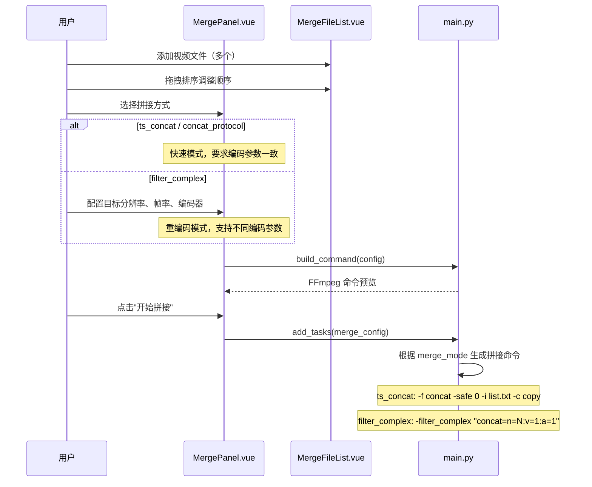

### 流程说明

1. 用户通过文件列表组件添加 2 个或以上视频文件
2. 支持拖拽排序调整拼接顺序
3. 选择拼接方式：默认 ts_concat（最快）
4. filter_complex 模式可配置目标分辨率、帧率和编码器进行标准化
5. 命令预览实时显示生成的 FFmpeg 命令
6. 开始拼接后作为任务添加到任务队列执行

---

### 音频字幕混合流程

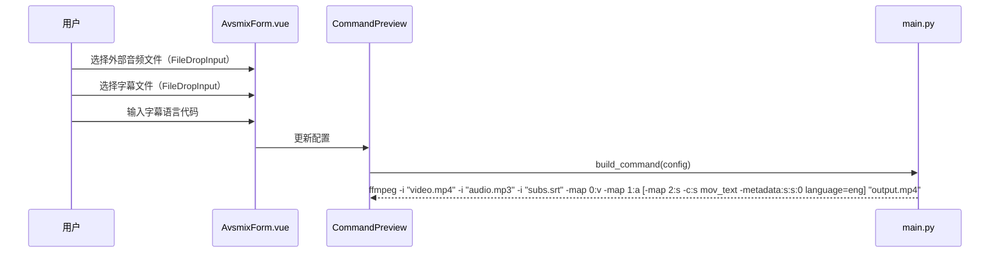

### 流程说明

1. 用户在"音频/字幕"选项卡中操作
2. 通过 FileDropInput 组件拖拽或选择外部音频/字幕文件
3. 可选输入字幕语言代码（如 `chi`, `eng`）
4. 命令通过额外的 `-i` 输入和 `-map` 流映射实现混合
5. 字幕使用 mov_text 编码器嵌入 MP4 容器
6. 此功能与转码/滤镜配置可叠加使用

---

### 横竖屏转换流程

```mermaid
sequenceDiagram
    participant User as 用户
    participant Filter as FilterForm.vue
    participant Preview as CommandPreview
    participant Main as main.py

    User->>Filter: 选择横竖屏转换模式
    alt I 模式（背景图片）
        User->>Filter: 选择背景图片（FileDropInput）
    end
    User->>Filter: 设置目标分辨率（默认 1080x1920）
    Filter->>Preview: 更新配置
    Preview->>Main: build_command(config)

    alt H2V-I（横转竖+图片背景）
        Note over Main: -filter_complex "[1:v]scale=W:H,setsar=1,loop=-1:size=duration[bg];[0:v]scale=W:-2,setsar=1[v];[bg][v]overlay=(W-w)/2:(H-h)/2:shortest=1[vout]"
    else H2V-T（横转竖+模糊视频背景）
        Note over Main: -filter_complex "split=2[v_main][v_bg];scale,boxblur,scale[bg_blurred];overlay"
    else H2V-B（横转竖+黑色填充）
        Note over Main: scale + pad
    end
```

### 流程说明

1. 用户在滤镜配置中选择 aspect_convert 模式
2. I 模式（H2V-I/V2H-I）需额外提供背景图片
3. T 模式（H2V-T/V2H-T）使用视频自身模糊作为背景
4. B 模式（H2V-B/V2H-B）使用黑色填充（最简单）
5. 所有模式均使用 `-filter_complex`，需要处理多输入流
6. 启用横竖屏转换时，基础滤镜（crop/rotate/watermark）应被禁用

---

## Phase 3.5: 命令构建改进流程

<!-- v2.1.0-CHANGE: Phase 3.5 新增质量参数自动填充、自定义命令、片头片尾等流程 -->

### 编码器质量自动填充流程

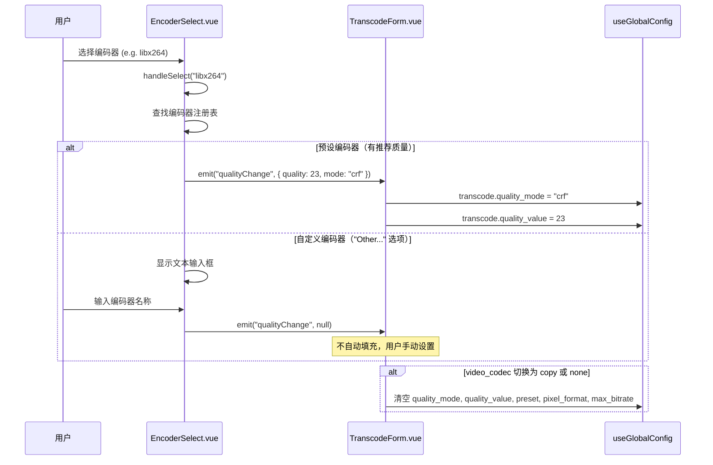

### 流程说明

1. 用户从 EncoderSelect 下拉列表选择预设编码器
2. 组件查找编码器注册表中的 `recommendedQuality` 和 `qualityMode`
3. 通过 `qualityChange` 事件传递给 TranscodeForm，自动填充质量参数
4. 选择 "Other (custom name)..." 选项时，显示文本输入框
5. 自定义编码器不触发自动填充（`qualityChange` 返回 null）
6. 当 video_codec 切换为 copy 或 none 时，清空所有质量相关字段

---

### 自定义命令流程

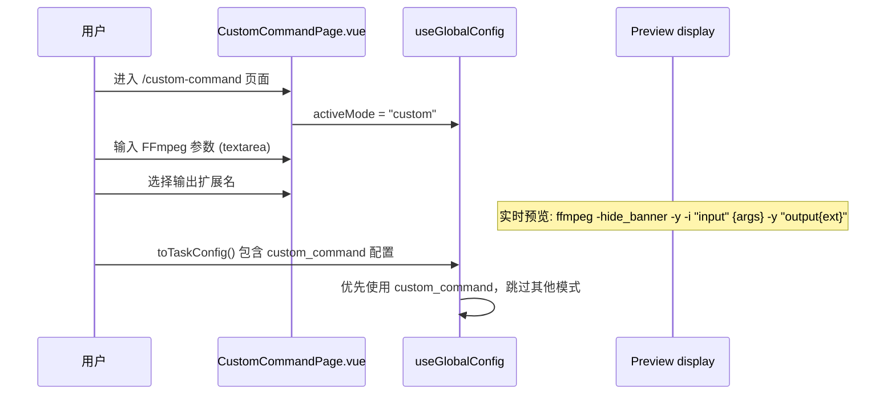

### 流程说明

1. 用户通过导航栏或路由进入自定义命令页面
2. 页面设置 `activeMode = "custom"`
3. 用户在 textarea 中输入原始 FFmpeg 参数
4. 可选择输出文件扩展名（默认 .mp4）
5. 页面实时显示完整命令预览（不调用 build_command）
6. `toTaskConfig()` 在 activeMode 为 custom 时优先生成 custom_command 配置
7. 实际执行时直接拼接用户参数，不经过常规命令构建流程

---

### 片头片尾拼接流程

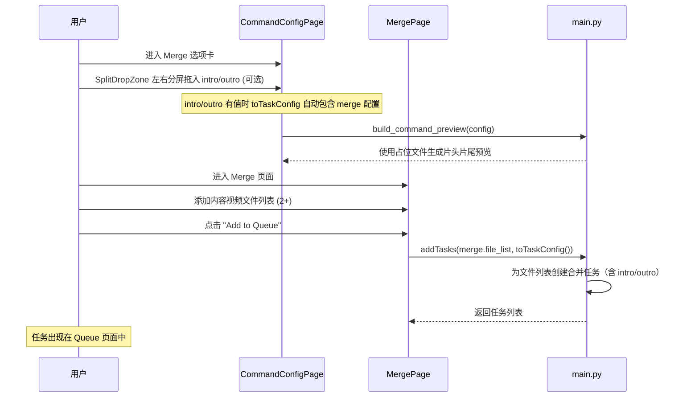

### 流程说明

<!-- v2.1.0-CHANGE: Phase 3.5.2 更新 Intro/Outro 流程 -->

1. Intro/Outro 从 Merge 页面移至 Config 页面的 Merge 选项卡
2. 使用 SplitDropZone 实现左右分屏拖拽上传
3. 当 intro_path 或 outro_path 有值时，`toTaskConfig()` 自动包含 merge 配置（无论当前 activeMode）
4. Config 页面的命令预览使用占位文件显示 intro/outro 命令
5. Merge 页面仅保留文件列表、合并模式和 Add to Queue 按钮
6. 提交后为每个内容视频生成独立的合并任务（含 intro/outro）

---

### 剪辑条件包含流程

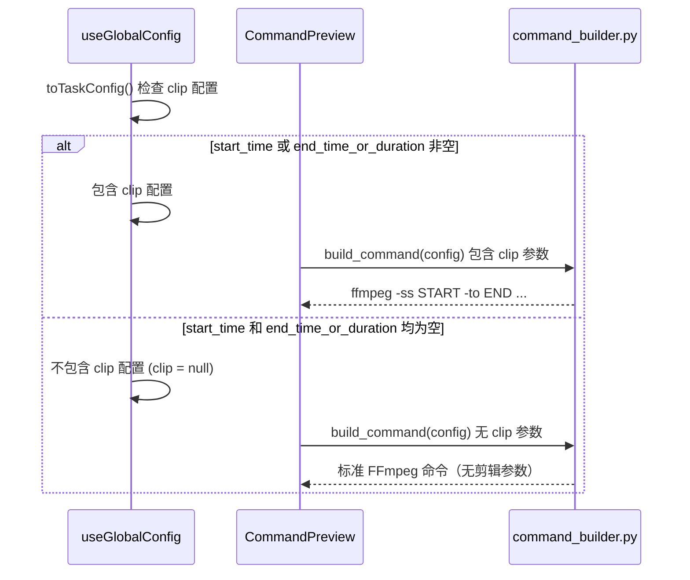

### 流程说明

1. `toTaskConfig()` 检查 clip 的 start_time 和 end_time_or_duration 是否有值
2. 均为空时，`clip` 字段设为 `null`，不传递给 `build_command`
3. `build_command` 仅在 `config.clip` 非空时才调用 `build_clip_command()`

---

### 滤镜互斥清理流程 (Phase 3.5.1)

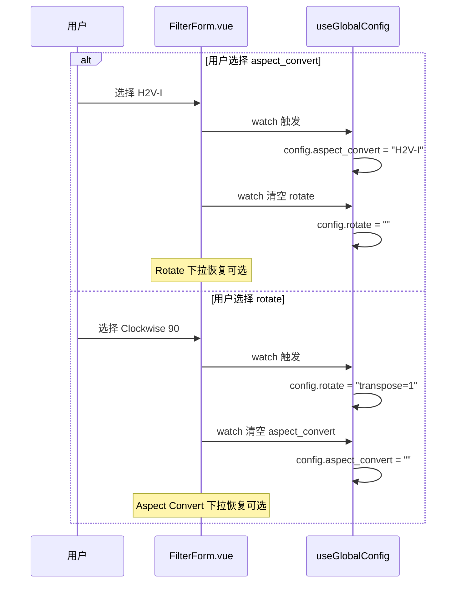

### 流程说明

1. FilterForm 通过 `watch` 监听 `aspect_convert` 和 `rotate` 的变化
2. 选择 aspect_convert 时自动清空 rotate，选择 rotate 时自动清空 aspect_convert
3. 修复了此前两个选项可能同时被 disabled 导致的"冻结"问题

---

### Merge 独立提交流程 (Phase 3.5.2-fixes)

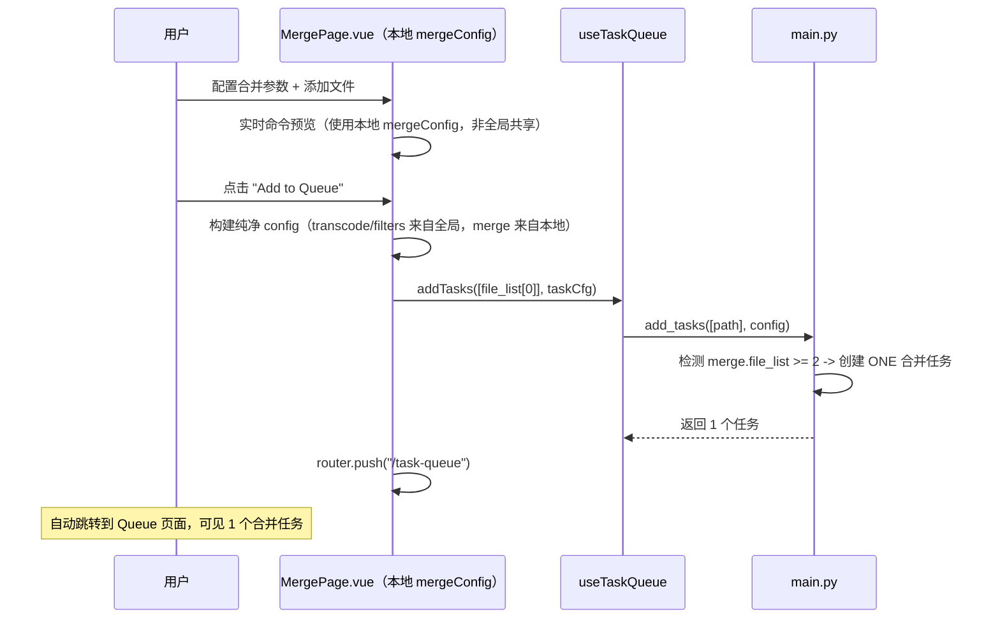

### 流程说明

1. 用户在 Merge 页面配置合并参数并添加文件
2. 命令预览使用本地 `mergeConfig`（不引用全局 merge 单例，避免与 Config 页面 intro/outro 冲突）
3. 点击 "Add to Queue" 时构建纯净配置：仅继承全局 `transcode` + `filters`，merge 使用本地配置
4. 后端检测到 config 包含 `merge.file_list >= 2` 时创建 ONE 任务（给 merge.file_list 第一个文件路径）
5. 添加完成后自动跳转到 Queue 页面 (`router.push("/task-queue")`)

---

### Concat 列表文件创建流程 (Phase 3.5.2-fixes)

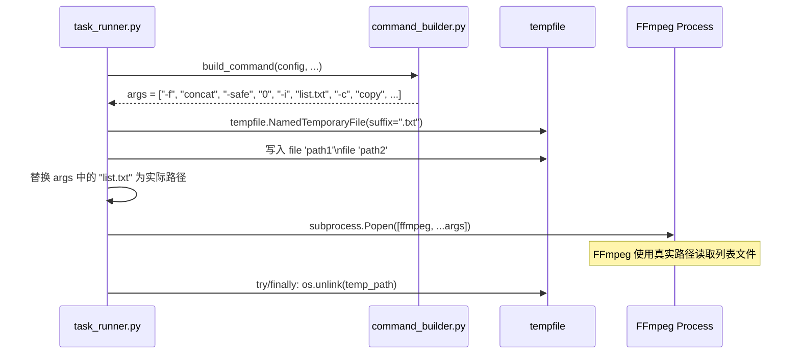

### 流程说明

1. `build_merge_command` 返回 `list.txt` 作为占位符（预览和执行用同一函数）
2. `start_task` 在构建完命令后检查是否为 concat demuxer 模式
3. 创建临时列表文件，内容为 `file 'path1'\nfile 'path2'`
4. 替换 args 中的占位符为临时文件真实路径
5. 提交到线程池执行
6. `_run_task` 通过 `try/finally` 确保临时文件被清理

---

### Intro/Outro 全局应用流程 (Phase 3.5.2-fixes)

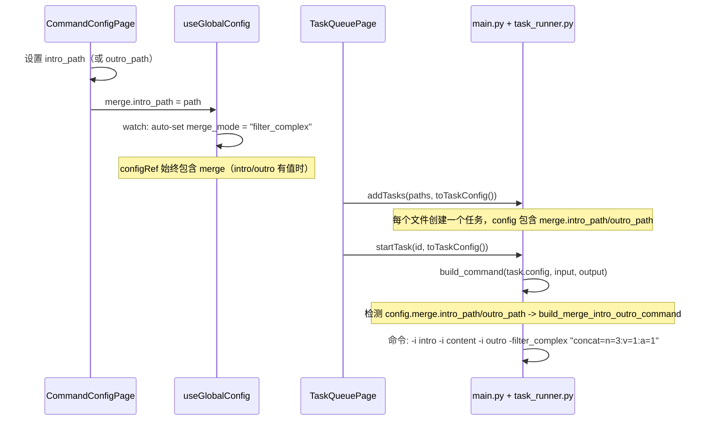

### 流程说明

1. Config 页面设置 intro/outro → 全局 reactive merge 更新 → watch 自动设 merge_mode 为 filter_complex
2. `toTaskConfig()` 在 intro/outro 有值时始终包含 merge 配置（无论当前 activeMode）
3. Queue 页面添加任务时，每个任务都包含 intro/outro 配置
4. 任务启动时 `build_command` 检测 intro/outro → 调度到 `build_merge_intro_outro_command`
5. Merge 页面任务不受影响：`start_task` 保留任务已有的 merge 配置

<!-- v2.1.0-CHANGE: Phase 4 新增流程 -->

## Phase 4: 国际化与平台化流程

### 语言切换流程

```
用户 -> AppNavbar.vue: 点击语言切换按钮 (CN/EN)
-> useLocale.setLocale("en" | "zh-CN")
-> vue-i18n: i18n.locale.value = "en"
-> 页面所有 t("key") 立即响应切换
-> save_settings({ language: "en" })
-> core/config.py: 持久化到 data/settings.json
```

**auto 模式解析**:
1. 启动时读取 settings.language，若为 "auto" 则读取 navigator.language
2. 匹配优先级：zh-CN > zh > en > fallback "zh-CN"

### 数据目录迁移流程

```
main.py 启动
-> from core.paths import migrate_if_needed
-> migrate_if_needed()
-> 检查 get_data_dir()/settings.json 是否存在
  -> 存在: 跳过，已迁移
  -> 不存在: 检查旧 APPDATA 路径
    -> 旧路径存在: 复制 settings.json 到 data/
    -> 旧路径存在: 复制 presets/ 到 data/presets/
    -> 日志不迁移（轮转制自动清理）
    -> 打印一次性迁移日志
-> 后续所有模块使用 core.paths 获取路径
```

**初始化顺序**:
1. `main.py` 顶层调用 `migrate_if_needed()`（在任何 core 模块导入之前）
2. `core/config.py` 导入时使用 `core.paths.get_settings_path()`
3. `core/logging.py` 导入时使用 `core.paths.get_log_dir()`
4. `core/preset_manager.py` 导入时使用 `core.paths.get_presets_dir()`

### FFmpeg 平台下载流程

```
用户 -> SettingsPage -> FFmpegSetup.vue: 点击按钮
-> if platform === "win32":
  -> 弹出 DaisyUI modal 确认对话框
  -> 确认 -> call("download_ffmpeg")
  -> main.py: static_ffmpeg.add_paths() 下载
  -> 成功 -> ffmpeg_version_changed 事件
-> else:
  -> 显示平台安装提示 (非按钮，静态文本)
  -> macOS: "brew install ffmpeg" + brew.sh 链接
  -> Linux: 对应包管理器命令
```

**非 Windows 调用 download_ffmpeg**:
```
main.py: download_ffmpeg()
-> sys.platform != "win32"
-> 返回 {"success": False, "error": "download_not_supported", "data": {"platform": "darwin", "instructions": {"method": "homebrew", "command": "brew install ffmpeg", "url": "https://brew.sh"}}}
```
