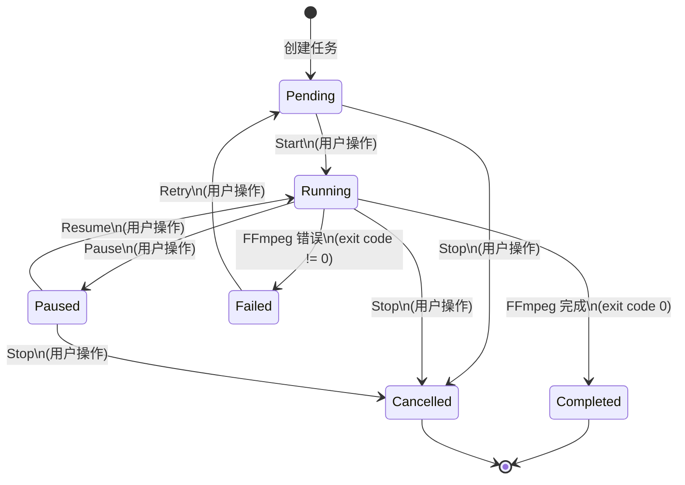
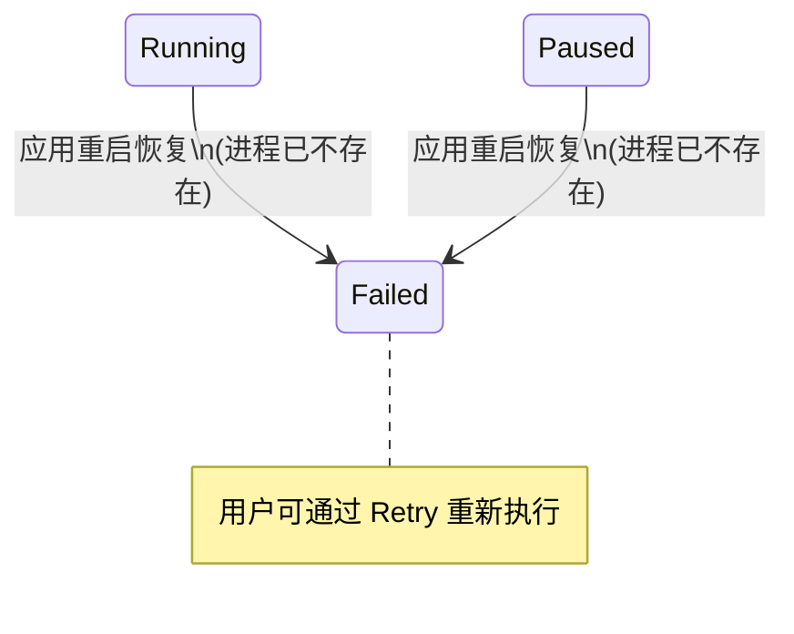

# 任务状态机

## 状态定义

| 状态 | 值 | 说明 |
|------|---|------|
| 待处理 | `pending` | 任务已创建，等待执行 |
| 运行中 | `running` | FFmpeg 正在处理 |
| 已暂停 | `paused` | 进程已挂起，等待恢复 |
| 已完成 | `completed` | 处理成功完成 |
| 已失败 | `failed` | 处理过程中发生错误 |
| 已取消 | `cancelled` | 被用户手动停止 |

## 状态机图



## 恢复状态转移

应用重启后，队列恢复时会发生以下状态自动转移：



## 转移触发方式

### 用户触发

| 转移 | 触发方式 | 前端 API | 后端处理 |
|------|---------|---------|---------|
| pending -> running | 点击 Start | `start_task(id)` | ThreadPoolExecutor 提交任务 |
| running -> paused | 点击 Pause | `pause_task(id)` | `suspend_process(pid)` |
| paused -> running | 点击 Resume | `resume_task(id)` | `resume_process(pid)` |
| pending -> cancelled | 点击 Stop | `stop_task(id)` | 直接状态转移 |
| running -> cancelled | 点击 Stop | `stop_task(id)` | `kill_process_tree(pid)` |
| paused -> cancelled | 点击 Stop | `stop_task(id)` | `kill_process_tree(pid)` |
| failed -> pending | 点击 Retry | `retry_task(id)` | 清除错误,重新提交 |

### 系统触发

| 转移 | 触发方式 | 处理模块 |
|------|---------|---------|
| running -> completed | FFmpeg exit code 0 | ffmpeg_runner.run_single |
| running -> failed | FFmpeg exit code != 0 | ffmpeg_runner.run_single |
| running -> failed | 应用重启 | task_queue.load_state |
| paused -> failed | 应用重启 | task_queue.load_state |

### 批量操作触发

| 操作 | 影响的转移 | 前端 API |
|------|-----------|---------|
| Stop All | pending->cancelled, running->cancelled, paused->cancelled | `stop_all()` |
| Pause All | running->paused (所有 running 任务) | `pause_all()` |
| Resume All | paused->running (所有 paused 任务) | `resume_all()` |

## 状态约束总结

```
pending:   可接收 Start, Stop
running:   可接收 Pause, Stop; 可自动转到 Completed, Failed
paused:    可接收 Resume, Stop
completed: 终态, 不可变更
failed:    可接收 Retry
cancelled: 终态, 不可变更
```

## 状态与 UI 按钮对应关系

| 状态 | 显示按钮 |
|------|---------|
| pending | Start, Stop |
| running | Pause, Stop |
| paused | Resume, Stop |
| completed | (无) |
| failed | Retry |
| cancelled | (无) |
