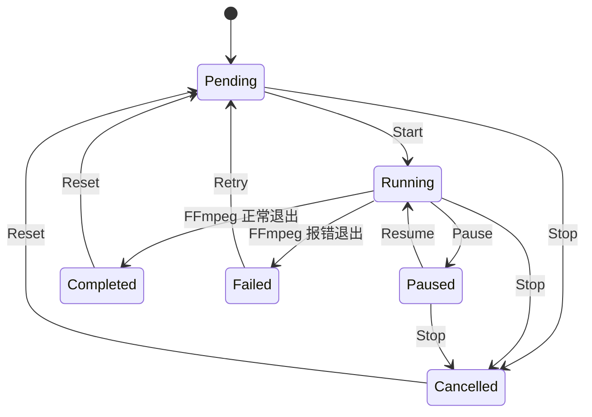

# 任务状态机

## 状态定义

<!-- v2.1.0-CHANGE: 行1-行14 新增完整状态机文档 -->

| 状态 | 说明 | 终态 |
|------|------|------|
| `pending` | 任务已创建，等待执行 | 否 |
| `running` | 任务正在执行中 | 否 |
| `paused` | 任务已暂停 | 否 |
| `completed` | 任务执行成功 | 是 |
| `failed` | 任务执行失败 | 否（可 Retry） |
| `cancelled` | 任务被用户取消 | 是 |

## 合法状态转移



### 转移矩阵

| 当前状态 | 可转移至 | 触发方式 | 前端 API |
|---------|---------|---------|---------|
| `pending` | `running` | 用户点击 Start | `start_task(id, config)` |
| `pending` | `cancelled` | 用户点击 Stop | `stop_task(id)` |
| `running` | `paused` | 用户点击 Pause | `pause_task(id)` |
| `running` | `completed` | FFmpeg 正常退出（exit code 0） | 后端自动 |
| `running` | `failed` | FFmpeg 异常退出（exit code != 0） | 后端自动 |
| `running` | `cancelled` | 用户点击 Stop | `stop_task(id)` |
| `paused` | `running` | 用户点击 Resume | `resume_task(id)` |
| `paused` | `cancelled` | 用户点击 Stop | `stop_task(id)` |
| `failed` | `pending` | 用户点击 Retry | `retry_task(id, config)` |
| `completed` | `pending` | 用户点击 Reset | `reset_task(id)` |
| `cancelled` | `pending` | 用户点击 Reset | `reset_task(id)` |

### 后端实现

状态转移由 `core/models.py` 中 `VALID_TRANSITIONS` 字典约束：

```python
VALID_TRANSITIONS: dict[TaskState, set[TaskState]] = {
    "pending": {"running", "cancelled"},
    "running": {"paused", "completed", "failed", "cancelled"},
    "paused": {"running", "cancelled"},
    "failed": {"pending"},
    "completed": {"pending"},
    "cancelled": {"pending"},
}
```

任务对象的 `can_transition(new_state)` 方法校验转移合法性。

## 按钮映射

<!-- v2.1.0-CHANGE: 行56-行82 新增按钮映射，涵盖 Reset 变更 -->

| 状态 | 显示按钮 | 说明 |
|------|---------|------|
| `pending` | Start, MoveUp, MoveDown | MoveUp 在首个任务时禁用，MoveDown 在末尾任务时禁用 |
| `running` | Pause, Stop, Log | Log 按钮查看实时日志 |
| `paused` | Resume, Stop, Log | Log 按钮查看暂停前日志 |
| `completed` | Reset | 重置为 pending 状态，可重新执行 |
| `failed` | Retry, Log | Log 保留完整错误日志内容 |
| `cancelled` | Reset | 重置为 pending 状态 |

### 按钮样式

| 按钮 | DaisyUI 类 | 说明 |
|------|-----------|------|
| Start | `btn-primary` | 开始执行 |
| Pause | `btn-warning btn-outline` | 暂停执行 |
| Resume | `btn-info btn-outline` | 恢复执行 |
| Stop | `btn-error btn-outline` | 终止任务 |
| Retry | `btn-warning` | 重试失败任务 |
| Reset | `btn-info` | 重置终态任务 |
| Log | `btn-ghost` | 查看日志 |

## Reset 状态转移

<!-- v2.1.0-CHANGE: 新增 Reset 转移章节 -->

`completed` 和 `cancelled` 为终态的任务可通过用户操作重置为 `pending` 重新执行。

### 触发方式

| 转移 | 触发方式 | 前端 API | 后端处理 |
|------|---------|---------|---------|
| completed -> pending | 点击 Reset | `reset_task(id)` | 清除日志、输出路径、错误信息、进度、时间戳 |
| cancelled -> pending | 点击 Reset | `reset_task(id)` | 同上 |

### Reset 行为（后端实现）

`core/task_runner.py` 中 `reset_task` 方法执行以下清理：

1. 清空 `error` 字符串
2. 重置 `progress` 为空的 `TaskProgress()`
3. 清空 `output_path`
4. 清空 `log_lines` 数组
5. 清空 `started_at` 和 `completed_at` 时间戳
6. 调用 `transition_task(task_id, "pending")` 执行状态转移
7. 发送 `task_state_changed` 和 `queue_changed` 事件

### Reset 与 Retry 的区别

| 维度 | Reset | Retry |
|------|-------|-------|
| 适用状态 | completed, cancelled | failed |
| 目标状态 | pending | pending |
| 保留日志 | 否（清空） | 是（保留） |
| 自动执行 | 否（需手动 Start） | 否（需手动 Start） |

## 日志可见性规则

<!-- v2.1.0-CHANGE: 新增日志可见性规则 -->

| 任务状态 | Log 按钮 | 说明 |
|---------|---------|------|
| `running` | 显示 | 查看实时日志 |
| `paused` | 显示 | 查看暂停前日志 |
| `failed` | 显示 | 保留完整错误日志，不清除 |
| `completed` | 隐藏 | Reset 时日志已清空 |
| `cancelled` | 隐藏 | Reset 时日志将清空 |
| `pending` | 隐藏 | 无日志内容 |
