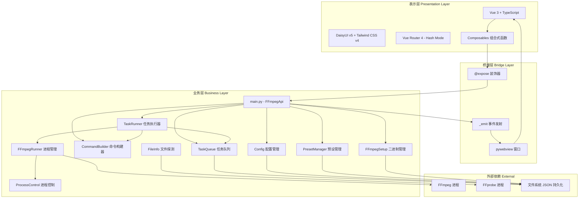
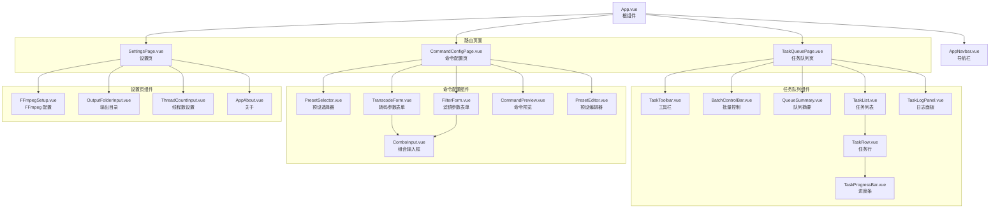
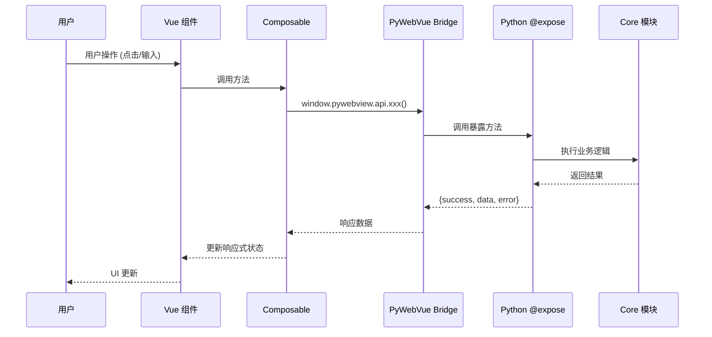
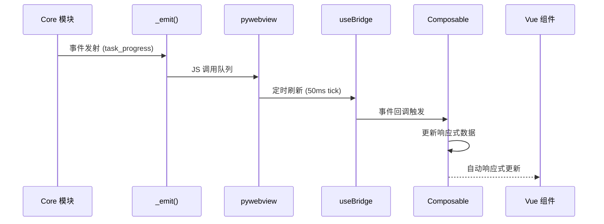

# 系统架构

## 系统架构总览



## 模块依赖关系

```mermaid
graph LR
    main[main.py] --> pywebvue_app[pywebvue/app.py]
    main --> pywebvue_bridge[pywebvue/bridge.py]
    main --> task_runner[task_runner.py]
    main --> task_queue[task_queue.py]
    main --> config[config.py]
    main --> preset_mgr[preset_manager.py]
    main --> ffmpeg_setup[ffmpeg_setup.py]
    main --> file_info[file_info.py]
    main --> command_builder[command_builder.py]
    main --> logging[logging.py]

    task_runner --> ffmpeg_runner[ffmpeg_runner.py]
    task_runner --> command_builder
    task_runner --> task_queue
    task_runner --> ffmpeg_setup
    task_runner --> process_control[process_control.py]
    task_runner --> models

    task_queue --> models
    ffmpeg_runner --> process_control
    ffmpeg_runner --> models
    command_builder --> models
    file_info --> ffmpeg_setup
    config --> models
    preset_mgr --> models

    models[models.py] -.-> "数据定义" task_runner
    models -.-> "数据定义" task_queue
```

## 前端组件层级



## 数据流架构

### 请求流（前端 -> 后端）



### 事件流（后端 -> 前端）



## 前端路由结构

| 路径 | 组件 | 说明 |
|------|------|-----|
| `/` | - | 重定向到 `/task-queue` |
| `/task-queue` | `TaskQueuePage.vue` | 任务队列管理 |
| `/command-config` | `CommandConfigPage.vue` | 命令配置 |
| `/settings` | `SettingsPage.vue` | 应用设置 |

使用 Hash 模式（`/#/task-queue`），兼容 pywebview 环境。

## Composable 职责分配

| Composable | 职责 | 管理的状态 |
|-----------|------|-----------|
| `useBridge` | 事件监听管理 | 事件监听器注册/注销 |
| `useSettings` | 应用设置读写 | max_workers, output_dir, ffmpeg_path, ffprobe_path |
| `useTaskQueue` | 任务队列操作 | tasks 列表, drag-drop 状态 |
| `useTaskControl` | 单任务/批量控制 | 无自有状态, 调用 API |
| `useTaskProgress` | 进度/日志追踪 | progress_map, logs_map |
| `useCommandPreview` | 命令预览生成 | command, validation errors/warnings |
| `usePresets` | 预设管理 | presets 列表, 当前预设 |
| `useGlobalConfig` | 全局配置状态 | 当前 TaskConfig |
| `useFileDrop` | 拖拽文件处理 | is_dragging 状态 |

## 文件结构说明

### 后端文件

```
core/
├── models.py            # 数据模型定义
│   ├── TaskState        # 任务状态类型 (Literal)
│   ├── VALID_TRANSITIONS # 合法状态转移映射
│   ├── TranscodeConfig   # 转码参数配置 (frozen dataclass)
│   ├── FilterConfig      # 滤镜参数配置 (frozen dataclass)
│   ├── TaskConfig        # 任务完整配置 (frozen dataclass)
│   ├── TaskProgress      # 任务进度快照 (frozen dataclass)
│   ├── Task              # 任务实体 (mutable class)
│   ├── Preset            # 预设配置 (frozen dataclass)
│   └── AppSettings       # 应用设置 (frozen dataclass)
│
├── task_queue.py        # 线程安全任务队列
│   ├── TaskQueue        # 队列管理器 (RLock, Timer)
│   ├── CRUD 操作        # add/remove/get/reorder
│   ├── 状态机           # transition_task()
│   ├── 持久化           # save_state()/load_state()
│   └── 防抖保存         # 0.5s debounce
│
├── task_runner.py       # 任务执行引擎
│   ├── TaskRunner       # 执行协调器
│   ├── ThreadPool       # 并发执行 (max_workers)
│   ├── 进程追踪         # _running_procs, _cancel_events
│   └── 批量控制         # stop_all/pause_all/resume_all
│
├── ffmpeg_runner.py     # FFmpeg 进程管理
│   ├── run_single()     # 执行单条命令
│   ├── 进度解析         # stderr 正则解析 (time/speed/fps)
│   └── 进度回调         # 0.5s 间隔进度更新
│
├── command_builder.py   # FFmpeg 命令构建
│   ├── build_command()  # 从 TaskConfig 构建 FFmpeg 命令
│   ├── build_output_path() # 生成输出文件路径
│   └── 滤镜链排序       # 按优先级自动排序
│
├── process_control.py   # 跨平台进程控制
│   ├── kill_process_tree() # 进程树终止
│   ├── suspend_process()   # 进程暂停 (Windows/Linux/macOS)
│   └── resume_process()    # 进程恢复
│
├── config.py            # 设置持久化
├── preset_manager.py    # 预设管理
├── ffmpeg_setup.py      # FFmpeg 二进制管理
├── file_info.py         # 文件探测 (ffprobe)
├── app_info.py          # 应用元信息
└── logging.py           # 日志配置 (loguru)

pywebvue/
├── app.py               # 窗口管理 + 事件系统
├── bridge.py            # @expose 装饰器 + Bridge 基类
└── __init__.py

main.py                  # 应用入口 + FFmpegApi (Bridge)
```

### 前端文件

```
frontend/src/
├── main.ts              # Vue 应用入口
├── App.vue              # 根组件 (Navbar + router-view)
├── bridge.ts            # 后端通信封装
├── router.ts            # 路由配置 (Hash 模式)
├── style.css            # 全局样式 (Tailwind)
│
├── pages/               # 页面组件
│   ├── TaskQueuePage.vue
│   ├── CommandConfigPage.vue
│   └── SettingsPage.vue
│
├── components/          # 子组件
│   ├── layout/AppNavbar.vue
│   ├── common/ComboInput.vue
│   ├── config/          # 配置相关组件
│   ├── settings/        # 设置相关组件
│   └── task-queue/      # 队列相关组件
│
├── composables/         # 组合式函数
│   ├── useBridge.ts
│   ├── useSettings.ts
│   ├── useTaskQueue.ts
│   ├── useTaskControl.ts
│   ├── useTaskProgress.ts
│   ├── useCommandPreview.ts
│   ├── usePresets.ts
│   ├── useGlobalConfig.ts
│   └── useFileDrop.ts
│
├── types/               # TypeScript 类型定义
│   ├── task.ts
│   ├── config.ts
│   ├── preset.ts
│   └── settings.ts
│
└── utils/
    └── format.ts        # 格式化工具函数
```

## Bridge API 接口清单

### 任务管理

| 方法 | 说明 |
|------|-----|
| `select_files()` | 打开文件选择对话框 |
| `select_output_dir()` | 打开目录选择对话框 |
| `add_tasks(paths, config?)` | 添加任务到队列 |
| `remove_tasks(task_ids)` | 删除任务 |
| `reorder_tasks(task_ids)` | 重排任务顺序 |
| `get_tasks()` | 获取所有任务 |
| `get_queue_summary()` | 获取队列统计 |
| `clear_completed()` | 清除已完成任务 |
| `clear_all()` | 清除所有任务 |

### 任务控制

| 方法 | 说明 |
|------|-----|
| `start_task(task_id)` | 开始任务 |
| `stop_task(task_id)` | 停止任务 |
| `pause_task(task_id)` | 暂停任务 |
| `resume_task(task_id)` | 恢复任务 |
| `retry_task(task_id)` | 重试失败任务 |
| `stop_all()` | 停止所有任务 |
| `pause_all()` | 暂停所有运行中任务 |
| `resume_all()` | 恢复所有暂停任务 |

### 设置与配置

| 方法 | 说明 |
|------|-----|
| `get_settings()` | 获取应用设置 |
| `save_settings(settings)` | 保存应用设置 |
| `build_command(config)` | 构建 FFmpeg 命令 |
| `validate_config(config)` | 验证配置 |

### FFmpeg 管理

| 方法 | 说明 |
|------|-----|
| `setup_ffmpeg()` | 确保 FFmpeg 可用 |
| `get_ffmpeg_versions()` | 获取 FFmpeg 版本信息 |
| `switch_ffmpeg(path)` | 切换 FFmpeg 二进制路径 |
| `select_ffmpeg_binary()` | 选择 FFmpeg 文件 |
| `download_ffmpeg()` | 下载 FFmpeg |

### 预设管理

| 方法 | 说明 |
|------|-----|
| `get_presets()` | 获取所有预设 |
| `save_preset(preset)` | 保存预设 |
| `delete_preset(preset_id)` | 删除预设 |

### 后端事件

| 事件名 | 触发时机 |
|-------|---------|
| `task_added` | 任务添加到队列 |
| `task_state_changed` | 任务状态变更 |
| `task_progress` | 任务进度更新 |
| `task_log` | 任务日志输出 |
| `queue_changed` | 队列内容变更 |
| `batch_complete` | 批量处理完成 |
