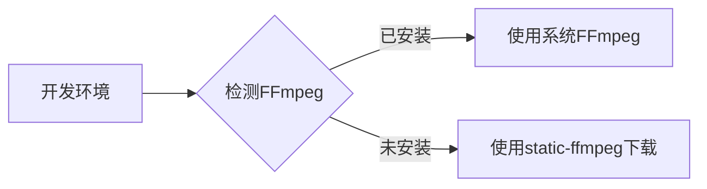
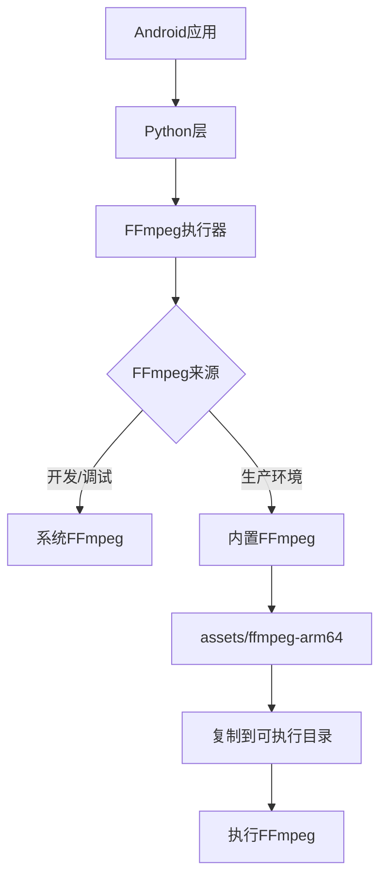
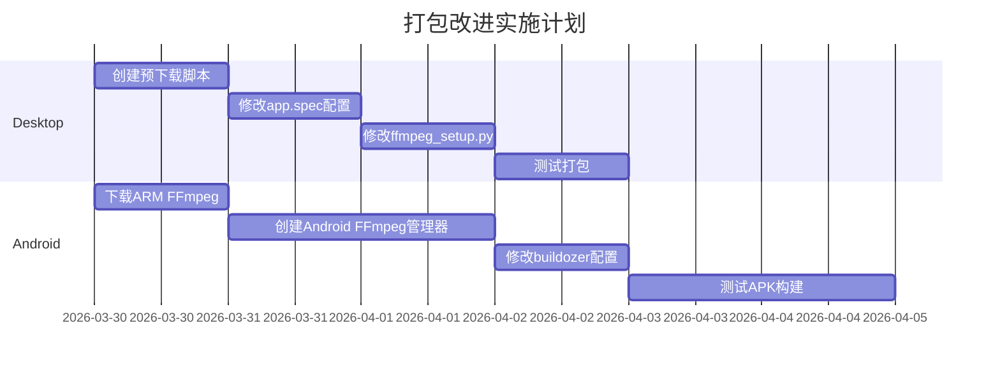

# 问题

最后一个问题了，软件的代码都已经撰写完成测试基本没有问题。
但是在打包的时候有一下问题。

- 对于static-ffmpeg的打包，按理来说下载ffmpeg应该在打包的时候就完成掉。用户启动时只需将ffmpeg添加到环境或者啥的 就行了。目前还需要在第一次启动的时候下载ffmpeg，导致不可预测的问题。当然这个也需要与开发环境区分一下，开发环境需要什么样的调整呢？你怎么想？
- 安卓端的打包好像不够完整，而且static-ffmpeg没有安卓端的包，安卓端如何打包ffmpeg也是一个大问题。这个有没有办法解决？

根据代码分析，我现在可以详细回答这两个打包问题。

---

## 问题1：static-ffmpeg 打包问题分析

### 当前情况

从 [`core/ffmpeg_setup.py`](core/ffmpeg_setup.py:52) 可以看到：

```python
def ensure_ffmpeg() -> bool:
    """Download ffmpeg binaries if needed and verify availability."""
    try:
        import static_ffmpeg
        static_ffmpeg.add_paths()  # 这里会在运行时下载
    except ImportError:
        pass
```

[`static-ffmpeg`](https://github.com/zackees/static_ffmpeg) 包的设计是**运行时下载**，这导致了：
- 用户首次启动需要联网下载
- 下载过程可能失败或很慢
- 用户体验不佳

### 解决方案

#### 方案A：预下载并打包FFmpeg（推荐）

**生产环境：**


**开发环境：**


**实现步骤：**

1. **创建构建前脚本** `scripts/pre_build.py`：
```python
"""Pre-build script to download FFmpeg binaries for packaging."""
import sys
from pathlib import Path

def download_ffmpeg_for_platform():
    """Download FFmpeg binaries for the current platform."""
    import static_ffmpeg
    static_ffmpeg.add_paths()  # 这会下载到缓存目录
    
    # 复制到项目目录
    pkg_dir = Path(static_ffmpeg.__file__).parent
    output_dir = Path(__file__).parent.parent / "ffmpeg_binaries"
    output_dir.mkdir(exist_ok=True)
    
    # 复制平台特定的二进制文件
    for bin_name in ["ffmpeg", "ffprobe"]:
        for pattern in [f"bin/*/{bin_name}", f"bin/*/{bin_name}.exe"]:
            for src in pkg_dir.glob(pattern):
                dst = output_dir / src.name
                shutil.copy2(src, dst)
                print(f"Copied {src} -> {dst}")

if __name__ == "__main__":
    download_ffmpeg_for_platform()
```

2. **修改 [`app.spec`](app.spec:62)** 添加 binaries：
```python
# ========== [MODIFY] FFmpeg binaries ==========
_ffmpeg_bin_dir = project_root / "ffmpeg_binaries"
if _ffmpeg_bin_dir.exists():
    binaries = [
        (str(_ffmpeg_bin_dir / "ffmpeg"), "."),
        (str(_ffmpeg_bin_dir / "ffprobe"), "."),
    ]
else:
    binaries = []
```

3. **修改 [`core/ffmpeg_setup.py`](core/ffmpeg_setup.py:52)** 检测打包环境：
```python
def is_frozen() -> bool:
    """Check if running as a PyInstaller bundle."""
    return getattr(sys, 'frozen', False) and hasattr(sys, '_MEIPASS')

def ensure_ffmpeg() -> bool:
    """Download ffmpeg binaries if needed and verify availability."""
    # 生产环境：使用打包的二进制
    if is_frozen():
        return _find_static_ffmpeg_bin("ffmpeg") is not None
    
    # 开发环境：使用static-ffmpeg下载
    try:
        import static_ffmpeg
        static_ffmpeg.add_paths()
    except ImportError:
        pass
    
    return _find_static_ffmpeg_bin("ffmpeg") is not None
```

4. **修改 [`build.py`](build.py:118)** 添加预下载步骤：
```python
def _build_onedir() -> None:
    """Build desktop app as a directory (uses app.spec directly)."""
    # 先下载FFmpeg
    _info("Pre-downloading FFmpeg binaries...")
    _pre_download_ffmpeg()
    
    # 继续原有构建流程
    ...
```

#### 方案B：使用FFmpeg静态编译二进制

直接从 [FFmpeg官方](https://ffmpeg.org/download.html) 或 [gyan.dev](https://www.gyan.dev/ffmpeg/builds/) 下载预编译的静态二进制文件，手动放入 `ffmpeg_binaries/` 目录，然后在 `app.spec` 中打包。

---

## 问题2：Android端打包问题分析

### 当前情况

从 [`build.py`](build.py:272) 的Android构建配置可以看到：

```python
requirements = python3,kivy,pywebview
```

**关键问题：**
1. `static-ffmpeg` **不支持Android**（它只支持 Windows、macOS、Linux）
2. Android ARM架构需要ARM版本的FFmpeg
3. Android环境限制（没有标准PATH、权限限制）

### 解决方案

#### 方案A：使用FFmpeg Android库（推荐）

**架构设计：**



**实现步骤：**

1. **获取Android FFmpeg二进制**
   - 从 [FFmpeg Android Builds](https://github.com/tanersener/mobile-ffmpeg/releases) 下载
   - 或使用 [ffmpeg-kit](https://github.com/arthenica/ffmpeg-kit) 的ARM版本

2. **创建Android专用FFmpeg管理器** `core/ffmpeg_android.py`：
```python
"""FFmpeg setup for Android platform."""
import os
import shutil
import sys
from pathlib import Path

def is_android() -> bool:
    """Check if running on Android."""
    return 'ANDROID_ROOT' in os.environ or 'ANDROID_DATA' in os.environ

def setup_ffmpeg_android() -> str | None:
    """Setup FFmpeg for Android by copying from assets."""
    if not is_android():
        return None
    
    # 目标目录（应用可执行目录）
    app_dir = Path(sys._MEIPASS) if getattr(sys, 'frozen', False) else Path(__file__).parent
    ffmpeg_path = app_dir / "ffmpeg"
    
    # 如果已存在，直接返回
    if ffmpeg_path.exists():
        return str(ffmpeg_path)
    
    # 从assets复制（需要使用pywebview的文件访问）
    try:
        import webview
        # 使用webview的API访问assets
        # 这里需要根据实际pywebview Android API调整
        pass
    except Exception:
        pass
    
    return None
```

3. **修改 [`buildozer.spec`](build.py:357)** 添加FFmpeg：
```python
# 在 [app] section 添加
android.include_src = True
android.assets = ffmpeg_binaries:assets

# 或者使用presplash复制
android.presplash_color = #FFFFFF
```

4. **修改 [`build.py`](build.py:357)** 的Android构建配置：
```python
# 添加FFmpeg相关配置
requirements = python3,kivy,pywebview,ffmpeg-python
android.permissions = INTERNET,WRITE_EXTERNAL_STORAGE,READ_EXTERNAL_STORAGE
```

#### 方案B：使用FFmpeg-Kit（更完整）

[ffmpeg-kit](https://github.com/arthenica/ffmpeg-kit) 提供了完整的Android FFmpeg解决方案：


**实现：**

1. 在 `buildozer.spec` 中添加：
```python
android.gradle_dependencies = com.arthenica:ffmpeg-kit:6.0-2
```

2. 创建JNI桥接层（需要编写Java/Kotlin代码）

3. Python层通过JNI调用

#### 方案C：使用Termux FFmpeg（简化方案）

如果应用目标用户主要是技术用户，可以：
1. 检测Termux环境
2. 使用Termux的FFmpeg包
3. 提示用户安装：`pkg install ffmpeg`

---

## 开发环境 vs 生产环境对比

| 方面 | 开发环境 | 生产环境 |
|------|---------|---------|
| **FFmpeg来源** | 系统FFmpeg 或 static-ffmpeg下载 | 打包的预编译二进制 |
| **检测方式** | `shutil.which('ffmpeg')` | 打包目录中的二进制 |
| **首次启动** | 可能需要下载（如果用static-ffmpeg） | 立即可用 |
| **网络依赖** | 可选（如果系统有FFmpeg则无需） | 无需网络 |
| **Android** | 不支持/需要特殊处理 | 需要ARM版本二进制 |

---

## 建议的实施顺序



---

## 总结

1. **Desktop端**：通过预下载FFmpeg并在打包时包含，避免运行时下载
2. **Android端**：需要使用ARM版本的FFmpeg二进制，通过assets打包或使用ffmpeg-kit
3. **开发环境**：保持灵活性，可以使用系统FFmpeg或static-ffmpeg
4. **生产环境**：完全离线可用，无需网络依赖

需要我切换到 Code 模式来实现这些解决方案吗？