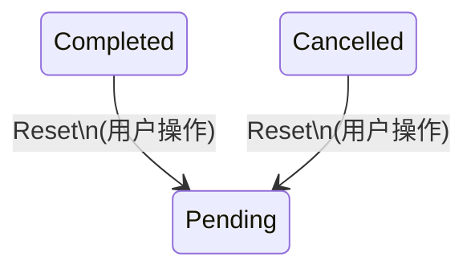

# ff-intelligent-neo 2.1.0 - 产品需求文档

> 版本: 2.1.0
> 日期: 2026-04-23
> 状态: Draft
> 基于: PRD-2.0.0-fin.md

---

## 开发流程规范（重要）

> **本节为强制性规范，所有开发者必须遵守。**

### 文档先行原则

2.1.0 版本的每个需求在进入开发阶段之前，**必须先更新 `docs/` 目录下的对应文档**。具体要求：

1. **定位关联文档**：每个需求明确关联需要修改的 `docs/` 文件
2. **标记变更行数**：在 `docs/` 文件中使用注释标记行号范围，格式为 `<!-- v2.1.0-CHANGE: 行N-行M -->`
3. **同步到 PRD**：将修改后的 `docs/` 内容段复制到本 PRD 的"文档变更追踪"附录中，以便开发时快速参照
4. **变更完成后开发**：文档变更经确认后，方可开始代码实现

### 文档与代码映射

| 需求类别 | 需关联的 docs 文件 | 说明 |
|---------|-------------------|------|
| 状态机/任务行为变更 | `docs/StateMachine.md` | 状态转移、按钮映射、终态处理 |
| 业务规则变更 | `docs/BusinessRules.md` | 验证规则、约束条件、异常处理 |
| 流程变更 | `docs/Procedure.md` | 操作流程、时序图 |
| 数据模型变更 | `docs/fields/*.csv` | 字段新增/修改/删除 |
| 架构变更 | `docs/Structure.md` | 模块关系、API 变更 |

---

## 0. 版本概述

### 0.1 版本背景

2.0.0 版本完成了基础架构重构（多页面导航、任务队列、命令配置、软件设置），但在以下方面存在不足：

- **多平台兼容性**：FFmpeg 下载/检测/路径选择和暂停恢复功能仅适配 Windows
- **功能完整性**：命令构建器仅实现了基础转码参数，缺少编码器库、高级滤镜、多文件操作等
- **用户体验**：任务完成后操作按钮行为不合理、FFmpeg 检测弹出终端窗口、缺少主题和国际化支持

### 0.2 版本目标

| 类别 | 目标 |
|------|------|
| 多平台兼容 | FFmpeg 管理、暂停/恢复功能在 Windows/macOS/Linux 上均可正常工作 |
| 功能完善 | 命令构建器覆盖编码器设置、滤镜设置、横竖屏转换、视频剪辑、音频字幕处理、多视频处理 |
| 用户体验 | 优化任务完成后的操作逻辑、静默 FFmpeg 检测、水印拖拽输入、主题切换、中英双语 |
| 文档先行 | 所有需求先更新 `docs/` 文档，确保设计文档与代码同步 |

### 0.3 不兼容说明

2.1.0 向下兼容 2.0.0 的配置数据。不引入破坏性变更。

### 0.4 技术栈（不变）

与 PRD-2.0.0-fin.md 1.3 节一致，无变更。

---

## 1. 多平台兼容性

### 1.1 FFmpeg 下载/路径检测/文件选择 — 跨平台审查

> 关联文档：`docs/Structure.md`（FFmpeg 管理模块）、`docs/Procedure.md`（FFmpeg 初始化流程）

#### 1.1.1 FFmpeg 下载

**现状问题**：
- `static_ffmpeg` 仅支持 Windows 平台的预编译二进制下载
- 下载失败时无明确的平台提示

**需求**：
- Windows: 保持使用 `static_ffmpeg` 下载
- macOS: 使用 `homebrew` 或从 `ffmpeg.org` 下载预编译二进制
- Linux: 引导用户通过包管理器安装（`apt`/`dnf`/`pacman`）

**Bridge API 变更**：

| 方法 | 变更 |
|------|------|
| `download_ffmpeg` | 增加平台判断，不同平台使用不同下载策略 |
| 返回值 | 增加平台特定提示信息 |

#### 1.1.2 FFmpeg 路径检测

**现状问题**：
- 仅在 Windows PATH 和内置目录中查找
- 未检测软件同目录下的 `ffmpeg/` 文件夹

**需求**：
- 检测优先级（从高到低）：
  1. 用户上次选择的路径（settings.json 中记录）
  2. 软件同目录下 `ffmpeg/` 文件夹（`./ffmpeg/ffmpeg.exe` 或 `./ffmpeg/ffmpeg`）
  3. 系统 PATH 中的 ffmpeg
  4. 内置/下载的 ffmpeg（static_ffmpeg/homebrew等）
- 跨平台路径处理：使用 `pathlib.Path` 替代硬编码的 `\` 或 `/`
- 自动检测同目录 ffprobe（与 ffmpeg 同目录下）

#### 1.1.3 文件选择对话框

**现状问题**：
- 文件选择对话框可能存在平台差异

**需求**：
- Windows: 使用 `pywebview` 的 `create_file_dialog`
- macOS/Linux: 同上，验证 `create_file_dialog` 在各平台的文件类型过滤（filter）参数格式

### 1.2 暂停/恢复/退出/权限 — 跨平台审查

> 关联文档：`docs/StateMachine.md`（暂停/恢复转移）、`docs/Procedure.md`（进程控制流程）

#### 1.2.1 进程挂起

**现状**：PRD-2.0.0-fin.md 6.6 节已定义跨平台方案，但需验证和补充。

| 平台 | 挂起方式 | 已实现 | 需验证/修复 |
|------|---------|--------|------------|
| Windows | `ctypes.windll.kernel32.SuspendProcess` | 是 | 权限不足时的降级处理 |
| macOS | `os.kill(pid, SIGSTOP)` | 否 | 需实现 |
| Linux | `os.kill(pid, SIGSTOP)` | 否 | 需实现 |

**需求**：
- macOS: 使用 `SIGSTOP`/`SIGCONT`，需注意 macOS SIP（System Integrity Protection）不影响用户进程
- Linux: 使用 `SIGSTOP`/`SIGCONT`，需处理权限不足场景
- 通用降级：若进程挂起失败（权限不足等），降级为 kill + 记录进度，恢复时从进度点重新启动

#### 1.2.2 进程终止

**现状问题**：
- Windows 使用 `taskkill /F /T /PID`，需确认是否在所有 Windows 版本可用
- macOS/Linux 需实现进程树终止

**需求**：
- Windows: 保持使用 `subprocess.CREATE_NO_WINDOW` 标志避免弹出终端
- macOS/Linux: 使用 `os.killpg` 或 `kill -- -$PGID` 终止进程组
- 所有平台：FFmpeg 子进程创建时设置 `start_new_session=True`（Unix）或使用 Job Object（Windows），确保子进程树可被完整终止

#### 1.2.3 退出时清理

**需求**：
- 应用退出时，所有 running 和 paused 状态的任务应被标记为 failed（与当前 StateMachine.md 恢复逻辑一致）
- 终止所有关联的 FFmpeg 子进程
- 确保 stderr 读取线程正确退出，不产生僵尸线程

---

## 2. 功能问题

### 2.1 命令构建功能完善

> 关联文档：`docs/Structure.md`（command_builder 模块）、`docs/fields/TranscodeConfig.csv`、`docs/fields/FilterConfig.csv`、`docs/BusinessRules.md`（参数验证）
> 参考文档：`references/command_builder.md`

根据 `references/command_builder.md` 自检，当前命令构建器缺少以下功能：

#### 2.1.1 编码器设置增强

**现状问题**：
- 编码器下拉列表仅包含 `libx264, libx265, copy, none` 等基础选项
- 缺少硬件加速编码器（NVIDIA/AMD/Intel）
- 缺少质量值推荐和说明

**需求**：

**视频编码器扩展**：

| 分类 | 编码器 | 硬件类型 | 推荐质量值 | 质量模式 | 优先级 |
|------|--------|---------|-----------|---------|--------|
| 首选推荐 | `av1_nvenc` | NVIDIA | CQ=36 | cq | P0 |
| 首选推荐 | `libx265` | CPU | CRF=24 | crf | P0 |
| 首选推荐 | `libsvtav1` | CPU | CRF=32 | crf | P0 |
| 次选推荐 | `libx264` | CPU | CRF=23 | crf | P1 |
| 次选推荐 | `hevc_nvenc` | NVIDIA | CQ=28 | cq | P1 |
| 次选推荐 | `h264_nvenc` | NVIDIA | CQ=28 | cq | P1 |
| 次选推荐 | `libvpx-vp9` | CPU | CRF=31 | crf | P1 |
| 条件推荐 | `h264_amf` | AMD | QP=34 | qp | P2 |
| 条件推荐 | `hevc_amf` | AMD | QP=32 | qp | P2 |
| 条件推荐 | `h264_qsv` | Intel | QP=28 | qp | P2 |
| 条件推荐 | `hevc_qsv` | Intel | QP=30 | qp | P2 |

**音频编码器扩展**：

| 编码器 | 说明 | 推荐码率 |
|--------|------|---------|
| `aac` | 通用音频编码 | 192k |
| `opus` | 开源高质量音频编码 | 128k |
| `flac` | 无损音频编码 | - |
| `libmp3lame` | MP3 编码 | 320k |
| `alac` | Apple Lossless | - |
| `copy` | 不重编码 | - |
| `none` | 移除音频 | - |

**编码器数据库设计**：

```typescript
// docs/fields/ 新增 Encoder.csv
interface EncoderConfig {
  name: string              // FFmpeg 编码器名称
  displayName: string        // 用户友好显示名
  category: 'video' | 'audio'
  hardwareType?: 'cpu' | 'nvidia' | 'amd' | 'intel'
  recommendedQuality?: number // 推荐质量值
  qualityMode?: 'crf' | 'cq' | 'qp'
  description: string       // 使用建议
  priority: 'P0' | 'P1' | 'P2' // 显示优先级
}
```

**UI 变更**：
- 编码器下拉列表分组显示：首选推荐 / 次选推荐 / 条件推荐
- 选择编码器后，自动填充推荐质量值和质量模式
- 显示编码器说明和适用场景提示
- 硬件加速编码器检测：启动时检测 FFmpeg 是否支持对应硬件编码器，不支持的不显示或灰显

#### 2.1.2 滤镜设置增强

**现状问题**：
- 当前仅支持旋转、裁剪、水印、音量、速度基础滤镜
- 缺少音频归一化（loudnorm）、横竖屏转换等

**需求**：

**新增滤镜参数**：

| 参数 | 字段名 | 类型 | 默认值 | 说明 |
|------|--------|------|--------|------|
| 音频归一化 | audio_normalize | boolean | false | 启用 EBU R128 响度归一化 |
| 目标响度 | target_loudness | number | -16 | 目标整合响度（LUFS） |
| 真峰值限制 | true_peak | number | -1.5 | 真峰值限制（dBTP） |
| 响度范围 | lra | number | 11 | 响度范围目标（LU） |
| 横竖屏转换 | aspect_convert | select | 无 | H2V-I, H2V-T, H2V-B, V2H-I, V2H-T, V2H-B |
| 目标分辨率 | target_resolution | text | 1080x1920 | 横竖屏转换目标分辨率 |
| 背景图片 | bg_image_path | text | "" | H2V-I/V2H-I 模式的背景图片路径 |

**滤镜链排序**（与 2.0.0 一致，新增项插入对应位置）：

```
crop -> scale -> rotate -> aspect_convert -> overlay(watermark) -> audio_normalize -> speed
```

#### 2.1.3 横竖屏转换

**参考**：`references/command_builder.md` "横竖屏转换" 章节

**支持的转换模式**：

| 模式 | 说明 | filter_complex |
|------|------|---------------|
| H2V-I | 横转竖，背景叠加图片 | `[1:v]scale + loop + overlay` |
| H2V-T | 横转竖，背景模糊视频 | `split + scale + boxblur + overlay` |
| H2V-B | 横转竖，黑色填充 | `scale + pad` |
| V2H-I | 竖转横，背景叠加图片 | 同 H2V-I 逻辑，方向相反 |
| V2H-T | 竖转横，背景模糊视频 | 同 H2V-T 逻辑，方向相反 |
| V2H-B | 竖转横，黑色填充 | `scale + pad` |

**UI 要求**：
- 横竖屏转换与基础滤镜互斥（参考 command_builder.md 的验证规则）
- H2V-I/V2H-I 模式需额外提供背景图片选择器（复用水印的拖拽输入组件）

#### 2.1.4 视频剪辑

**参考**：`references/command_builder.md` "Video Extraction and Cutting" 章节

**支持的剪辑模式**：

| 模式 | 说明 | 参数 |
|------|------|------|
| 提取模式 | 去除片头片尾 | 开始时间、片尾时长 |
| 精确剪切 | 指定时间范围 | 开始时间、结束时间 |

**命令构建**：
```
ffmpeg -hide_banner -y -ss START -to END -accurate_seek -i "input" -c copy "output"
```

**UI 要求**：
- 剪辑功能作为命令配置页的新选项卡或独立区域
- 时间输入格式：`H:mm:ss.fff`
- 需要探测文件时长（使用 ffprobe），用于提取模式的计算
- 验证：时间范围不超过文件时长

#### 2.1.5 音频字幕混合

**参考**：`references/command_builder.md` "avsmix_encode" 章节

**功能**：从外部文件替换/添加音频和字幕到视频

**参数**：

| 参数 | 字段名 | 类型 | 说明 |
|------|--------|------|------|
| 外部音频 | external_audio_path | text | 外部音频文件路径 |
| 字幕文件 | subtitle_path | text | 外部字幕文件路径 |
| 字幕语言 | subtitle_language | text | 字幕语言代码（如 `chi`, `eng`） |

**命令构建**：
```
ffmpeg -i "input.mp4" -i "audio.mp3" -i "subs.srt" -map 0:v -map 1:a -map 2:s -c:s mov_text -metadata:s:s:0 language=eng "output.mp4"
```

#### 2.1.6 多视频拼接

**参考**：`references/command_builder.md` "Video Merging and Concatenation" 章节

**拼接方式**（三种可选）：

| 方式 | FFmpeg 参数 | 特点 | 质量 |
|------|-----------|------|------|
| TS 格式拼接 | `-f concat -safe 0` | 极快，要求相同编码参数 | 无损 |
| FFmpeg concat 协议 | `concat:file1\|file2` | 极快，要求相同编码 | 无损 |
| filter_complex 重编码 | `-filter_complex concat` | 支持不同编码参数，可标准化 | 有损 |

**需求**：
- 提供独立的"多文件拼接"界面（包含文件列表 + 命令配置）
- 文件列表支持拖拽排序
- 默认使用 TS 格式拼接（最快），若参数不同则降级到 filter_complex
- filter_complex 模式支持分辨率和帧率标准化

**UI 布局**：

```
+------------------------------------------------------------------+
| MultiFilePanel                                                     |
| [添加文件] [移除选中] [上移] [下移]                                  |
|                                                                    |
| FileList:                                                          |
| [1] OP_video.mp4    [x]                                            |
| [2] Main_video.mp4  [x]                                            |
| [3] ED_video.mp4    [x]                                            |
+------------------------------------------------------------------+
| MergeConfig                                                        |
| 拼接方式: (o) TS快速拼接  ( ) concat协议  ( ) 重编码拼接            |
| [重编码拼接时显示:]                                                 |
|   目标分辨率: [1920x1080]   目标帧率: [30]                          |
|   编码器: [libx265 v]     质量: [24]                               |
+------------------------------------------------------------------+
| CommandPreview                                                     |
| ffmpeg -f concat -safe 0 -i list.txt -c copy "output.mp4"          |
+------------------------------------------------------------------+
| [开始拼接]                                                          |
+------------------------------------------------------------------+
```

### 2.2 任务完成后操作按钮优化

> 关联文档：`docs/StateMachine.md`（终态处理、按钮映射）

**现状问题**：
- 任务完成后（completed/cancelled），Action 列仍显示 Log 按钮
- 日志内容已被清除，点击无意义

**需求**：

#### 2.2.1 按钮行为变更

| 任务状态 | 现有按钮 | 变更后按钮 | 说明 |
|---------|---------|-----------|------|
| failed | Log, Retry | Log, Retry | Log 保留完整日志内容不删除 |
| completed | Log (空) | Reset | 重置为 pending，可重新执行 |
| cancelled | Log (空) | Reset | 重置为 pending，可重新执行 |
| running | Pause, Stop | Pause, Stop | 不变 |
| paused | Resume, Stop | Resume, Stop | 不变 |
| pending | Start, Stop | Start, Stop | 不变 |

#### 2.2.2 日志生命周期变更

| 场景 | 现有行为 | 变更后行为 |
|------|---------|-----------|
| FFmpeg 运行中报错 | 日志随任务结束清除 | 保留日志直到手动删除任务记录 |
| 正常完成/取消 | 日志清除 | 日志清除（Reset 不需要日志） |
| 重启恢复 | 日志截断 | 不变 |
| 手动删除任务 | 同步删除 | 同步删除日志文件 |

#### 2.2.3 状态机变更

在现有 StateMachine.md 中新增状态转移：



**Bridge API 新增**：

| 方法 | 参数 | 返回 | 说明 |
|------|------|------|------|
| `reset_task` | task_id: str | None | 将 completed/cancelled 任务重置为 pending，清除日志和输出路径 |

### 2.3 FFmpeg 检测静默运行

**现状问题**：
- 打包后，进入设置界面和 FFmpeg 版本切换时会短暂弹出两个终端窗口
- 原因：`subprocess.Popen` 未设置隐藏窗口标志

**需求**：

| 平台 | 解决方案 |
|------|---------|
| Windows | `subprocess.Popen` 添加 `creationflags=subprocess.CREATE_NO_WINDOW` |
| macOS | 使用 `subprocess.Popen` 默认行为（macOS 默认不弹出终端） |
| Linux | 使用 `subprocess.Popen` 默认行为（Linux 默认不弹出终端） |

**影响范围**：
- `core/ffmpeg_setup.py` 中的版本检测调用
- `core/file_info.py` 中的 ffprobe 探测调用
- `core/ffmpeg_runner.py` 中的 FFmpeg 执行（已处理，验证是否完整）

---

## 3. 前端优化

### 3.1 水印路径输入组件

**现状问题**：
- 水印路径为普通文本输入框，需手动输入路径

**需求**：
- 改为可拖拽输入文件区域（drag & drop zone）
- 点击区域时打开文件选择器（过滤图片文件：*.png, *.jpg, *.jpeg, *.bmp, *.webp）
- 拖拽/选择后显示文件名（非完整路径），鼠标悬停显示完整路径
- 支持清除已选文件
- 此组件为通用组件，横竖屏转换的背景图片路径也复用

**组件设计**：`FileDropInput.vue`

```
Props:
  - accept: string (文件类型过滤器，如 ".png,.jpg")
  - modelValue: string (文件路径)
  - placeholder: string (占位文本)

Events:
  - update:modelValue (选择/拖拽后触发)

Behavior:
  - 拖拽进入时显示高亮边框
  - 点击打开文件选择器
  - 选中后显示文件名 + 清除按钮
```

### 3.2 FFmpeg 版本指示器更新

**现状问题**：
- 切换 FFmpeg 版本后，导航栏右上角的 FFmpeg 状态标识未更新

**需求**：
- `switch_ffmpeg` 调用成功后，触发事件更新导航栏状态
- 事件名：`ffmpeg_version_changed`（新增）
- 事件数据：`{ version: string, path: string, status: 'ready' | 'not_found' }`
- 导航栏监听此事件并更新显示

### 3.3 "Download FFmpeg" 按钮始终存在

**现状问题**：
- 检测到 FFmpeg 后，下载按钮可能被隐藏或禁用

**需求**：
- "Download FFmpeg" 按钮始终可见
- 点击后弹出二次确认对话框："确认下载 FFmpeg？将覆盖当前版本。"
- 用户确认后通过 `download_ffmpeg` 下载
- 下载过程中按钮显示加载状态

### 3.4 本地 FFmpeg 文件夹检测

**现状问题**：
- 未检测软件同目录下的 `ffmpeg/` 文件夹

**需求**：
- 启动时检测 `./ffmpeg/` 文件夹
- 若 `./ffmpeg/ffmpeg[.exe]` 存在且可执行，将其视为最高优先级（仅次于用户上次选择的路径）
- 在 FFmpeg 版本列表中标记来源为"本地"（区别于"系统"和"自定义"）
- 若同目录 `ffmpeg/` 中有有效文件且当前无自定义路径，自动设为默认路径

### 3.5 浅色/深色主题切换

**现状问题**：
- 仅使用 DaisyUI 默认深色主题

**需求**：
- 利用 DaisyUI 自带的 `data-theme` 属性实现主题切换
- 导航栏添加主题切换按钮（太阳/月亮图标）
- 默认跟随系统主题（`prefers-color-scheme`）
- 用户手动选择后保存到 `settings.json`
- 支持的 DaisyUI 主题：`light` / `dark`（2.1.0 仅支持这两个）

**实现要点**：
- 在 `<html>` 标签上设置 `data-theme` 属性
- 使用 DaisyUI 的 `theme-change` 事件或手动切换
- `AppSettings` 新增字段 `theme: 'auto' | 'light' | 'dark'`

### 3.6 i18n 多语言支持

**现状问题**：
- 所有界面文本硬编码为中文

**需求**：
- 首先实现中文界面（确保所有现有文本完整）
- 然后实现中英双语切换
- 默认语言：跟随系统语言，中文优先

**技术选型**：
- 使用 `vue-i18n` 作为国际化框架
- 语言文件组织：

```
frontend/src/
  i18n/
    index.ts          # i18n 实例配置
    zh-CN.ts          # 中文语言包
    en-US.ts          # 英文语言包
```

**语言包示例**：
```typescript
// zh-CN.ts
export default {
  nav: {
    taskQueue: '任务队列',
    commandConfig: '命令配置',
    settings: '软件配置'
  },
  taskQueue: {
    addFiles: '添加文件',
    removeSelected: '移除选中',
    // ...
  }
}
```

**UI 变更**：
- 导航栏添加语言切换按钮（中/EN）
- 所有硬编码文本替换为 `$t('key')` 或 `t('key')`
- 用户选择保存到 `settings.json`

---

## 4. 数据模型变更

### 4.1 AppSettings 新增字段

| 字段 | 类型 | 默认值 | 说明 |
|------|------|--------|------|
| theme | string | 'auto' | 主题设置：auto/light/dark |
| language | string | 'auto' | 语言设置：auto/zh-CN/en-US |

### 4.2 FilterConfig 新增字段

| 字段 | 类型 | 默认值 | 说明 |
|------|------|--------|------|
| audio_normalize | bool | false | 是否启用音频归一化 |
| target_loudness | number | -16 | 目标响度（LUFS） |
| true_peak | number | -1.5 | 真峰值限制（dBTP） |
| lra | number | 11 | 响度范围（LU） |
| aspect_convert | string | '' | 横竖屏转换模式 |
| target_resolution | string | '' | 横竖屏目标分辨率 |
| bg_image_path | string | '' | 横竖屏背景图片路径 |

### 4.3 新增数据模型

#### EncoderConfig（编码器配置）

新增 `docs/fields/Encoder.csv`：

| 字段名 | 类型 | 说明 |
|--------|------|------|
| name | string | FFmpeg 编码器名称 |
| display_name | string | 用户友好显示名 |
| category | enum | video / audio |
| hardware_type | enum? | cpu / nvidia / amd / intel |
| recommended_quality | number? | 推荐质量值 |
| quality_mode | enum? | crf / cq / qp |
| description | string | 使用建议描述 |
| priority | enum | P0 / P1 / P2 |

#### MergeConfig（拼接配置）

新增 `docs/fields/MergeConfig.csv`：

| 字段名 | 类型 | 说明 |
|--------|------|------|
| merge_mode | enum | ts_concat / concat_protocol / filter_complex |
| target_resolution | string? | 重编码模式的目标分辨率 |
| target_fps | number? | 重编码模式的目标帧率 |
| transcode_config | TranscodeConfig? | 重编码模式的编码参数 |

#### ClipConfig（剪辑配置）

新增 `docs/fields/ClipConfig.csv`：

| 字段名 | 类型 | 说明 |
|--------|------|------|
| clip_mode | enum | extract / cut |
| start_time | string | 开始时间（H:mm:ss.fff） |
| end_time_or_duration | string | 结束时间或片尾时长 |
| use_copy_codec | bool | 是否使用 -c copy（无损快速模式） |

#### AudioSubtitleConfig（音频字幕配置）

新增 `docs/fields/AudioSubtitleConfig.csv`：

| 字段名 | 类型 | 说明 |
|--------|------|------|
| external_audio_path | string | 外部音频文件路径 |
| subtitle_path | string | 字幕文件路径 |
| subtitle_language | string | 字幕语言代码 |

---

## 5. Bridge API 变更汇总

### 5.1 新增方法

| 方法 | 参数 | 返回 | 说明 |
|------|------|------|------|
| `reset_task` | task_id: str | None | 重置 completed/cancelled 为 pending |
| `check_hw_encoders` | - | encoders: list | 检测 FFmpeg 支持的硬件编码器 |

### 5.2 修改方法

| 方法 | 变更说明 |
|------|---------|
| `download_ffmpeg` | 增加平台判断和二次确认 |
| `setup_ffmpeg` | 增加本地 `./ffmpeg/` 文件夹检测 |
| `switch_ffmpeg` | 成功后触发 `ffmpeg_version_changed` 事件 |
| `get_ffmpeg_versions` | 增加本地文件夹来源标识 |
| `build_command` | 支持新增的滤镜参数、剪辑参数、音频字幕参数 |
| `validate_config` | 增加新参数的验证规则 |

### 5.3 新增事件

| 事件名 | 数据 | 触发时机 |
|--------|------|----------|
| `ffmpeg_version_changed` | { version, path, status } | FFmpeg 版本切换后 |

---

## 6. 实施阶段

### Phase 1: 多平台兼容性与基础修复（优先级最高）

| 编号 | 任务 | 关联文档 |
|------|------|---------|
| 1.1 | FFmpeg 检测静默运行（subprocess CREATE_NO_WINDOW） | docs/Procedure.md |
| 1.2 | FFmpeg 路径检测跨平台化 + 本地 ffmpeg/ 文件夹检测 | docs/Structure.md, docs/Procedure.md |
| 1.3 | 暂停/恢复 macOS/Linux 实现与权限降级 | docs/StateMachine.md, docs/Procedure.md |
| 1.4 | 进程终止跨平台化（进程组管理） | docs/Procedure.md |

### Phase 2: 用户体验优化

| 编号 | 任务 | 关联文档 |
|------|------|---------|
| 2.1 | 任务完成后操作按钮优化（Reset + 日志生命周期） | docs/StateMachine.md, docs/BusinessRules.md |
| 2.2 | 水印路径拖拽输入组件（FileDropInput.vue） | docs/Structure.md |
| 2.3 | FFmpeg 版本指示器实时更新 | docs/Structure.md |
| 2.4 | Download FFmpeg 按钮始终可见 + 二次确认 | docs/BusinessRules.md |
| 2.5 | 浅色/深色主题切换 | docs/Structure.md, docs/fields/AppSettings.csv |

### Phase 3: 命令构建功能完善

| 编号 | 任务 | 关联文档 |
|------|------|---------|
| 3.1 | 编码器数据库扩展（40+ 编码器） | docs/fields/Encoder.csv (新增), docs/BusinessRules.md |
| 3.2 | 硬件编码器自动检测 | docs/Procedure.md |
| 3.3 | 音频归一化滤镜 | docs/fields/FilterConfig.csv, docs/BusinessRules.md |
| 3.4 | 横竖屏转换功能 | docs/fields/FilterConfig.csv, docs/BusinessRules.md |
| 3.5 | 视频剪辑功能（提取 + 精确剪切） | docs/fields/ClipConfig.csv (新增) |
| 3.6 | 音频字幕混合功能 | docs/fields/AudioSubtitleConfig.csv (新增) |
| 3.7 | 多视频拼接功能 | docs/fields/MergeConfig.csv (新增) |

### Phase 4: 国际化

| 编号 | 任务 | 关联文档 |
|------|------|---------|
| 4.1 | vue-i18n 集成 + 中文语言包完善 | docs/Structure.md |
| 4.2 | 英文语言包翻译 | - |
| 4.3 | 语言切换 UI | docs/fields/AppSettings.csv |

---

## 附录 A: 文档变更追踪

> 开发时参照此附录，确认对应 docs 文件已更新后再开始编码。

### A.1 docs/StateMachine.md 变更

**变更内容**：新增 Reset 状态转移

```markdown
<!-- v2.1.0-CHANGE: 新增 Reset 转移 -->
在"恢复状态转移"章节后新增：

## Reset 状态转移

completed 和 cancelled 为终态的任务可通过用户操作重置为 pending 重新执行。

### 触发方式

| 转移 | 触发方式 | 前端 API | 后端处理 |
|------|---------|---------|---------|
| completed -> pending | 点击 Reset | `reset_task(id)` | 清除日志、输出路径、错误信息，重置进度 |
| cancelled -> pending | 点击 Reset | `reset_task(id)` | 同上 |

### 按钮映射变更

| 状态 | 变更前 | 变更后 |
|------|--------|--------|
| completed | (无) | Reset |
| cancelled | (无) | Reset |
```

### A.2 docs/BusinessRules.md 变更

**变更内容**：
1. 新增参数验证规则（编码器、滤镜、剪辑、音频字幕）
2. 日志生命周期规则
3. FFmpeg 路径检测优先级规则
4. Download FFmpeg 二次确认规则

### A.3 docs/fields/ 变更

**新增文件**：
- `docs/fields/Encoder.csv` - 编码器配置
- `docs/fields/MergeConfig.csv` - 拼接配置
- `docs/fields/ClipConfig.csv` - 剪辑配置
- `docs/fields/AudioSubtitleConfig.csv` - 音频字幕配置

**修改文件**：
- `docs/fields/FilterConfig.csv` - 新增音频归一化、横竖屏转换字段
- `docs/fields/TranscodeConfig.csv` - 扩展编码器列表
- `docs/fields/AppSettings.csv` - 新增 theme、language 字段
- `docs/fields/Task.csv` - 新增 Reset 相关行为说明

### A.4 docs/Structure.md 变更

**变更内容**：
1. 新增 FileDropInput.vue 组件
2. 新增 i18n 目录结构
3. 更新 command_builder.py 模块职责描述
4. 新增 MultiFileMerge 页面描述（如为独立页面）

### A.5 docs/Procedure.md 变更

**变更内容**：
1. 更新 FFmpeg 初始化流程（增加本地文件夹检测）
2. 更新进程控制流程（跨平台兼容）
3. 新增硬件编码器检测流程

---

## 附录 B: 参考文档索引

| 文档 | 路径 | 用途 |
|------|------|------|
| PRD 2.0.0 | `references/PRD-2.0.0-fin.md` | 基础架构设计参考 |
| 命令构建参考 | `references/command_builder.md` | FFmpeg 功能完整参考 |
| Issues 2.1.0 | `references/issues-2.1.0.md` | 原始问题列表 |
