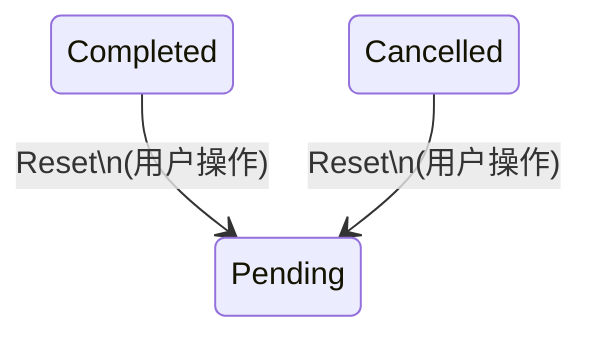

# ff-intelligent-neo 2.1.0 - 产品需求文档

> 版本: 2.1.0
> 日期: 2026-04-23
> 状态: Draft
> 基于: PRD-2.0.0-fin.md

---

## 开发流程规范（重要）

> **本节为强制性规范，所有开发者必须遵守。**

### 文档先行原则

2.1.0 版本的每个需求在进入开发阶段之前，**必须先更新 `docs/` 目录下的对应文档**。具体要求：

1. **定位关联文档**：每个需求明确关联需要修改的 `docs/` 文件
2. **标记变更行数**：在 `docs/` 文件中使用注释标记行号范围，格式为 `<!-- v2.1.0-CHANGE: 行N-行M -->`
3. **同步到 PRD**：将修改后的 `docs/` 内容段复制到本 PRD 的"文档变更追踪"附录中，以便开发时快速参照
4. **变更完成后开发**：文档变更经确认后，方可开始代码实现

### 文档与代码映射

| 需求类别 | 需关联的 docs 文件 | 说明 |
|---------|-------------------|------|
| 状态机/任务行为变更 | `docs/StateMachine.md` | 状态转移、按钮映射、终态处理 |
| 业务规则变更 | `docs/BusinessRules.md` | 验证规则、约束条件、异常处理 |
| 流程变更 | `docs/Procedure.md` | 操作流程、时序图 |
| 数据模型变更 | `docs/fields/*.csv` | 字段新增/修改/删除 |
| 架构变更 | `docs/Structure.md` | 模块关系、API 变更 |

---

## 0. 版本概述

### 0.1 版本背景

2.0.0 版本完成了基础架构重构（多页面导航、任务队列、命令配置、软件设置），但在以下方面存在不足：

- **多平台兼容性**：FFmpeg 下载/检测/路径选择和暂停恢复功能仅适配 Windows
- **功能完整性**：命令构建器仅实现了基础转码参数，缺少编码器库、高级滤镜、多文件操作等
- **用户体验**：任务完成后操作按钮行为不合理、FFmpeg 检测弹出终端窗口、缺少主题和国际化支持

### 0.2 版本目标

| 类别 | 目标 |
|------|------|
| 多平台兼容 | FFmpeg 管理、暂停/恢复功能在 Windows/macOS/Linux 上均可正常工作 |
| 功能完善 | 命令构建器覆盖编码器设置、滤镜设置、横竖屏转换、视频剪辑、音频字幕处理、多视频处理 |
| 用户体验 | 优化任务完成后的操作逻辑、静默 FFmpeg 检测、水印拖拽输入、主题切换、中英双语 |
| 文档先行 | 所有需求先更新 `docs/` 文档，确保设计文档与代码同步 |

### 0.3 不兼容说明

2.1.0 向下兼容 2.0.0 的配置数据。不引入破坏性变更。

### 0.4 技术栈（不变）

与 PRD-2.0.0-fin.md 1.3 节一致，无变更。

---

## 1. 多平台兼容性

### 1.1 FFmpeg 下载/路径检测/文件选择 — 跨平台审查

> 关联文档：`docs/Structure.md`（FFmpeg 管理模块）、`docs/Procedure.md`（FFmpeg 初始化流程）

#### 1.1.1 FFmpeg 下载

**现状问题**：
- `static_ffmpeg` 仅支持 Windows 平台的预编译二进制下载
- 下载失败时无明确的平台提示

**需求**：
- Windows: 保持使用 `static_ffmpeg` 下载
- macOS: 使用 `homebrew` 或从 `ffmpeg.org` 下载预编译二进制
- Linux: 引导用户通过包管理器安装（`apt`/`dnf`/`pacman`）

**Bridge API 变更**：

| 方法 | 变更 |
|------|------|
| `download_ffmpeg` | 增加平台判断，不同平台使用不同下载策略 |
| 返回值 | 增加平台特定提示信息 |

#### 1.1.2 FFmpeg 路径检测

**现状问题**：
- 仅在 Windows PATH 和内置目录中查找
- 未检测软件同目录下的 `ffmpeg/` 文件夹

**需求**：
- 检测优先级（从高到低）：
  1. 用户上次选择的路径（settings.json 中记录）
  2. 软件同目录下 `ffmpeg/` 文件夹（`./ffmpeg/ffmpeg.exe` 或 `./ffmpeg/ffmpeg`）
  3. 系统 PATH 中的 ffmpeg
  4. 内置/下载的 ffmpeg（static_ffmpeg/homebrew等）
- 跨平台路径处理：使用 `pathlib.Path` 替代硬编码的 `\` 或 `/`
- 自动检测同目录 ffprobe（与 ffmpeg 同目录下）

#### 1.1.3 文件选择对话框

**现状问题**：
- 文件选择对话框可能存在平台差异

**需求**：
- Windows: 使用 `pywebview` 的 `create_file_dialog`
- macOS/Linux: 同上，验证 `create_file_dialog` 在各平台的文件类型过滤（filter）参数格式

### 1.2 暂停/恢复/退出/权限 — 跨平台审查

> 关联文档：`docs/StateMachine.md`（暂停/恢复转移）、`docs/Procedure.md`（进程控制流程）

#### 1.2.1 进程挂起

**现状**：PRD-2.0.0-fin.md 6.6 节已定义跨平台方案，但需验证和补充。

| 平台 | 挂起方式 | 已实现 | 需验证/修复 |
|------|---------|--------|------------|
| Windows | `ctypes.windll.kernel32.SuspendProcess` | 是 | 权限不足时的降级处理 |
| macOS | `os.kill(pid, SIGSTOP)` | 否 | 需实现 |
| Linux | `os.kill(pid, SIGSTOP)` | 否 | 需实现 |

**需求**：
- macOS: 使用 `SIGSTOP`/`SIGCONT`，需注意 macOS SIP（System Integrity Protection）不影响用户进程
- Linux: 使用 `SIGSTOP`/`SIGCONT`，需处理权限不足场景
- 通用降级：若进程挂起失败（权限不足等），降级为 kill + 记录进度，恢复时从进度点重新启动

#### 1.2.2 进程终止

**现状问题**：
- Windows 使用 `taskkill /F /T /PID`，需确认是否在所有 Windows 版本可用
- macOS/Linux 需实现进程树终止

**需求**：
- Windows: 保持使用 `subprocess.CREATE_NO_WINDOW` 标志避免弹出终端
- macOS/Linux: 使用 `os.killpg` 或 `kill -- -$PGID` 终止进程组
- 所有平台：FFmpeg 子进程创建时设置 `start_new_session=True`（Unix）或使用 Job Object（Windows），确保子进程树可被完整终止

#### 1.2.3 退出时清理

**需求**：
- 应用退出时，所有 running 和 paused 状态的任务应被标记为 failed（与当前 StateMachine.md 恢复逻辑一致）
- 终止所有关联的 FFmpeg 子进程
- 确保 stderr 读取线程正确退出，不产生僵尸线程

---

## 2. 功能问题

### 2.1 命令构建功能完善

> 关联文档：`docs/Structure.md`（command_builder 模块）、`docs/fields/TranscodeConfig.csv`、`docs/fields/FilterConfig.csv`、`docs/BusinessRules.md`（参数验证）
> 参考文档：`references/command_builder.md`

根据 `references/command_builder.md` 自检，当前命令构建器缺少以下功能：

#### 2.1.1 编码器设置增强

**现状问题**：
- 编码器下拉列表仅包含 `libx264, libx265, copy, none` 等基础选项
- 缺少硬件加速编码器（NVIDIA/AMD/Intel）
- 缺少质量值推荐和说明

**需求**：

**视频编码器扩展**：

| 分类 | 编码器 | 硬件类型 | 推荐质量值 | 质量模式 | 优先级 |
|------|--------|---------|-----------|---------|--------|
| 首选推荐 | `av1_nvenc` | NVIDIA | CQ=36 | cq | P0 |
| 首选推荐 | `libx265` | CPU | CRF=24 | crf | P0 |
| 首选推荐 | `libsvtav1` | CPU | CRF=32 | crf | P0 |
| 次选推荐 | `libx264` | CPU | CRF=23 | crf | P1 |
| 次选推荐 | `hevc_nvenc` | NVIDIA | CQ=28 | cq | P1 |
| 次选推荐 | `h264_nvenc` | NVIDIA | CQ=28 | cq | P1 |
| 次选推荐 | `libvpx-vp9` | CPU | CRF=31 | crf | P1 |
| 条件推荐 | `h264_amf` | AMD | QP=34 | qp | P2 |
| 条件推荐 | `hevc_amf` | AMD | QP=32 | qp | P2 |
| 条件推荐 | `h264_qsv` | Intel | QP=28 | qp | P2 |
| 条件推荐 | `hevc_qsv` | Intel | QP=30 | qp | P2 |

**音频编码器扩展**：

| 编码器 | 说明 | 推荐码率 |
|--------|------|---------|
| `aac` | 通用音频编码 | 192k |
| `opus` | 开源高质量音频编码 | 128k |
| `flac` | 无损音频编码 | - |
| `libmp3lame` | MP3 编码 | 320k |
| `alac` | Apple Lossless | - |
| `copy` | 不重编码 | - |
| `none` | 移除音频 | - |

**编码器数据库设计**：

```typescript
// docs/fields/ 新增 Encoder.csv
interface EncoderConfig {
  name: string              // FFmpeg 编码器名称
  displayName: string        // 用户友好显示名
  category: 'video' | 'audio'
  hardwareType?: 'cpu' | 'nvidia' | 'amd' | 'intel'
  recommendedQuality?: number // 推荐质量值
  qualityMode?: 'crf' | 'cq' | 'qp'
  description: string       // 使用建议
  priority: 'P0' | 'P1' | 'P2' // 显示优先级
}
```

**UI 变更**：
- 编码器下拉列表分组显示：首选推荐 / 次选推荐 / 条件推荐
- 选择编码器后，自动填充推荐质量值和质量模式
- 显示编码器说明和适用场景提示
- 硬件加速编码器检测：启动时检测 FFmpeg 是否支持对应硬件编码器，不支持的不显示或灰显

#### 2.1.2 滤镜设置增强

**现状问题**：
- 当前仅支持旋转、裁剪、水印、音量、速度基础滤镜
- 缺少音频归一化（loudnorm）、横竖屏转换等

**需求**：

**新增滤镜参数**：

| 参数 | 字段名 | 类型 | 默认值 | 说明 |
|------|--------|------|--------|------|
| 音频归一化 | audio_normalize | boolean | false | 启用 EBU R128 响度归一化 |
| 目标响度 | target_loudness | number | -16 | 目标整合响度（LUFS） |
| 真峰值限制 | true_peak | number | -1.5 | 真峰值限制（dBTP） |
| 响度范围 | lra | number | 11 | 响度范围目标（LU） |
| 横竖屏转换 | aspect_convert | select | 无 | H2V-I, H2V-T, H2V-B, V2H-I, V2H-T, V2H-B |
| 目标分辨率 | target_resolution | text | 1080x1920 | 横竖屏转换目标分辨率 |
| 背景图片 | bg_image_path | text | "" | H2V-I/V2H-I 模式的背景图片路径 |

**滤镜链排序**（与 2.0.0 一致，新增项插入对应位置）：

```
crop -> scale -> rotate -> aspect_convert -> overlay(watermark) -> audio_normalize -> speed
```

#### 2.1.3 横竖屏转换

**参考**：`references/command_builder.md` "横竖屏转换" 章节

**支持的转换模式**：

| 模式 | 说明 | filter_complex |
|------|------|---------------|
| H2V-I | 横转竖，背景叠加图片 | `[1:v]scale + loop + overlay` |
| H2V-T | 横转竖，背景模糊视频 | `split + scale + boxblur + overlay` |
| H2V-B | 横转竖，黑色填充 | `scale + pad` |
| V2H-I | 竖转横，背景叠加图片 | 同 H2V-I 逻辑，方向相反 |
| V2H-T | 竖转横，背景模糊视频 | 同 H2V-T 逻辑，方向相反 |
| V2H-B | 竖转横，黑色填充 | `scale + pad` |

**UI 要求**：
- 横竖屏转换与基础滤镜互斥（参考 command_builder.md 的验证规则）
- H2V-I/V2H-I 模式需额外提供背景图片选择器（复用水印的拖拽输入组件）

#### 2.1.4 视频剪辑

**参考**：`references/command_builder.md` "Video Extraction and Cutting" 章节

**支持的剪辑模式**：

| 模式 | 说明 | 参数 |
|------|------|------|
| 提取模式 | 去除片头片尾 | 开始时间、片尾时长 |
| 精确剪切 | 指定时间范围 | 开始时间、结束时间 |

**命令构建**：
```
ffmpeg -hide_banner -y -ss START -to END -accurate_seek -i "input" -c copy "output"
```

**UI 要求**：
- 剪辑功能作为命令配置页的新选项卡或独立区域
- 时间输入格式：`H:mm:ss.fff`
- 需要探测文件时长（使用 ffprobe），用于提取模式的计算
- 验证：时间范围不超过文件时长

#### 2.1.5 音频字幕混合

**参考**：`references/command_builder.md` "avsmix_encode" 章节

**功能**：从外部文件替换/添加音频和字幕到视频

**参数**：

| 参数 | 字段名 | 类型 | 说明 |
|------|--------|------|------|
| 外部音频 | external_audio_path | text | 外部音频文件路径 |
| 字幕文件 | subtitle_path | text | 外部字幕文件路径 |
| 字幕语言 | subtitle_language | text | 字幕语言代码（如 `chi`, `eng`） |

**命令构建**：
```
ffmpeg -i "input.mp4" -i "audio.mp3" -i "subs.srt" -map 0:v -map 1:a -map 2:s -c:s mov_text -metadata:s:s:0 language=eng "output.mp4"
```

#### 2.1.6 多视频拼接

**参考**：`references/command_builder.md` "Video Merging and Concatenation" 章节

**拼接方式**（三种可选）：

| 方式 | FFmpeg 参数 | 特点 | 质量 |
|------|-----------|------|------|
| TS 格式拼接 | `-f concat -safe 0` | 极快，要求相同编码参数 | 无损 |
| FFmpeg concat 协议 | `concat:file1\|file2` | 极快，要求相同编码 | 无损 |
| filter_complex 重编码 | `-filter_complex concat` | 支持不同编码参数，可标准化 | 有损 |

**需求**：
- 提供独立的"多文件拼接"界面（包含文件列表 + 命令配置）
- 文件列表支持拖拽排序
- 默认使用 TS 格式拼接（最快），若参数不同则降级到 filter_complex
- filter_complex 模式支持分辨率和帧率标准化

**UI 布局**：

```
+------------------------------------------------------------------+
| MultiFilePanel                                                     |
| [添加文件] [移除选中] [上移] [下移]                                  |
|                                                                    |
| FileList:                                                          |
| [1] OP_video.mp4    [x]                                            |
| [2] Main_video.mp4  [x]                                            |
| [3] ED_video.mp4    [x]                                            |
+------------------------------------------------------------------+
| MergeConfig                                                        |
| 拼接方式: (o) TS快速拼接  ( ) concat协议  ( ) 重编码拼接            |
| [重编码拼接时显示:]                                                 |
|   目标分辨率: [1920x1080]   目标帧率: [30]                          |
|   编码器: [libx265 v]     质量: [24]                               |
+------------------------------------------------------------------+
| CommandPreview                                                     |
| ffmpeg -f concat -safe 0 -i list.txt -c copy "output.mp4"          |
+------------------------------------------------------------------+
| [开始拼接]                                                          |
+------------------------------------------------------------------+
```

### 2.2 任务完成后操作按钮优化

> 关联文档：`docs/StateMachine.md`（终态处理、按钮映射）

**现状问题**：
- 任务完成后（completed/cancelled），Action 列仍显示 Log 按钮
- 日志内容已被清除，点击无意义

**需求**：

#### 2.2.1 按钮行为变更

| 任务状态 | 现有按钮 | 变更后按钮 | 说明 |
|---------|---------|-----------|------|
| failed | Log, Retry | Log, Retry | Log 保留完整日志内容不删除 |
| completed | Log (空) | Reset | 重置为 pending，可重新执行 |
| cancelled | Log (空) | Reset | 重置为 pending，可重新执行 |
| running | Pause, Stop | Pause, Stop | 不变 |
| paused | Resume, Stop | Resume, Stop | 不变 |
| pending | Start, Stop | Start, Stop | 不变 |

#### 2.2.2 日志生命周期变更

| 场景 | 现有行为 | 变更后行为 |
|------|---------|-----------|
| FFmpeg 运行中报错 | 日志随任务结束清除 | 保留日志直到手动删除任务记录 |
| 正常完成/取消 | 日志清除 | 日志清除（Reset 不需要日志） |
| 重启恢复 | 日志截断 | 不变 |
| 手动删除任务 | 同步删除 | 同步删除日志文件 |

#### 2.2.3 状态机变更

在现有 StateMachine.md 中新增状态转移：



**Bridge API 新增**：

| 方法 | 参数 | 返回 | 说明 |
|------|------|------|------|
| `reset_task` | task_id: str | None | 将 completed/cancelled 任务重置为 pending，清除日志和输出路径 |

### 2.3 FFmpeg 检测静默运行

**现状问题**：
- 打包后，进入设置界面和 FFmpeg 版本切换时会短暂弹出两个终端窗口
- 原因：`subprocess.Popen` 未设置隐藏窗口标志

**需求**：

| 平台 | 解决方案 |
|------|---------|
| Windows | `subprocess.Popen` 添加 `creationflags=subprocess.CREATE_NO_WINDOW` |
| macOS | 使用 `subprocess.Popen` 默认行为（macOS 默认不弹出终端） |
| Linux | 使用 `subprocess.Popen` 默认行为（Linux 默认不弹出终端） |

**影响范围**：
- `core/ffmpeg_setup.py` 中的版本检测调用
- `core/file_info.py` 中的 ffprobe 探测调用
- `core/ffmpeg_runner.py` 中的 FFmpeg 执行（已处理，验证是否完整）

---

## 3. 前端优化

### 3.1 水印路径输入组件

**现状问题**：
- 水印路径为普通文本输入框，需手动输入路径

**需求**：
- 改为可拖拽输入文件区域（drag & drop zone）
- 点击区域时打开文件选择器（过滤图片文件：*.png, *.jpg, *.jpeg, *.bmp, *.webp）
- 拖拽/选择后显示文件名（非完整路径），鼠标悬停显示完整路径
- 支持清除已选文件
- 此组件为通用组件，横竖屏转换的背景图片路径也复用

**组件设计**：`FileDropInput.vue`

```
Props:
  - accept: string (文件类型过滤器，如 ".png,.jpg")
  - modelValue: string (文件路径)
  - placeholder: string (占位文本)

Events:
  - update:modelValue (选择/拖拽后触发)

Behavior:
  - 拖拽进入时显示高亮边框
  - 点击打开文件选择器
  - 选中后显示文件名 + 清除按钮
```

### 3.2 FFmpeg 版本指示器更新

**现状问题**：
- 切换 FFmpeg 版本后，导航栏右上角的 FFmpeg 状态标识未更新

**需求**：
- `switch_ffmpeg` 调用成功后，触发事件更新导航栏状态
- 事件名：`ffmpeg_version_changed`（新增）
- 事件数据：`{ version: string, path: string, status: 'ready' | 'not_found' }`
- 导航栏监听此事件并更新显示

### 3.3 "Download FFmpeg" 按钮始终存在

**现状问题**：
- 检测到 FFmpeg 后，下载按钮可能被隐藏或禁用

**需求**：
- "Download FFmpeg" 按钮始终可见
- 点击后弹出二次确认对话框："确认下载 FFmpeg？将覆盖当前版本。"
- 用户确认后通过 `download_ffmpeg` 下载
- 下载过程中按钮显示加载状态

### 3.4 本地 FFmpeg 文件夹检测

**现状问题**：
- 未检测软件同目录下的 `ffmpeg/` 文件夹

**需求**：
- 启动时检测 `./ffmpeg/` 文件夹
- 若 `./ffmpeg/ffmpeg[.exe]` 存在且可执行，将其视为最高优先级（仅次于用户上次选择的路径）
- 在 FFmpeg 版本列表中标记来源为"本地"（区别于"系统"和"自定义"）
- 若同目录 `ffmpeg/` 中有有效文件且当前无自定义路径，自动设为默认路径

### 3.5 浅色/深色主题切换

**现状问题**：
- 仅使用 DaisyUI 默认深色主题

**需求**：
- 利用 DaisyUI 自带的 `data-theme` 属性实现主题切换
- 导航栏添加主题切换按钮（太阳/月亮图标）
- 默认跟随系统主题（`prefers-color-scheme`）
- 用户手动选择后保存到 `settings.json`
- 支持的 DaisyUI 主题：`light` / `dark`（2.1.0 仅支持这两个）

**实现要点**：
- 在 `<html>` 标签上设置 `data-theme` 属性
- 使用 DaisyUI 的 `theme-change` 事件或手动切换
- `AppSettings` 新增字段 `theme: 'auto' | 'light' | 'dark'`

### 3.6 i18n 多语言支持

**现状问题**：
- 所有界面文本硬编码为中文

**需求**：
- 首先实现中文界面（确保所有现有文本完整）
- 然后实现中英双语切换
- 默认语言：跟随系统语言，中文优先

**技术选型**：
- 使用 `vue-i18n` 作为国际化框架
- 语言文件组织：

```
frontend/src/
  i18n/
    index.ts          # i18n 实例配置
    zh-CN.ts          # 中文语言包
    en-US.ts          # 英文语言包
```

**语言包示例**：
```typescript
// zh-CN.ts
export default {
  nav: {
    taskQueue: '任务队列',
    commandConfig: '命令配置',
    settings: '软件配置'
  },
  taskQueue: {
    addFiles: '添加文件',
    removeSelected: '移除选中',
    // ...
  }
}
```

**UI 变更**：
- 导航栏添加语言切换按钮（中/EN）
- 所有硬编码文本替换为 `$t('key')` 或 `t('key')`
- 用户选择保存到 `settings.json`

---

## 4. 数据模型变更

### 4.1 AppSettings 新增字段

| 字段 | 类型 | 默认值 | 说明 |
|------|------|--------|------|
| theme | string | 'auto' | 主题设置：auto/light/dark |
| language | string | 'auto' | 语言设置：auto/zh-CN/en-US |

### 4.2 FilterConfig 新增字段

| 字段 | 类型 | 默认值 | 说明 |
|------|------|--------|------|
| audio_normalize | bool | false | 是否启用音频归一化 |
| target_loudness | number | -16 | 目标响度（LUFS） |
| true_peak | number | -1.5 | 真峰值限制（dBTP） |
| lra | number | 11 | 响度范围（LU） |
| aspect_convert | string | '' | 横竖屏转换模式 |
| target_resolution | string | '' | 横竖屏目标分辨率 |
| bg_image_path | string | '' | 横竖屏背景图片路径 |

### 4.3 新增数据模型

#### EncoderConfig（编码器配置）

新增 `docs/fields/Encoder.csv`：

| 字段名 | 类型 | 说明 |
|--------|------|------|
| name | string | FFmpeg 编码器名称 |
| display_name | string | 用户友好显示名 |
| category | enum | video / audio |
| hardware_type | enum? | cpu / nvidia / amd / intel |
| recommended_quality | number? | 推荐质量值 |
| quality_mode | enum? | crf / cq / qp |
| description | string | 使用建议描述 |
| priority | enum | P0 / P1 / P2 |

#### MergeConfig（拼接配置）

新增 `docs/fields/MergeConfig.csv`：

| 字段名 | 类型 | 说明 |
|--------|------|------|
| merge_mode | enum | ts_concat / concat_protocol / filter_complex |
| target_resolution | string? | 重编码模式的目标分辨率 |
| target_fps | number? | 重编码模式的目标帧率 |
| transcode_config | TranscodeConfig? | 重编码模式的编码参数 |

#### ClipConfig（剪辑配置）

新增 `docs/fields/ClipConfig.csv`：

| 字段名 | 类型 | 说明 |
|--------|------|------|
| clip_mode | enum | extract / cut |
| start_time | string | 开始时间（H:mm:ss.fff） |
| end_time_or_duration | string | 结束时间或片尾时长 |
| use_copy_codec | bool | 是否使用 -c copy（无损快速模式） |

#### AudioSubtitleConfig（音频字幕配置）

新增 `docs/fields/AudioSubtitleConfig.csv`：

| 字段名 | 类型 | 说明 |
|--------|------|------|
| external_audio_path | string | 外部音频文件路径 |
| subtitle_path | string | 字幕文件路径 |
| subtitle_language | string | 字幕语言代码 |

---

## 5. Bridge API 变更汇总

### 5.1 新增方法

| 方法 | 参数 | 返回 | 说明 |
|------|------|------|------|
| `reset_task` | task_id: str | None | 重置 completed/cancelled 为 pending |
| `check_hw_encoders` | - | encoders: list | 检测 FFmpeg 支持的硬件编码器 |

### 5.2 修改方法

| 方法 | 变更说明 |
|------|---------|
| `download_ffmpeg` | 增加平台判断和二次确认 |
| `setup_ffmpeg` | 增加本地 `./ffmpeg/` 文件夹检测 |
| `switch_ffmpeg` | 成功后触发 `ffmpeg_version_changed` 事件 |
| `get_ffmpeg_versions` | 增加本地文件夹来源标识 |
| `build_command` | 支持新增的滤镜参数、剪辑参数、音频字幕参数 |
| `validate_config` | 增加新参数的验证规则 |

### 5.3 新增事件

| 事件名 | 数据 | 触发时机 |
|--------|------|----------|
| `ffmpeg_version_changed` | { version, path, status } | FFmpeg 版本切换后 |

---

## 6. 实施阶段

### Phase 1: 多平台兼容性与基础修复（优先级最高）

| 编号 | 任务 | 关联文档 |
|------|------|---------|
| 1.1 | FFmpeg 检测静默运行（subprocess CREATE_NO_WINDOW） | docs/Procedure.md |
| 1.2 | FFmpeg 路径检测跨平台化 + 本地 ffmpeg/ 文件夹检测 | docs/Structure.md, docs/Procedure.md |
| 1.3 | 暂停/恢复 macOS/Linux 实现与权限降级 | docs/StateMachine.md, docs/Procedure.md |
| 1.4 | 进程终止跨平台化（进程组管理） | docs/Procedure.md |

### Phase 2: 用户体验优化

| 编号 | 任务 | 关联文档 |
|------|------|---------|
| 2.1 | 任务完成后操作按钮优化（Reset + 日志生命周期） | docs/StateMachine.md, docs/BusinessRules.md |
| 2.2 | 水印路径拖拽输入组件（FileDropInput.vue） | docs/Structure.md |
| 2.3 | FFmpeg 版本指示器实时更新 | docs/Structure.md |
| 2.4 | Download FFmpeg 按钮始终可见 + 二次确认 | docs/BusinessRules.md |
| 2.5 | 浅色/深色主题切换 | docs/Structure.md, docs/fields/AppSettings.csv |

### Phase 3: 命令构建功能完善

| 编号 | 任务 | 关联文档 |
|------|------|---------|
| 3.1 | 编码器数据库扩展（40+ 编码器） | docs/fields/Encoder.csv (新增), docs/BusinessRules.md |
| 3.2 | 硬件编码器自动检测 | docs/Procedure.md |
| 3.3 | 音频归一化滤镜 | docs/fields/FilterConfig.csv, docs/BusinessRules.md |
| 3.4 | 横竖屏转换功能 | docs/fields/FilterConfig.csv, docs/BusinessRules.md |
| 3.5 | 视频剪辑功能（提取 + 精确剪切） | docs/fields/ClipConfig.csv (新增) |
| 3.6 | 音频字幕混合功能 | docs/fields/AudioSubtitleConfig.csv (新增) |
| 3.7 | 多视频拼接功能 | docs/fields/MergeConfig.csv (新增) |

### Phase 4: 国际化与平台化

| 编号 | 任务 | 关联文档 |
|------|------|---------|
| 4.1 | vue-i18n 集成 + 中英双语语言包 | docs/Structure.md |
| 4.2 | 英文语言包翻译 | - |
| 4.3 | 语言切换 UI | docs/fields/AppSettings.csv |
| 4.4 | FFmpeg 下载按钮平台化（非 Windows 显示安装提示） | docs/BusinessRules.md |
| 4.5 | 数据目录迁移（APPDATA -> `<app_dir>/data/`） | docs/Structure.md, docs/Procedure.md |

Phase4补充任务：

- FFmpeg下载按钮：由于static-ffmepg只在win有二进制文件下载，所以下载按钮只在win显示，其他平台替换为显示对应下载提示，如mac显示可通过homebrew安装
- 软件相关持久化配置和日志文件全部保存到：软件目录\data\ 中

---

## 附录 A: 文档变更追踪

> 开发时参照此附录，确认对应 docs 文件已更新后再开始编码。

### A.1 docs/StateMachine.md 变更

**状态**: Phase 2 已同步 (2.1.0-CHANGE 标记: 行1-行14, 行56-行82, 行87-行115) + Phase 3.5.2-fixes 无变更

**变更内容**：完整状态机文档（新建）+ Reset 状态转移

```markdown
## 状态定义

| 状态 | 说明 | 终态 |
|------|------|------|
| pending | 任务已创建，等待执行 | 否 |
| running | 任务正在执行中 | 否 |
| paused | 任务已暂停 | 否 |
| completed | 任务执行成功 | 是 |
| failed | 任务执行失败 | 否（可 Retry） |
| cancelled | 任务被用户取消 | 是 |

## 合法状态转移

| 当前状态 | 可转移至 | 触发方式 | 前端 API |
|---------|---------|---------|---------|
| pending | running, cancelled | Start / Stop | start_task / stop_task |
| running | paused, completed, failed, cancelled | Pause / FFmpeg退出 / Stop | pause_task / 后端自动 / stop_task |
| paused | running, cancelled | Resume / Stop | resume_task / stop_task |
| failed | pending | Retry | retry_task |
| completed | pending | Reset | reset_task |
| cancelled | pending | Reset | reset_task |

## 按钮映射

| 状态 | 显示按钮 | 样式 |
|------|---------|------|
| pending | Start, MoveUp, MoveDown | btn-primary, btn-ghost |
| running | Pause, Stop, Log | btn-warning-outline, btn-error-outline, btn-ghost |
| paused | Resume, Stop, Log | btn-info-outline, btn-error-outline, btn-ghost |
| completed | Reset | btn-info |
| failed | Retry, Log | btn-warning, btn-ghost |
| cancelled | Reset | btn-info |

## Reset 状态转移

completed 和 cancelled 为终态的任务可通过用户操作重置为 pending 重新执行。

### 触发方式

| 转移 | 触发方式 | 前端 API | 后端处理 |
|------|---------|---------|---------|
| completed -> pending | 点击 Reset | `reset_task(id)` | 清除日志、输出路径、错误信息，重置进度 |
| cancelled -> pending | 点击 Reset | `reset_task(id)` | 同上 |

### Reset vs Retry 区别

| 维度 | Reset | Retry |
|------|-------|-------|
| 适用状态 | completed, cancelled | failed |
| 保留日志 | 否（清空） | 是（保留） |

## 日志可见性规则

| 状态 | Log 按钮 | 说明 |
|------|---------|------|
| running | 显示 | 实时日志 |
| paused | 显示 | 暂停前日志 |
| failed | 显示 | 保留完整错误日志 |
| completed | 隐藏 | |
| cancelled | 隐藏 | |
```

### A.2 docs/BusinessRules.md 变更

**状态**: Phase 2 已同步 + Phase 3 已同步 + Phase 3.5 已同步 + Phase 3.5.1 已同步 + Phase 3.5.2 已同步 + Phase 3.5.2-fixes 已同步 + Phase 4 已同步 (见 BusinessRules.md Phase 4 章节)

**Phase 3 变更内容**：8 个业务规则章节（新增）

```markdown
## 日志生命周期规则

| 场景 | 行为 |
|------|------|
| running | 日志实时写入 log_lines，Log 按钮可查看 |
| failed | 日志保留不清除，Log 按钮持续可查看 |
| completed | 日志保留，Log 按钮隐藏 |
| cancelled | 日志保留，Log 按钮隐藏 |
| Reset (completed/cancelled) | 清空 log_lines, error, output_path, progress, 时间戳 |
| Retry (failed) | 日志保留，不清除 |
容量：每个任务最多 100 行，仅内存维护不持久化

## Download FFmpeg 二次确认规则

- 按钮始终可见，不受 FFmpeg 状态影响
- 点击弹出 DaisyUI modal 确认对话框
- 确认后触发 download 事件，下载中显示 spinner 并禁用
- detecting 状态时按钮禁用

## FFmpeg 版本切换事件规则

- 事件名: ffmpeg_version_changed
- 触发时机: switch_ffmpeg 成功后
- 数据: { version, path, status: "ready" }
- 监听: AppNavbar.vue 通过 onEvent 监听并更新状态徽标

## Reset 行为规则

- 仅 completed/cancelled 可 Reset，目标 pending
- 清空: error, log_lines, output_path, progress, started_at, completed_at
- 保留: id, file_path, file_name, file_size_bytes, duration_seconds, config
- 不自动开始，需手动 Start

## 主题切换规则

- 支持: auto/light/dark
- 通过 data-theme 属性切换 DaisyUI 主题
- 持久化到 settings.json 的 theme 字段
- auto 模式监听 matchMedia change 事件

## 文件拖拽输入规则

- 组件: FileDropInput.vue (common/)
- 输入: 拖拽 或 点击打开文件选择器
- 前端扩展名验证 (accept prop)
- drop 后 80ms 延迟调用 get_dropped_files
- 显示文件名，悬停显示完整路径，支持清除

## Phase 3 新增业务规则

### 编码器选择规则
- 编码器按 P0/P1/P2 优先级分组显示
- 启动时 check_hw_encoders() 检测可用编码器
- 不支持硬件编码器灰显，选择后自动填充推荐质量值
- validate_config 校验编码器名称有效性

### 音频归一化规则
- 与 volume 调整互斥
- 默认参数: I=-16 LUFS, TP=-1.5 dBTP, LRA=11 LU (EBU R128)
- 滤镜链 priority=16, 不可与 -c:a copy 同时使用
- Phase 3 使用单遍 loudnorm

### 横竖屏转换规则
- 与 crop/rotate/watermark 基础滤镜互斥
- 6 种模式: H2V-I/T/B, V2H-I/T/B
- I 模式必须提供 bg_image_path
- 全部使用 -filter_complex, 滤镜链 priority=35

### 视频剪辑规则
- extract 模式: 去除片头片尾（需 ffprobe 获取时长）
- cut 模式: 精确起止时间范围
- 时间格式转换: H:mm:ss.fff -> HH:MM:SS.mmm
- 默认 -c copy, 始终 -accurate_seek
- 与其他功能互斥

### 音频字幕混合规则
- 可与转码/滤镜叠加使用
- replace_audio: -map 0:v -map 1:a 替换音频
- 字幕: -c:s mov_text -metadata:s:s:0 language=xxx
- 两个路径输入均使用 FileDropInput 组件

### 多视频拼接规则
- 至少 2 个文件, 默认 ts_concat 模式
- ts_concat 失败时自动降级到 filter_complex
- filter_complex 支持分辨率/帧率/编码器标准化
- 支持拖拽排序, 与其他功能互斥

### 命令预览一致性规则
- 所有模式统一通过 build_command 生成预览
- 预览配置与执行配置完全一致

## Phase 3.5 新增业务规则

### 自定义编码器输入规则
- EncoderSelect 底部提供 "Other (custom name)..." 选项
- 选中后显示文本输入框，用户键入任意 FFmpeg 编码器名称
- 自定义编码器不自动填充 quality_mode / quality_value
- 自定义编码器跳过 supportedEncoders 硬件检测

### 编码质量参数规则
- quality_mode: crf/cq/qp，对应 FFmpeg -crf/-cq/-qp
- quality_value: 0-51，CRF/CQ 越低质量越高，QP 越高质量越高
- 自动填充从编码器注册表的 recommendedQuality / qualityMode
- video_codec 为 copy/none 时所有质量参数不生成命令参数
- preset: ultrafast ~ veryslow，映射 -preset
- pixel_format: yuv420p / yuv420p10le / yuv422p / yuv444p，映射 -pix_fmt
- max_bitrate: 格式如 8M，自动附带 -bufsize 2M，映射 -maxrate

### 视频剪辑条件包含规则
- start_time 和 end_time_or_duration 均为空时不生成剪辑参数
- toTaskConfig() 在此情况下将 clip 设为 null

### 多视频拼接规则补充
- filter_complex 默认值: target_resolution 空 -> 1920x1080, target_fps 0 -> 30, setsar=1 始终包含

### 片头片尾规则
- MergeConfig 新增 intro_path / outro_path
- 仅 filter_complex 模式支持，设置后自动强制 filter_complex
- 批量处理: 对每个内容视频独立拼接片头/片尾
- 所有输入经 fps/scale/setsar 标准化后 concat

### 页面布局规则
- A/V Mix、Merge、Custom Command 独立路由页面
- 继承全局 TranscodeConfig，不显示转码 UI
- CommandConfigPage 仅保留 Transcode/Filters/Clip 三个选项卡（互斥显示）
- 每个表单使用 3 列网格布局
- 命令预览移至 CommandConfigPage 顶部
- Merge 页面有 "Add to Queue" 按钮
- A/V Mix 音频/字幕各占半屏，全屏拖放
- 水印支持全屏拖放

### 命令路径引用规则
- 所有文件路径用 shlex.quote 引用（含空格路径安全）

### 自定义命令规则
- CustomCommandPage 独立路由 /custom-command
- 原始 FFmpeg 参数文本域 + 输出扩展名选择
- 模板: ffmpeg -hide_banner -y -i "input" {用户参数} -y "output{ext}"
- activeMode="custom" 时 toTaskConfig 优先生成 custom_command 配置
```

### A.3 docs/fields/ 变更

**状态**: Phase 2 已同步 + Phase 3 已同步 + Phase 3.5 已同步 + Phase 3.5.1 已同步 + Phase 3.5.2 已同步 + Phase 3.5.2-fixes 已同步 + Phase 4 已同步

**Phase 3.5.2-fixes 变更:**

| 文件 | 变更内容 |
|------|---------|
| `docs/fields/MergeConfig.csv` | merge_mode 默认值说明（页面相关）、concat URL 协议不推荐说明、file_list 最少文件数（intro/outro 存在时无需 2 个）、intro_path/outro_path 全局应用说明 |
| `docs/fields/FilterConfig.csv` | watermark_path 补充上下文依赖全屏拖拽行为说明 |

| 文件 | 变更内容 |
|------|---------|
| `docs/fields/Task.csv` | log_lines 补充 Reset/Retry 行为说明；error 补充 Reset 清理说明；started_at/completed_at 补充 Reset 清理说明 |
| `docs/fields/AppSettings.csv` | 新增 `theme` 字段（str, default="auto", auto/light/dark） |
| `docs/fields/FilterConfig.csv` | watermark_path 补充 FileDropInput.vue 组件输入方式说明 |

**已新增文件（Phase 3）**：

| 文件 | 变更内容 |
|------|---------|
| `docs/fields/Encoder.csv` | 编码器配置注册表（name, display_name, category, hardware_type, recommended_quality, quality_mode, description, priority） |
| `docs/fields/MergeConfig.csv` | 拼接配置（merge_mode, target_resolution, target_fps, transcode_config, file_list） |
| `docs/fields/ClipConfig.csv` | 剪辑配置（clip_mode, start_time, end_time_or_duration, use_copy_codec, file_duration） |
| `docs/fields/AudioSubtitleConfig.csv` | 音频字幕配置（external_audio_path, subtitle_path, subtitle_language, replace_audio） |

**已修改文件（Phase 3）**：

| 文件 | 变更内容 |
|------|---------|
| `docs/fields/FilterConfig.csv` | 新增 audio_normalize, target_loudness, true_peak, lra, aspect_convert, target_resolution, bg_image_path |
| `docs/fields/TranscodeConfig.csv` | 扩展 video_codec/audio_codec 描述，列举所有支持的编码器 |

**已修改文件（Phase 3.5）**：

| 文件 | 变更内容 |
|------|---------|
| `docs/fields/TranscodeConfig.csv` | 新增 quality_mode, quality_value, preset, pixel_format, max_bitrate |
| `docs/fields/MergeConfig.csv` | 新增 intro_path, outro_path；更新 target_resolution/target_fps 默认值说明 |
| `docs/fields/Encoder.csv` | 新增自定义编码器输入支持说明 |

**待修改文件（Phase 4）**：
- `docs/fields/AppSettings.csv` - 新增 language 字段

**已修改文件（Phase 4）**：

| 文件 | 变更内容 |
|------|---------|
| `docs/fields/AppSettings.csv` | 新增 language 字段（str, default="auto", auto/zh-CN/en） |

### A.4 docs/Structure.md 变更

**状态**: Phase 2 已同步 + Phase 3 已同步 + Phase 3.5 已同步 + Phase 3.5.1 已同步 + Phase 3.5.2 已同步 + Phase 3.5.2-fixes 已同步 + Phase 4 已同步 (见 Structure.md Phase 4 章节)

**Phase 3 变更内容**：编码器数据库、命令构建器扩展、新页面与组件

```markdown
## 编码器数据库 (新增)
路径: frontend/src/data/encoders.ts
类型: EncoderConfig { name, displayName, category, hardwareType, recommendedQuality, qualityMode, description, priority }
视频编码器: 11个 (av1_nvenc, libx265, libsvtav1, libx264, hevc_nvenc, h264_nvenc, libvpx-vp9, h264_amf, hevc_amf, h264_qsv, hevc_qsv) + copy/none
音频编码器: 7个 (aac, opus, flac, libmp3lame, alac, copy, none)
硬件检测: check_hw_encoders() Bridge API, 不支持编码器灰显

## command_builder.py 扩展
新增滤镜: audio_normalize (priority 16), aspect_convert (priority 35)
新增函数: build_clip_command(), build_merge_command(), build_avsmix_command()
VALID_VIDEO_CODECS 扩展到 13 个

## 数据模型扩展 (models.py)
FilterConfig: +audio_normalize, +target_loudness, +true_peak, +lra, +aspect_convert, +target_resolution, +bg_image_path
新增: ClipConfig, MergeConfig, AudioSubtitleConfig

## 新增前端组件
EncoderSelect.vue: 编码器分组选择 + 硬件检测标记
ClipForm.vue: 视频剪辑配置
AvsmixForm.vue: 音频字幕混合配置
MergeFileList.vue: 拼接文件列表（拖拽排序）

## Bridge API 新增
check_hw_encoders: 检测可用编码器
get_file_duration: 获取文件时长
修改: build_command, validate_config 支持新参数
```

```markdown
## 通用组件

### FileDropInput.vue
路径: frontend/src/components/common/FileDropInput.vue
Props: modelValue(string), accept(string?), placeholder(string?)
Events: update:modelValue
行为: 拖拽高亮、dragCounter 冒泡处理、80ms drop 延迟、
     select_file_filtered 后端 API、文件名显示+悬停全路径、清除按钮
使用: FilterForm.vue 水印路径 (accept: .png,.jpg,.jpeg,.bmp,.webp)

## Composables

### useTheme.ts (新增)
路径: frontend/src/composables/useTheme.ts
类型: ThemeValue = "auto" | "light" | "dark"
返回: currentTheme, setTheme, toggleTheme, resolveTheme
行为: data-theme 属性切换、auto 模式 matchMedia 监听、save_settings 持久化

### useTaskControl.ts (更新)
新增方法: resetTask(taskId) -> 调用后端 reset_task

## Bridge API - 事件系统

### ffmpeg_version_changed (新增)
数据: { version, path, status }
触发: main.py switch_ffmpeg 成功后
监听: AppNavbar.vue 更新状态徽标
```

**Phase 3.5 变更内容**：页面重构、质量参数、自定义命令

```markdown
## 页面重构
CommandConfigPage: 命令预览移至顶部，仅保留 Transcode/Filters/Clip 三个选项卡
新增 AudioSubtitlePage: AvsmixForm + CommandPreview（独立路由 /audio-subtitle）
新增 MergePage: MergePanel + Intro/Outro + CommandPreview（独立路由 /merge）
新增 CustomCommandPage: 原始参数 textarea + 输出扩展名（独立路由 /custom-command）
路由: /, /config, /audio-subtitle, /merge, /custom-command, /settings
AppNavbar: 新增 A/V Mix, Merge, Custom 导航项

## 数据模型扩展 (models.py)
TranscodeConfig: +quality_mode, +quality_value, +preset, +pixel_format, +max_bitrate
MergeConfig: +intro_path, +outro_path
新增: CustomCommandConfig { raw_args, output_extension }
TaskConfig: +custom_command: CustomCommandConfig | None

## command_builder.py Phase 3.5 扩展
新增转码参数: quality_mode (-crf/-cq/-qp), preset (-preset), pixel_format (-pix_fmt), max_bitrate (-maxrate -bufsize 2M)
新增函数: build_merge_intro_outro_command(), build_custom_command()
修复: merge filter_complex 默认值 (fps=30, scale=1920:1080, setsar=1)
修复: clip 条件包含 (仅当 start_time/end_time 非空时生成)
命令构建优先级: custom_command > clip > merge > 默认转码

## EncoderSelect 扩展
新增 qualityChange 事件: { quality, mode } | null
底部 "Other (custom name)..." 选项: 显示文本输入框
自定义编码器跳过硬件检测，不自动填充质量参数

## TranscodeForm 扩展
新增 UI 字段: Quality Mode (select), Quality Value (number), Preset (select), Pixel Format (combo), Max Bitrate (input)
选择预设编码器时 qualityChange 事件自动填充
video_codec 切换为 copy/none 时清空所有质量字段
```

**待变更（Phase 4）**：
1. ~~新增 i18n 目录结构~~ (已完成)
2. ~~新增 language 字段到 AppSettings~~ (已完成)

**Phase 4 变更内容**：

```markdown
## i18n 国际化架构
新增 core/paths.py: 集中路径管理（get_app_dir, get_data_dir, get_settings_path, get_log_dir, get_presets_dir, migrate_if_needed）
新增 frontend/src/i18n/: vue-i18n 实例 + zh-CN/en 语言包（~200 keys）
新增 frontend/src/composables/useLocale.ts: 语言切换 composable（持久化到后端）
修改 core/config.py, core/logging.py, core/preset_manager.py: 改用 core.paths 路径模块
修改 core/models.py: AppSettings 新增 language 字段
修改 core/app_info.py: 新增 platform 字段
修改 main.py: 启动迁移 + 平台化 download_ffmpeg

## 翻译键命名空间
nav., ffmpeg., settings., taskQueue., config., avMix., merge., custom., common.

## 语言切换 UI
AppNavbar.vue 导航栏右侧 EN/CN 切换按钮，btn-ghost btn-sm btn-square

## FFmpeg 下载按钮平台化
Windows: Download FFmpeg 按钮（static_ffmpeg）
macOS: homebrew 安装提示
Linux: 对应包管理器安装提示

## 数据目录迁移
APPDATA -> <app_dir>/data/，copy-not-move 策略，一次性迁移
```

### A.5 docs/Procedure.md 变更

**状态**: Phase 2 已同步 + Phase 3 已同步 + Phase 3.5 已同步 + Phase 3.5.1 已同步 + Phase 3.5.2 已同步 + Phase 3.5.2-fixes 已同步 + Phase 4 已同步 (见 Procedure.md 语言切换流程、数据目录迁移流程、FFmpeg 平台下载流程)

**Phase 2 变更内容**：4 个业务流程时序图（新建）

**Phase 3 变更内容**：5 个业务流程时序图（新增）

**Phase 3.5 变更内容**：4 个业务流程时序图（新增）

**Phase 3.5.1 变更内容**：3 个业务流程时序图（新增）

```markdown
## 编码器质量自动填充流程
用户选择预设编码器 -> handleSelect -> 查找注册表
-> qualityChange 事件: { quality, mode }
-> TranscodeForm 自动填充 quality_mode, quality_value
"Other..." 选项: 显示文本输入框, qualityChange 返回 null
copy/none: 清空所有质量字段

## 自定义命令流程
进入 /custom-command -> activeMode = "custom"
-> 输入 FFmpeg 参数 (textarea) + 选择输出扩展名
-> 实时预览: ffmpeg -hide_banner -y -i "input" {args} -y "output{ext}"
-> toTaskConfig() 优先生成 custom_command 配置

## 片头片尾拼接流程
设置 intro_path/outro_path -> 自动强制 filter_complex
-> 对每个内容视频构建独立命令
-> Input 0=intro, Input 1=content, Input 2=outro
-> 所有输入标准化: fps=30,scale=1920:1080,setsar=1
-> concat=n=N:v=1:a=1
-> 预览使用第一个内容文件占位

## 剪辑条件包含流程
toTaskConfig() 检查 clip start_time/end_time_or_duration
-> 均为空: clip=null, 不传递给 build_command
-> 有值: 包含 clip 配置, build_clip_command() 生成命令

## 滤镜互斥清理流程 (Phase 3.5.1)
选择 aspect_convert -> watch 清空 rotate -> Aspect Convert 下拉恢复可选
选择 rotate -> watch 清空 aspect_convert -> Rotate 下拉恢复可选
修复两个选项同时 disabled 导致的冻结问题

## Merge 独立提交流程 (Phase 3.5.1)
Merge 页面配置 + 添加文件 -> 实时命令预览
-> 点击 "Add to Queue" -> addTasks(merge.file_list, toTaskConfig())
-> 任务出现在 Queue 页面中，可独立启动/暂停/停止

<!-- v2.1.0-CHANGE: Phase 3.5.2 变更内容 -->

## Intro/Outro 移至 Config 流程 (Phase 3.5.2)
用户在 Config 页面 Merge 选项卡中设置 intro_path/outro_path
-> intro/outro 可独立使用，不要求同时设置两者
-> 仅设置 intro_path: 仅添加片头
-> 仅设置 outro_path: 仅添加片尾
-> toTaskConfig() 在 intro/outro 有值时自动包含 merge 配置
-> build_command_preview 使用占位文件生成预览
-> Merge 页面仅保留文件列表 + 合并模式 + Add to Queue

## Merge 页面独立命令预览 (Phase 3.5.2)
MergePage 拥有独立的配置构建逻辑用于命令预览
-> 从 Config 的 transcode_config 继承转码设置
-> MergePage 仅在本地维护 file_list 和 merge_mode
-> toTaskConfig() 使用本地配置生成预览命令
-> Add to Queue 时才将 transcode_config 与 file_list 合并提交

## 跨模式配置隔离架构 (Phase 3.5.2)
Config / A-V Mix / Custom 模式共享同一份 config 状态
-> 切换模式时配置互相覆盖
Merge 模式拥有独立的 config 状态
-> 仅从 Config 继承 transcode_config 设置
-> Merge 的 file_list 和 merge_mode 不与其他模式共享

## SplitDropZone 分屏拖拽流程 (Phase 3.5.2)
Config/Merge: 全屏拖入 -> 判断鼠标 X 坐标 -> 左半屏=Intro, 右半屏=Outro
A/V Mix: 全屏拖入 -> 判断鼠标 X 坐标 -> 左半屏=Audio, 右半屏=Subtitle

### 宽高比转换全屏拖拽行为 (aspect_convert)
无宽高比转换: 全屏拖入 -> watermark_path 设置水印图片
宽高比转换 (Black/Blur 模式): 隐藏背景图选项，不支持全屏拖入
宽高比转换 (Background Image 模式): 全屏拖入 -> bg_image_path 设置背景图

## TranscodeForm 分辨率拆分流程 (Phase 3.5.2)
单一文本输入 "1920x1080" -> computed get 拆分为 W/H 两个数字输入
-> 用户修改任一值 -> computed set 合并回 "WxH" 字符串
-> 切换 copy/none 时清空

## ClipForm 时间拆分流程 (Phase 3.5.2)
config.start_time "0:01:30.500" -> parseTimeFields 拆分为 H=0, MM=1, SS=30, ms=500
-> 用户在 4 个数字输入框分别修改 -> buildTimeString 合并回 "H:MM:SS.mmm"
-> StartTime 和 EndTime 并排显示，均为可选
```

```markdown
## 硬件编码器检测流程
CommandConfigPage -> main.py -> ffmpeg -encoders (subprocess)
解析编码器列表 -> 前端比对注册表 -> 标记不可用硬件编码器

## 视频剪辑流程
extract 模式: 输入开始时间+片尾时长 -> ffprobe 获取时长 -> 计算结束时间
cut 模式: 输入起止时间 -> 直接生成命令
命令: ffmpeg -hide_banner -y -ss START -to END -accurate_seek -i "input" [-c copy] "output"

## 多视频拼接流程
添加文件(2+) -> 拖拽排序 -> 选择模式(ts_concat/filter_complex)
ts_concat: -f concat -safe 0 -i list.txt -c copy
filter_complex: 标准化(fps,scale,setsar,aformat) -> concat=n=N:v=1:a=1

## 音频字幕混合流程
选择外部音频/字幕(FileDropInput) -> 输入语言代码
命令: ffmpeg -i video -i audio [-i subtitle] -map 0:v -map 1:a [-map 2:s] -c:s mov_text

## 横竖屏转换流程
选择模式(H2V-I/T/B, V2H-I/T/B) -> I模式选背景图 -> 设置分辨率
H2V-I: filter_complex [1:v]scale+loop -> [0:v]scale -> overlay
H2V-T: filter_complex split -> boxblur -> overlay
H2V-B: scale + pad
```

```markdown
## FFmpeg 版本切换流程
User -> Settings -> main.py -> ffmpeg_setup.py
main.py _emit("ffmpeg_version_changed") -> AppNavbar.vue 更新徽标

## 任务 Reset 流程
User -> TaskRow -> useTaskControl -> main.py -> task_runner
task_runner 校验状态 -> 清空运行时数据 -> transition_task(pending)
_emit("task_state_changed") + _emit("queue_changed")

## Download FFmpeg 流程
点击按钮 -> 弹出 DaisyUI modal -> 确认 -> emit("download")
-> 父组件调用 download_ffmpeg() -> 5秒后恢复 loading

## 主题切换流程
点击太阳/月亮 -> toggleTheme() -> resolveTheme -> setAttribute("data-theme")
-> save_settings({ theme }) (异步, 失败不影响本地)
```

**待变更**：
- Phase 4: i18n 流程（语言切换、翻译加载） -- 已完成 (见 Procedure.md Phase 4 章节)

---

### Phase 3.5.2-fixes 变更

**关联文档更新**:

#### docs/BusinessRules.md 变更

| 章节 | 变更内容 |
|------|---------|
| 命令路径引用规则 | 规则重写：子进程路径不再使用 `shlex.quote`（Windows Unicode 兼容），预览引用使用 `shlex.quote` |
| 多视频拼接规则 | 新增 concat URL 协议不推荐说明，concat 滤镜输入交错排列规则，临时列表文件说明，concat_protocol 默认说明 |
| 拼接片头片尾规则 | 新增全局生效规则、concat 滤镜交错输入规则、不要求文件列表规则、Merge 页面隔离规则、Task Config 保护规则 |

#### docs/Structure.md 变更

| 章节 | 变更内容 |
|------|---------|
| command_builder.py | 新增 Phase 3.5.2-fixes 路径引用变更章节，记录 shlex.quote 移除和 -hide_banner -y 去重 |
| MergeFileList.vue | 更新行为列表：全屏拖拽上传、允许重复文件 |
| MergePage.vue | 更新架构：本地 mergeConfig 隔离、纯净 config 构建、ONE 任务、自动跳转 |
| CustomCommandPage.vue | 更新架构：标准 CommandPreview，移除 Output Extension |
| FileDropInput.vue | 新增上下文依赖全屏拖拽说明（FilterForm 的 fullscreenDropTarget） |
| task_runner.py | 新增文档：start_task 配置保护（保留子配置）、Concat 列表文件管理（创建/清理） |

#### docs/Procedure.md 变更

| 章节 | 变更内容 |
|------|---------|
| Merge 独立提交流程 | 重写：本地 mergeConfig、ONE 任务、自动跳转 Queue |
| Concat 列表文件创建流程 | 新增：tempfile 创建/清理流程、args 替换 |
| Intro/Outro 全局应用流程 | 新增：全局 configRef、build_command 调度、Merge 页面保护 |

---

## 附录 B: 参考文档索引

| 文档 | 路径 | 用途 |
|------|------|------|
| PRD 2.0.0 | `references/PRD-2.0.0-fin.md` | 基础架构设计参考 |
| 命令构建参考 | `references/command_builder.md` | FFmpeg 功能完整参考 |
| Issues 2.1.0 | `references/issues-2.1.0.md` | 原始问题列表 |

---

## 附录 C: Bug 修复与架构改进 (Phase 3.5.2-fixes)

### C.1 路径引用修复

**问题**: `shlex.quote()` 在 Windows 上对 Unicode 文件名的"非法字节序列"错误

**修复**: 将所有 `_shlex.quote(path)` 替换为 `_subprocess_quote(path)`（no-op，原样返回路径）。
subprocess.Popen 以列表形式传递参数时，各平台均不需要 shell 级别引用。

**影响文件**: `core/command_builder.py`

---

### C.2 Concat 滤镜语法修复

**问题**: concat 滤镜 `concat=n=N:v=1:a=1` 期望输入流按 `[v0][a0][v1][a1]...` 交错排列，但代码生成了两个独立的 concat 滤镜（一个视频一个音频），导致 FFmpeg 报类型不匹配错误。

**修复**: 合并为单个交错输入的 concat 滤镜。同时修复了 `build_merge_command` 和 `build_merge_intro_outro_command`。

**影响文件**: `core/command_builder.py`

---

### C.3 -hide_banner -y 重复

**问题**: `ffmpeg_runner.py` 在命令前添加 `-hide_banner -y`，而各子 builder 函数也返回了包含 `-hide_banner -y` 的参数列表，导致运行时命令出现 `-hide_banner -y -hide_banner -y`。

**修复**: 从所有子 builder 函数中移除 `-hide_banner -y`。

**影响文件**: `core/command_builder.py`

---

### C.4 Concat Protocol MP4 兼容性

**问题**: `concat:` URL 协议 (`concat:file1|file2`) 不适用于 MP4 容器（仅支持 .ts 等基础流格式），且 Windows 路径的 `D:` 会与协议前缀冲突。

**修复**: `concat_protocol` 和 `ts_concat` 均改用 concat demuxer（`-f concat -safe 0 -i list.txt -c copy`），由 `task_runner.py` 在运行时创建临时列表文件。

**影响文件**: `core/command_builder.py`, `core/task_runner.py`

---

### C.5 Task Config 覆盖修复

**问题**: `start_task` 在启动任务时用全局 config 完全覆盖任务原有 config，导致 Merge 页面添加的任务丢失自己的 merge.file_list 配置，转而执行了 Config 页面的全局 intro/outro。

**修复**: `start_task` 在更新配置时保留任务的子配置（merge, clip, avsmix, custom_command），仅更新 transcode+filters。

**影响文件**: `core/task_runner.py`

---

### C.6 跨模式配置隔离

**问题**: `useGlobalConfig.configRef` 会将 merge 配置包含在非 merge 模式中（通过 `merge.intro_path || merge.outro_path` 条件），导致 Config/A/V Mix 页面的命令预览继承 Merge 页面配置。

**修复**: `configRef` 改为严格按 activeMode 包含子配置。全局 intro/outro 改用独立逻辑：
- `merge.intro_path`/`outro_path` 有值时始终包含在 configRef 中（全局生效）
- 其他 merge 字段仅在 `mode === "merge"` 时包含

**影响文件**: `frontend/src/composables/useGlobalConfig.ts`

---

### C.7 Merge 页面配置隔离

**问题**: Merge 页面使用全局共享的 `merge` reactive，与 Config 页面的 Intro/Outro 设置冲突（merge_mode 互相覆盖、命令预览互相污染）。

**修复**: Merge 页面使用本地独立的 `mergeConfig`（`reactive`），不引用全局 `merge`。
- 默认 merge_mode: `concat_protocol`
- `handleAddToQueue` 构建纯净 config：仅继承 `transcode`/`filters`，不继承全局 merge
- 添加 ONE 任务（不是每个文件一个任务）
- 添加后自动跳转到 Queue 页面

**影响文件**: `frontend/src/pages/MergePage.vue`

---

### C.8 后端 add_tasks Merge 模式

**问题**: Merge 页面调用 `addTasks` 时传多个文件路径，后端为每个文件创建一个任务，而非为整个 merge 操作创建一个任务。

**修复**: 后端 `add_tasks` 检测到 config 包含 `merge.file_list >= 2` 时，仅创建一个任务（使用第一个文件作为显示路径）。

**影响文件**: `main.py`

---

### C.9 Config 页面 Intro/Outro 全局化

**问题**: Config 页面 Merge 选项卡没有 "Add to Queue" 功能，且 Intro/Outro 设置只影响 Merge 选项卡自身。

**修复**: 简化 `MergeSettingsForm` 为纯 Intro/Outro 配置面板。Config 页面设置的 Intro/Outro 通过全局 configRef 应用于所有队列任务。

**影响文件**: `frontend/src/components/config/MergeSettingsForm.vue`, `frontend/src/composables/useGlobalConfig.ts`

---

### C.10 A/V Mix 页面点击选择

**问题**: 音频和字幕区域仅支持拖拽上传，无法点击打开文件选择器。

**修复**: 添加 `handleClickAudio()` 和 `handleClickSubtitle()`，绑定 `@click` 事件到文件选择区域。

**影响文件**: `frontend/src/pages/AudioSubtitlePage.vue`

---

### C.11 MergeFileList 全屏拖拽 + 重复文件

**问题**: Merge 页面文件列表不支持全屏拖拽，且不允许重复文件添加。

**修复**: 
- 添加 document 级 fullscreen drag-drop 事件处理
- 移除文件去重逻辑，允许用户添加同一文件多次

**影响文件**: `frontend/src/components/config/MergeFileList.vue`

---

### C.12 Filters 全屏拖拽上下文依赖

**问题**: 全屏拖拽目标应在 aspect_convert 激活时切换到 Background Image 而非 Watermark。

**修复**: 添加 `fullscreenDropTarget` computed，根据 `aspect_convert` 状态和模式（I/T/B）决定全屏拖拽目标。

**影响文件**: `frontend/src/components/config/FilterForm.vue`

---

### C.13 TranscodeForm 字段排序

**问题**: 用户要求的字段布局与当前布局不符。

**修复**: 按用户图表重新排列：
```
VC----Resolution----AC
QM----Framerate----AB
QV----VB----OutputFormat
EP----MB
PF
```

**影响文件**: `frontend/src/components/config/TranscodeForm.vue`

---

### C.14 Custom 页面改进

**问题**: Custom 页面使用独立内联预览，未与后端 `build_command_preview` 同步。

**修复**: 改用标准 `CommandPreview` 组件 + `useCommandPreview` composable。移除 OutputFormat 选择器。

**影响文件**: `frontend/src/pages/CustomCommandPage.vue`

---

### C.15 Merge 验证规则调整

**问题**: 验证规则 "At least 2 files required" 在仅设置 Intro/Outro 时不应显示。

**修复**: `validate_config` 仅在 `不` 同时设置 intro/outro 且 file_list < 2 时才报 "At least 2 files required" 错误。

**影响文件**: `core/command_builder.py`

---

### C.16 Merge Mode 自动切换

**问题**: 设置 intro_path 或 outro_path 时未自动切换到 filter_complex 模式。

**修复**: 在 `useGlobalConfig` 中添加 `watch`，当 `intro_path` 或 `outro_path` 有值时自动设置 `merge_mode = "filter_complex"`。

**影响文件**: `frontend/src/composables/useGlobalConfig.ts`
